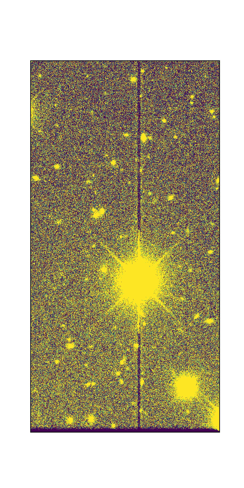

.. _artifacts:

###############
Image artifacts
###############

.. important::

   This webpage contains placeholder information from Data Preview 1 and is currently under development.

Some image artifacts from the camera or processing will remain visible in the data.

The purpose of this page is to assist with artifact identification and to provide users with a consistent vocabulary for the artifacts they might notice.

Masked artifacts
================

Several types of artifacts are masked, meaning that the pixel mask plane for processed images will have a value that indicates a pixel was affected by one of the following.

Bad pixels
----------

Individual pixels with erroneous sensitivity (quantum efficiency) beyond a correctable range or dead pixels.
A "vampire pixel" is a term for a particular kind of bad pixel that seems to "suck" charge from nearby pixels.

Bad columns
-----------

Instances when an entire column of pixels has erroneous sensitivity, e.g., due to a "hot" (oversensitive) pixel.

Bleed trails
------------

The charge created from very bright stars can overflow a pixel and extend along the column (vertical; y-direction), sometimes all the way to the CCD edge.
When a bleed trail extends to the CCD edge and then continues to affect pixels along the edge of the CCD in the x-direction.
There are two types of edge bleeds depending on the sensor vendor: for ITL sensors, the bleed fans out at the edge and we attempt to mask them, though some may be missed; for E2V sensors, the edge bleeds appear as a more compact feature and are masked with a box.

.. list-table::
   :widths: 50 50

   * - .. figure:: images/ITL_edge_bleed_3_inset.jpg
          :name: itl_edge_bleed
          :alt: A bleed trail on an ITL sensor fanning out along the CCD edge.

          An edge bleed on an ITL sensor: the bleed trail from a saturated star extends along the column to the CCD edge, where it fans out along the edge in the x-direction.
     - .. figure:: images/e2v_edge_bleed_3_inset.jpg
          :name: e2v_edge_bleed
          :alt: A compact edge bleed at the CCD edge of an e2v sensor.

          An edge bleed on an e2v sensor: compared to ITL sensors, the feature at the CCD edge is more compact, and it is masked with a box.

On ITL sensors, bright saturated stars can also produce a "dark dip" (or "ITL dip"): a depression of the background level along the columns that pass through the star.
See `The "dark dips" phenomenon in the LSST Camera on-sky images <https://ui.adsabs.harvard.edu/abs/2026arXiv260700925J/abstract>`_ for a detailed description of this effect.

    An ITL dip ("dark dip"): the columns passing through a bright saturated star on an ITL sensor show a depressed background level, appearing as a dark vertical trail through the star.

Dark trails
-----------

In some cases, the pixels in the column of a bleed trail exhibit a "dark trail" beyond where bleeding has occurred.

Midline break
-------------

An anti-blooming discontinuity at the midline of the e2v CCDs (where the two halves of the serial register meet) that can be visible in some images.
This feature is not currently masked.

Crosstalk
---------

Charge leakage between amplifiers, caused by excess charge from bright stars, typically affecting amplifiers on the same CCD.

The effect is long vertical (y-direction) features several pixels wide, and widest at about mid-length.

Cosmic rays
-----------

When high energy particles moving near the speed of light hit the CCD, the pixels they interact with are saturated.

Streaks and glints
------------------

Artificial objects in Earth's orbit, including satellites and debris, can reflect sunlight and appear as bright streaks and/or trailed glints across images. In general, shorter and thinner streaks (less than the length of one detector) are from objects in higher orbits, while longer and wider streaks (often crossing the whole field of view) are from objects in lower orbits.

**Coadds:** During coadd assembly, temporal outliers are clipped, which catches many regions affected by streaks and glints. Streak detection is run on the ``DETECTED`` mask plane to identify additional linear features to exclude.

**Difference images:** If a streak is visually present in a difference image, it may set the ``STREAK`` mask plane, and any diaSource detected in such a region will have the ``pixelFlags_streak`` (or ``pixelFlags_streakCenter``) flag set. If a trailed glint with five or more points in a line is detected in the diaSource catalog, each diaSource will have the ``glint_trail`` flag set. If a diaSource falls in the center of a streak or along a glint trail, it will not be used to create a new diaObject.

**Visit images:** No streak or glint detection or masking is presently implemented.

In all cases, pixel values are not erased, redacted, or otherwise altered due to streaks or glints, and no attempt is made to identify the origin of any streak.

For a description of how satellite constellations impact LSST, and mitigation strategies, a please see the `FAQ on artificial satellites and debris <https://rubinobservatory.org/for-scientists/frequently-asked-questions/leo-sats>`_.

Optical system
==============

Stray light
-----------

Light from off-axis sources beyond the camera's field of view can scatter into the camera and cause stray light features, typically near the edge of the focal plane.

Ghost
-----

Light from a bright object in the field of view can reflect off of the internal camera optics and cause large features.

Ghoul
-----

Fainter, more diffuse, and sometimes transient, stray light and ghost effects.

Glint
-----

Also caused by reflections, e.g., off the uncoated edge of the filters, but typically smaller and less diffuse.

Flares and comb pattern
-----------------------

Flares and the comb pattern are related artifacts.
The comb pattern most often shows up in images with high sky background or in y-band flats, and looks like a series of small flares along the edge of the detector.

.. list-table::
   :widths: 50 50

   * - .. figure:: images/flare.png
          :name: flare
          :alt: A flare artifact on an LSSTCam detector.

          A flare artifact on an LSSTCam detector.
     - .. figure:: images/comb.png
          :name: comb
          :alt: A comb pattern artifact along the edge of an LSSTCam detector.

          A comb pattern artifact: a series of small flares along the edge of the detector, most visible in high-background or y-band images.

Camera detector
===============

There are several effects related to the camera which should be corrected for during instrument signature removal -- by the flat field in particular.

Amplifier jump
--------------

The electronic gain of each amplifier is different, and an incomplete correction
looks like rectangular blocks with different background levels.

Fringing
--------

A variable interference pattern caused by light interacting with the different layers of the chip; most visible in the z- and y-bands.

Tree rings
----------

Circularly symmetric features caused by changes in the effective pixel size over the CCD; most apparent in the z-band.
Tree rings are actually changes in pixel *area*, not sensitivity, so they have a small astrometric effect as well, which is not currently corrected.

Crosshatch pattern
------------------

A faint correlated-noise pattern introduced by the overscan subtraction, most noticeable in visit images with low background levels.
The effect was more pronounced for LSSTComCam than for most LSSTCam detectors, due to the comparatively lower quality of the LSSTComCam CCDs.

Interpolation
=============

Pixel values are replaced by an interpolation algorithm when they're identified
as affected by bad pixels, cosmic rays, and bleeding.
Our interpolation algorithm is optimized for small regions and vertical features (primarily bleed trails); in larger areas it produces visible striping, and we rely on other features of the processing to ignore these areas.

Interpolation will also be evident at the edges of the HiPS maps.

Background subtraction artifacts
=================================

Artifacts that stem from the estimation and subtraction of the sky background.

Dark edge
---------

Over-estimation and thus over-subtraction of the sky background at the edge or in the corners of images.

Dark halo
---------

Over-estimation and thus over-subtraction of the sky background around bright stars.
