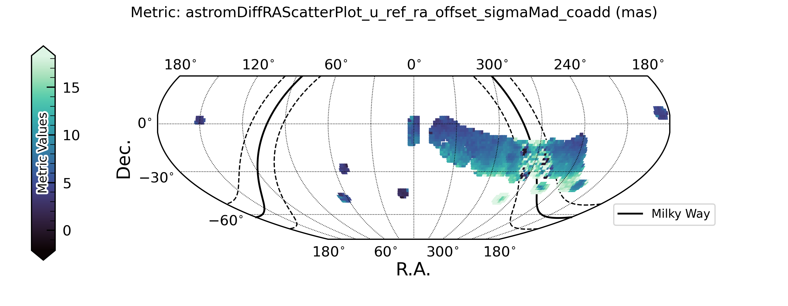
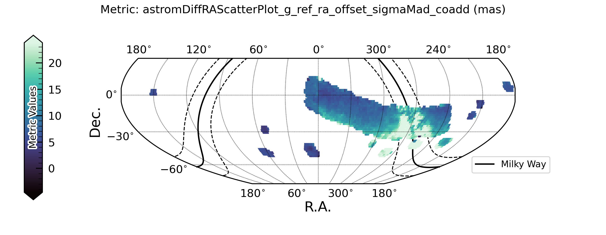
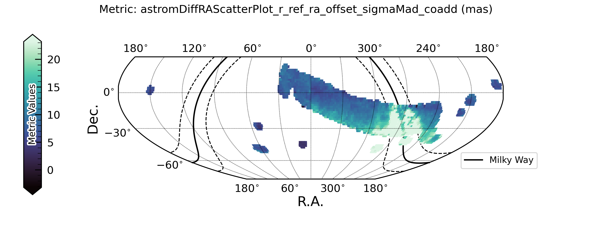
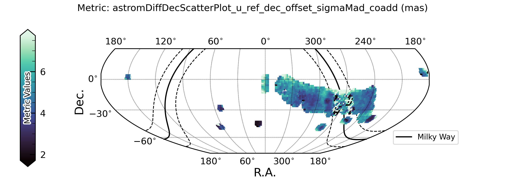
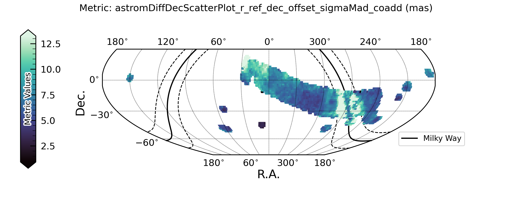

########################
Data Quality: Astrometry
########################

The following plots show the astrometric offset between calibration stars and the reference catalog.

Delta RA
========

    Figure 1: Astrometric scatter (sigma MAD) in RA between calibration stars and the reference catal

    Figure 1: Astrometric scatter (sigma MAD) in RA between calibration stars and the reference catalog, in g band.

    Figure 1: Astrometric scatter (sigma MAD) in RA between calibration stars and the reference catalog, in r band.

Delta Dec
=========

    Figure 1: Astrometric scatter (sigma MAD) in Declination between calibration stars and the reference catalog, in u band.

    Figure 1: Astrometric scatter (sigma MAD) in Declination between calibration stars and the reference catalog, in g band.

    Figure 1: Astrometric scatter (sigma MAD) in Declination between calibration stars and the reference catalog, in r band.

.. raw:: html

   

     

       

         
       

       

         
       

       

         
       

     

     <button class="carousel-control-prev" type="button" data-bs-target="#astrometryCarousel" data-bs-slide="prev">
       
     </button>

     <button class="carousel-control-next" type="button" data-bs-target="#astrometryCarousel" data-bs-slide="next">
       
     </button>
   

