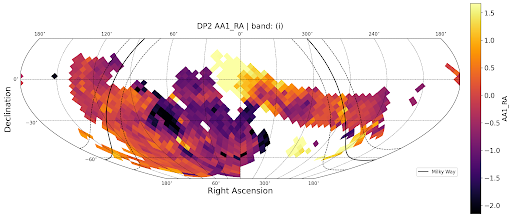
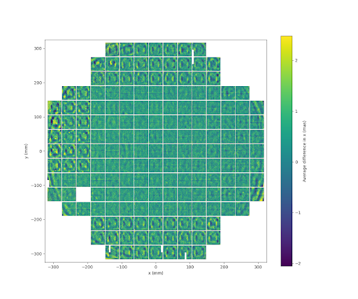
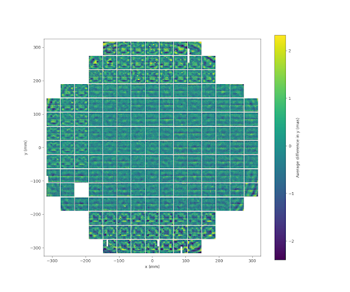

.. _products_known_issues:

############
Known issues
############

.. important::

   This webpage contains some placeholder information from Data Preview 1 and is currently under development.

The purpose of this page is to document and provide guidance on known issues with the dataset.
Each issue should be quantified and accompanied by practical user-facing information, such as the size of the resulting uncertainties, plots, and mitigation strategies.
Facts and descriptions of data products and processing are documented on the relevant :doc:`/products/index` and :doc:`/processing/index` pages.

.. _issues_crowded_fields:

Crowded fields
==============

Deblending quality
------------------

Poor deconvolution in crowded fields leaves rings that connect large regions, resulting in blends that take up most or all of a patch.
There are missing measurements for several patches in dense stellar fields.

PSF modeling in crowded fields is also affected; see :ref:`issues_psf`.

.. _issues_psf:

PSF modeling
============

A complete analysis of the DP2 PSF characterization will be presented in a forthcoming technote ("PSF Characterization using DP2", in preparation); see also the DP2 paper (`RTN-115 <https://rtn-115.lsst.io/>`__).
The key findings are:

- The PSF shape correlates with height variations across the focal plane (`RTN-108 <https://rtn-108.lsst.io/>`__).
  This is why ITL sensors are harder to model than E2V sensors, and why a fourth-order model is warranted.
- The LSSTCam PSF is chromatic, in a way that appears consistent with differential chromatic refraction (`SITCOMTN-174 <https://sitcomtn-174.lsst.io/>`__).
  This can be modeled, following the approach of the DES Y6 PSF analysis, but the modeling was not enabled for DP2 processing.
- With an order of magnitude more visits than previous campaigns, DP2 reveals new PSF-related artifacts, including annealing patterns in E2V sensors (visible in the u- and g-band stacks) and fringing in the z and y bands, all expected to arise from background subtraction.
- PSF residuals show structure that correlates with stellar density, with the largest biases in the Milky Way, the LMC, and the SMC.
  This also explains the band-to-band differences in the residuals, since more crowded bands show larger residuals.
  The underlying cause is again believed to be related to background subtraction in dense fields.

.. _issues_astrometry:

Astrometry
==========

Visit-level astrometry
----------------------

Known visit-level astrometric effects include:

- Not yet understood behavior in the per-visit median offset from Gaia (the ``AA1`` metric).
- Stacking residuals in focal plane coordinates reveals unmodeled camera behavior, including tree ring signatures and other small-scale effects.

These effects are all on the scale of approximately 1-2 mas, and are illustrated in the figures below.
This part of the analysis is expected to improve in future releases (for a description of the astrometric calibration, see the DP2 paper, `RTN-115 <https://rtn-115.lsst.io/>`__).
In addition, differential chromatic refraction (DCR) is not yet corrected for in the astrometric calibration.

   The ``AA1`` metric (per-visit median astrometric offset relative to Gaia) in Right Ascension, in mas, for the i band across the DP2 footprint.

   Stacked astrometric residuals in focal plane coordinates (x component, in mas), revealing unmodeled camera behavior such as tree ring signatures.

   Stacked astrometric residuals in focal plane coordinates (y component, in mas).

Coadd astrometry: galaxy RA bias
--------------------------------

Galaxy Right Ascension (but not Declination) has a magnitude-dependent bias, seen when compared to external catalogs (Euclid, DES, and others) and confirmed in injection runs.
This may be related to the way the aperture used in ``SdssCentroid`` grows with source brightness.
Exponential and Sersic model centroids, which have a free centroid parameter, are generally more accurate and have a smaller bias.

.. _issues_photometry:

Photometry
==========

Aperture corrections
--------------------

The aperture correction scheme used in Rubin processing (see :doc:`/processing/calibration/photometric`) has several known problems:

- These aperture corrections are well-defined for point sources only, but they are still applied for most of the galaxy-focused photometry algorithms (the ``sersic_*`` fluxes are the sole exception), since this at least makes them well-calibrated for poorly-resolved galaxies.

- Coadding apertures with the same weights as the images is only correct in the limit that the images have the same PSF.
  For fixed-aperture photometry a different combination should be used (and will be used in future data releases, if this scheme is used at all), and for PSF-dependent photometry no formally correct combination is possible.

- Ratios of fluxes on even bright stars can be very noisy, and in some cases the aperture correction is a significant fraction of the error budget.

Photometric calibration: background oversubtraction
----------------------------------------------------

Photometrically-derived background offset QA plots reveal systematic oversubtraction in all bands, worsening toward redder bands and in the densest regions.
DP2 includes many dense regions, making this effect more pronounced.
This oversubtraction can affect photometry and PSF estimation in crowded fields.

Absolute calibration: AB offsets
--------------------------------

DP2 provides photometry that is spatially and temporally uniform to an exceedingly high degree (< 2 milli-mags RMS) across the DP2 footprint, meeting the primary calibration goals for this release.
The DP2 photometric system is defined by the relative passbands derived from FGCM fits to DP2 observations.
These passbands ensure internal consistency but are not yet the final Rubin standard passbands that will be adopted for Data Release 1 (DR1).
As a result, synthetic photometry generated using spectrophotometry and the DP2 relative passbands will not perfectly match the observed DP2 magnitudes.

A small but measurable offset remains between the DP2 photometric system and the AB magnitude system.
These AB magnitude offsets are derived from DP2 observations of the HST CalSpec standard star C26202 (see the `CalSpec archive <https://www.stsci.edu/hst/instrumentation/reference-data-for-calibration-and-tools/astronomical-catalogs/calspec>`_), which lies in the ECDFS field and is unsaturated in LSST images.
The offsets are generally modest, ranging from 0.001 to 0.023 mag in grizy, but reach 0.071 mag in the u band (see table below).
These offsets are smaller than those discovered and corrected prior to DP1, but there was insufficient time to update the absolute calibration before DP2 was released.

Users who compute synthetic photometry using the DP2 relative passbands should therefore expect the resulting synthetic magnitudes to differ from observed DP2 photometry by the offsets listed below.

The offset is defined as

.. math::

   m_{offset} = m_{obs} - m_{AB}

Thus, to place observed DP2 photometry onto the AB system, subtract the offsets:

.. math::

   m_{AB} = m_{obs} - m_{offset}.

These offsets will be removed for Rubin DR1, when the final standard passbands, constrained by LSSTCam in-situ throughput measurements and an updated absolute calibration of The Monster reference catalog, are adopted.

AB Magnitude Offsets for the LSST DP2 Photometric System
--------------------------------------------------------

+------+--------+-----------------+----------------+-------------+
| band | n_band |m_obs\*          |m_AB\*\*        |m_offset     |
+======+========+=================+================+=============+
| u    | 9      | 17.649          | 17.578         | 0.071       |
+------+--------+-----------------+----------------+-------------+
| g    | 40     | 16.712          | 16.689         | 0.023       |
+------+--------+-----------------+----------------+-------------+
| r    | 43     | 16.363          | 16.362         | 0.001       |
+------+--------+-----------------+----------------+-------------+
| i    | 82     | 16.249          | 16.260         | -0.011      |
+------+--------+-----------------+----------------+-------------+
| z    | 53     | 16.242          | 16.244         | -0.001      |
+------+--------+-----------------+----------------+-------------+
| y    | 10     | 16.237          | 16.238         | -0.002      |
+------+--------+-----------------+----------------+-------------+

\* Observed LSST DP2 magnitude for the HST spectrophotometric standard
C26202, computed as the median of all source-table magnitude measurements
in the corresponding band.

\*\* Synthetic AB magnitude derived from the HST/STIS reference spectrum
``c26202_stiswfcnic_007`` of C26202 and integrated through the DP2 relative bandpass for the corresponding filter provided by FGCM.

Aperture flux uncertainties
---------------------------

The ``{band}_ap12FluxErr`` column in the Object table is sometimes NaN even when the uncertainty for larger apertures (e.g., ``{band}_ap17FluxErr``) is finite.
This is likely a problem with the sinc interpolation used for smaller apertures, and may also affect ``apFlux_12_0_instFluxErr`` in the Source table.

Sersic and Exponential model outputs
------------------------------------

Improvements to the Sersic and Exponential model outputs are planned for future data releases.
A full description of the ellipse parameterizations and units will be provided on the :doc:`/products/catalogs/object` page.

.. _issues_backgrounds:

Background subtraction
=======================

The ``SkyCorrectionTask`` that performs full-focal-plane background correction is not designed to accommodate detector-to-detector offsets in the input data.
These offsets arise from several sources, including E2V/ITL sensor differences, offset detectors, and offset REBs, and are more pronounced in the u and y bands.
A new full-focal-plane background fitter is under development but was not ready for DP2.

.. _issues_coadds:

Coadds
======

Empty cells
-----------

Coadd cells will have no data if none of the input warps is below the masked-pixel threshold, even though a fallback (such as including the warp with the largest mask fraction) could have been implemented.
This is not so much a bug as a case where the best solution has not yet been chosen.

.. _issues_object_catalog:

Object catalog
==============

Objects spanning multiple cell footprints
-----------------------------------------

There is no column to identify objects whose cells span multiple footprints, and which therefore effectively have ``INEXACT_PSF`` for their measurements.
What to do about this has not yet been decided.

Duplicate or missing objects near patch boundaries
--------------------------------------------------

A tiny fraction of objects, of the order of 10 per tract, with centroids near patch boundaries may appear in the Object table zero times (if their reference-band centroids happen to shift outside the inner area of every patch) or multiple times (up to four).

Similarly, the ``exponential_ra``/``exponential_dec`` and ``sersic_ra``/``sersic_dec`` centroids may not correspond to the same patch/tract as ``coord_ra``/``coord_dec``.

Matching to the object_shear_all table
--------------------------------------

The ``object_shear_all`` table has a completely different set of rows from the Object table: it includes rows with ``is_tract_inner == False``, but not rows with ``is_patch_inner == False``.
Users will need to be careful when comparing or matching the two tables.

.. _issues_dia:

Difference imaging
===================

DIA source reliability
----------------------

The machine-learned reliability ("real/bogus") model for DIA sources shows improved performance relative to DP1, but does not perform well on bad stellar subtractions: detections matched to Gaia stars, both real variables and subtraction artifacts, receive characteristically low reliability scores.

Other known weaknesses of the model are:

- A spurious peak in the reliability distribution at approximately 0.3, produced when the science or difference image cutouts contain rows or columns of NaN values.
- A bias against low signal-to-noise sources: detections with ``|psfFlux/psfFluxErr|`` below approximately 5 are unlikely to receive a reliability above 0.6.
- An excess of reliability scores above 0.5 for negative-flux detections.

On test data, a purity and completeness of 93.1% are both achieved at a reliability threshold of 0.596 (97.5% at a threshold of 0.301 for injected point sources); users can adjust the threshold to trade purity against completeness.
See `DMTN-337 <https://dmtn-337.lsst.io/>`__ for a full description of the model, its training data, and its performance.

Diffraction spike masks and bright-star halos
---------------------------------------------

The ``SPIKE`` masks are excessively wide at the bases.
In practice, where the bases intersect they mask out a polygon that is typically (possibly always) larger than the saturated (``SAT``) mask.

Despite the large spike masks, there is usually some residual flux from the halos of bright stars, beyond where the ``SPIKE`` masks end, that is not subtracted off.
Detections in these regions are more likely to be bogus, and even if real, the measurements are likely unreliable.
In the simplest case, where the diffraction spikes all line up, these detections are clustered around the four points where the spike-mask triangles intersect, making a square/diamond shape around the center of the star.

.. _issues_solarsystem:

Solar system processing
========================

Three-night discovery candidates are not sufficiently pure (approximately 1 in 500), while four-night candidates achieve much higher purity (approximately 1 in 10,000).
