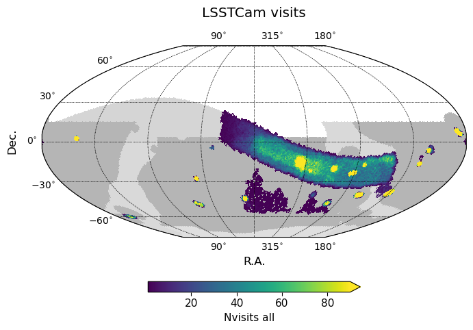

.. _observations:

############
Observations
############

The sky coverage (fields), filters, and number of visits (cadence).

.. _observations-fields:

Sky coverage
============

    Figure 1: The number of visits (sky coverage) of DP2.

Wide-fast-deep region
---------------------

``To be replaced with info about WFD. Describe lowdust, bulgy, and dusty_plane.``

Small fields
------------

``To be replaced with info about the small field survey areas. Include their names and central coordinates in a table.``

.. list-table:: Table 1: Small field survey area central coordinates.
   :widths: 2 2 1
   :header-rows: 1

   * - Field name
     - RA, Dec
     - RA, Dec (deg)
   * - M49 (Virgo)
     - 12h29m36s +08d00m00s
     - 187.4, +8
   * - Add new here
     - x
     - x

Deep drilling fields
--------------------

``To be replaced with info about the DDFs. Include their names and central coordinates in a table.``

.. list-table:: Table 2: Small field survey area central coordinates.
   :widths: 2 2 1
   :header-rows: 1

   * - Field name
     - RA, Dec
     - RA, Dec (deg)
   * - COSMOS
     - 12h30m33s +02d13m48s
     - 150.11, 2.23
   * - Add new here
     - x
     - x

.. _observations-filters:

Filters
=======

.. list-table:: Table 3: Number of visits per band per field.
   :widths: 4 1 1 1 1 1 1 1
   :header-rows: 1

   * - Sky region
     - u
     - g
     - r
     - i
     - z
     - y
     - Total
   * - WFD
     - x
     - x
     - x
     - x
     - x
     - x
     - x
   * - M49
     - x
     - x
     - x
     - x
     - x
     - x
     - x
   * - COSMOS
     - x
     - x
     - x
     - x
     - x
     - x
     - x
   * - Add new here
     - x
     - x
     - x
     - x
     - x
     - x
     - x

.. _observations-epochs:

Epochs (nights)
===============

.. list-table:: Table 4: Number of nights, mean visits per night.
   :widths: 3 1 1
   :header-rows: 1

   * - Sky region
     - Epochs (nights)
     - Visits/epoch
   * - WFD
     - x
     - x
   * - M49
     - x
     - x
   * - COSMOS
     - x
     - x
   * - Add new here
     - x
     - x

.. _observations-tracts:

Coadd tracts
============

.. list-table:: Table 5: Coadd tract IDs for each field
   :widths: 3 3
   :header-rows: 1

   * - Field name
     - Tract IDs
   * - M49
     - x, x
   * - COSMOS
     - x
   * - Add new here
     - x
