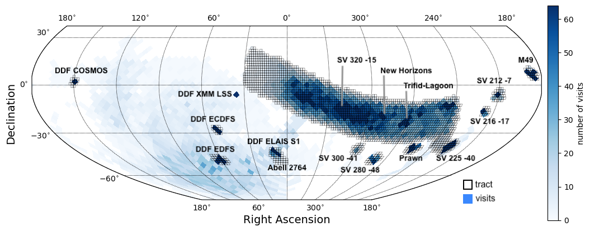
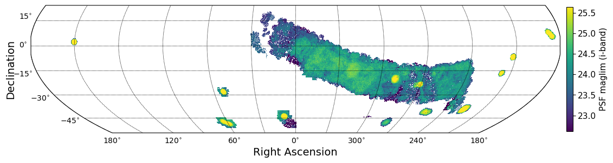

############
Observations
############

.. important::

   Data Preview 2 has not yet been released. This website is currently under development.

A summary of the sky coverage, including metadata for visit images and deep coadd images.

Sky coverage
============

    Figure 1: A map of the DP2 coverage. Blue represents a density map of the number of visits; the quadrilaterals are 19-sided HEALPix, similar in size to the LSSTCam 9.6 square degree field of view. Open black squares mark the locations of tracts in the skymap, within which deep coadd images were made if there were a sufficient number of input visits.

    Figure 2: A map of the i-band PSF limiting magnitude for DP2 deep coadd images. Deep coadd images are only made within the pre-defined tracts for which sufficient input visits exist. The total area covered by deep coadd images is approximatley 3000 square degrees.

Wide-fast-deep region
---------------------

The region of sky covered somewhat similarly to the LSST's future "wide-fast-deep" (WFD) stretches from RA 240-30 deg, over 20 deg span of Declination.
It is similar in that it includes low-dust and dusty regions within the plane of the Milky Way, where the depth is shallower, as seen in Figure 2.
There are three small fields within this WFD region, as labeled in Figure 1, making it particularly non-uniform in depth.
However this is still somewhat similar to the future LSST sky coverage, which won't be uniform in their depth either (especially years with rolling cadence).
Learn more about the WFD and the LSST strategy in the `Survey strategy documentation <https://survey-strategy.lsst.io/>`_.

Small fields
------------

Selected to provide LSSTCam commissioning-era images for science validation across variety of environments (crowded, dusty, galactic, extragalactic, clustering, nebulosity, and so on).
The small fields include M49 and Trifid-Lagoon, which produced the Rubin First Look images in June 2025.

.. csv-table:: Table 1: Small field survey area central coordinates.
   :header: "Field Name", "RA, Dec", "RA, Dec [deg]"
   :widths: 30, 30, 20
   :align: left

    "Abell 2764", "00h22m00s -49d00m00s", "5.5 -49"
    "DESI SV3 R1", "12h02m00s -00d18m00s", "180.5 -0.3"
    "M49", "12h25m12s +06d54m00s", "186.3 6.9"
    "Prawn", "16h54m00s -41d00m00s", "253.5 -41"
    "Trifid-Lagoon", "18h06m48s -23d54m00s", "271.7 -23.9"
    "New Horizons", "19h17m36s -20d12m00s", "289.4 -20.2"
    "Rubin SV 212 -7", "14h00m48s -06d06m00s", "210.2 -6.1"
    "Rubin SV 216 -17", "14h24m24s -16d42m00s", "216.1 -16.7"
    "Rubin SV 225 -40", "15h00m00s -39d30m00s", "225 -39.5"
    "Rubin SV 280 -48", "18h40m24s -48d00m00s", "280.1 -48"
    "Rubin SV 300 -41", "20h01m12s -41d00m00s", "300.3 -41"
    "Rubin SV 320 -15", "21h20m48s -15d06m00s", "320.2 -15.1"

Deep drilling fields
--------------------

The LSST Deep Drilling Field (DDF) program includes 5 single-pointing fields, chosen to maximize multi-wavelength coverage with pre-existing surveys.
The Euclid Deep Field South (EDFS) is larger and is split between an "a" and a "b" pointing which share the DDF visits.
While these fields were covered during commissioning, observations did not follow the `baseline DDF strategy <https://survey-strategy.lsst.io/baseline/ddf.html>`_ (primarily, the seasons were short).

.. csv-table:: Table 2: Deep drilling field central coordinates.
   :header: "Field Name", "RA, Dec", "RA, Dec [deg]"
   :widths: 30, 30, 20
   :align: left

    "DDF ELAIS S1", "00h38m00s -44d00m00s", "9.5 -44"
    "DDF XMM LSS", "02h22m24s -04d48m00s", "35.6 -4.8"
    "DDF ECDFS", "03h32m00s -28d06m00s", "53 -28.1"
    "DDF EDFS a", "03h56m48s -49d12m00s", "59.2 -49.2"
    "DDF EDFS b", "04h12m48s -47d48m00s", "63.2 -47.8"
    "DDF COSMOS", "10h00m24s +02d06m00s", "150.1 2.1"

Visit images metadata
=====================

Filters
-------

While observations in all six filters *ugrizy* are included in DP2, each field had a different distribution of visits per filter.

.. csv-table:: Table 3: Visit filter distribution by field.
   :header: "Field Name", "u", "g", "r", "i", "z", "y", "Total"
   :widths: 30, 10, 10, 10, 10, 10, 10, 10
   :align: left

    "DDF COSMOS", "105", "87", "173", "162", "110", "77", "714"
    "DDF ECDFS", "10", "61", "50", "96", "61", "11", "289"
    "DDF EDFS a", "7", "31", "33", "59", "33", "7", "170"
    "DDF EDFS b", "5", "37", "33", "57", "33", "7", "172"
    "DDF ELAIS S1", "57", "153", "128", "232", "141", "59", "770"
    "DDF XMM LSS", "42", "15", "8", "47", "10", "10", "132"
    "Abell 2764", "0", "6", "0", "2", "0", "0", "8"
    "DESI SV3 R1", "0", "0", "0", "3", "0", "0", "3"
    "M49", "234", "280", "378", "213", "0", "0", "1105"
    "New Horizons", "37", "53", "77", "116", "80", "33", "396"
    "Prawn", "193", "159", "139", "91", "30", "0", "612"
    "Rubin SV 212 -7", "0", "139", "231", "123", "0", "0", "493"
    "Rubin SV 216 -17", "0", "27", "28", "59", "0", "0", "114"
    "Rubin SV 225 -40", "307", "524", "391", "381", "239", "104", "1946"
    "Rubin SV 280 -48", "30", "29", "26", "30", "29", "0", "144"
    "Rubin SV 300 -41", "0", "8", "0", "0", "30", "0", "38"
    "Rubin SV 320 -15", "12", "47", "104", "259", "211", "77", "710"
    "Trifid-Lagoon", "231", "201", "129", "119", "9", "6", "695"
    "All", "1964", "4166", "4856", "7959", "5809", "3944", "28698"

Epochs
------

The number of visits, and the number of unique nights (epochs), varies by field.

.. csv-table:: Table 4: Number of visits and unique nights, by field.
   :header: "Field Name", "visits", "nights", "mean(visits/night)"
   :widths: 30, 10, 10, 10
   :align: left

    "DDF COSMOS", "714", "21", "34"
    "DDF ECDFS", "289", "37", "8"
    "DDF EDFS a", "170", "51", "3"
    "DDF EDFS b", "172", "50", "3"
    "DDF ELAIS S1", "770", "62", "12"
    "DDF XMM LSS", "132", "23", "6"
    "Abell 2764", "8", "2", "4"
    "DESI SV3 R1", "3", "1", "3"
    "M49", "1105", "7", "158"
    "New Horizons", "396", "24", "16"
    "Prawn", "612", "7", "87"
    "Rubin SV 212 -7", "493", "5", "99"
    "Rubin SV 216 -17", "114", "2", "57"
    "Rubin SV 225 -40", "1946", "28", "70"
    "Rubin SV 280 -48", "144", "1", "144"
    "Rubin SV 300 -41", "38", "2", "19"
    "Rubin SV 320 -15", "710", "34", "21"
    "Trifid-Lagoon", "695", "23", "30"
    "All", "28698", "131", "219"

Seeing
------

The DP2 images were acquired during commissioning, during which the Active Optics System (AOS) to stabilize image quality was also being commissioned for operations.
These values are not representative of the future expected image quality distributions.

.. csv-table:: Table 5: The mean seeing (PSF FWHM in arcsec) across all detectors and visits.
   :header: "Field Name", "u", "g", "r", "i", "z", "y"
   :widths: 30, 10, 10, 10, 10, 10, 10
   :align: left

    "DDF COSMOS", "1.36", "1.16", "1.25", "1.14", "1.17", "1.22"
    "DDF ECDFS", "1.68", "1.59", "1.35", "1.15", "1.34", "1.32"
    "DDF EDFS a", "1.56", "1.39", "1.39", "1.12", "1.29", "0.94"
    "DDF EDFS b", "1.34", "1.41", "1.39", "1.16", "1.3", "0.91"
    "DDF ELAIS S1", "1.63", "1.51", "1.51", "1.32", "1.46", "1.33"
    "DDF XMM LSS", "1.52", "1.24", "1.08", "1.01", "0.99", "0.94"
    "Abell 2764", "nan", "1.01", "nan", "0.85", "nan", "nan"
    "DESI SV3 R1", "nan", "nan", "nan", "1.47", "nan", "nan"
    "M49", "1.49", "1.37", "1.27", "1.22", "nan", "nan"
    "New Horizons", "1.26", "1.36", "1.12", "1.04", "1.01", "1.12"
    "Prawn", "1.49", "1.38", "1.28", "1.24", "1.42", "nan"
    "Rubin SV 212 -7", "nan", "1.42", "1.28", "1.12", "nan", "nan"
    "Rubin SV 216 -17", "nan", "1.35", "1.25", "1.32", "nan", "nan"
    "Rubin SV 225 -40", "1.5", "1.42", "1.27", "1.24", "1.31", "1.25"
    "Rubin SV 280 -48", "1.69", "1.54", "1.51", "1.34", "1.53", "nan"
    "Rubin SV 300 -41", "nan", "1.86", "nan", "nan", "1.65", "nan"
    "Rubin SV 320 -15", "1.26", "1.68", "1.47", "1.36", "1.37", "1.15"
    "Trifid-Lagoon", "1.22", "1.15", "1.15", "1.03", "1.1", "1.55"
    "All", "1.36", "1.3", "1.27", "1.18", "1.21", "1.19"

Magnitude limits
----------------

For the same reason as described above, these values are also not representative of the future expected mean depths per image (see `LSST Key Numbers <https://rubinobservatory.org/for-scientists/rubin-101/key-numbers>`_).

.. csv-table:: Table 6: The mean :math:`5\sigma` PSF magnitude limit across all detectors and visits.
   :header: "Field Name", "u", "g", "r", "i", "z", "y"
   :widths: 30, 10, 10, 10, 10, 10, 10
   :align: left

    "DDF COSMOS", "23.39", "24.39", "23.54", "22.98", "22.58", "21.57"
    "DDF ECDFS", "23.01", "23.52", "23.17", "23.42", "22.57", "21.68"
    "DDF EDFS a", "23.1", "23.62", "23.23", "23.47", "22.51", "21.94"
    "DDF EDFS b", "23.26", "23.68", "23.25", "23.42", "22.48", "21.96"
    "DDF ELAIS S1", "23.23", "23.64", "23.27", "23.2", "22.47", "21.48"
    "DDF XMM LSS", "23.21", "23.7", "23.93", "23.62", "23.03", "21.92"
    "Abell 2764", "nan", "24.87", "nan", "23.41", "nan", "nan"
    "DESI SV3 R1", "nan", "nan", "nan", "23.5", "nan", "nan"
    "M49", "23.29", "24.3", "23.85", "23.44", "nan", "nan"
    "New Horizons", "23.17", "24.41", "24.11", "23.63", "22.94", "21.88"
    "Prawn", "23.1", "24.07", "23.74", "23.38", "22.71", "nan"
    "Rubin SV 212 -7", "nan", "24.23", "23.83", "23.71", "nan", "nan"
    "Rubin SV 216 -17", "nan", "24.34", "24.03", "23.62", "nan", "nan"
    "Rubin SV 225 -40", "23.3", "23.97", "23.52", "23.33", "22.76", "21.63"
    "Rubin SV 280 -48", "22.59", "23.45", "23.28", "23.18", "22.27", "nan"
    "Rubin SV 300 -41", "nan", "23.25", "nan", "nan", "22.31", "nan"
    "Rubin SV 320 -15", "23.55", "24.08", "23.29", "23.05", "22.39", "21.67"
    "Trifid-Lagoon", "23.42", "24.28", "23.86", "23.65", "22.63", "21.05"
    "All", "23.37", "24.12", "23.58", "23.32", "22.65", "21.68"

Deep coadd images metadata
==========================

Depth
-----

The :math:`5\sigma` PSF magnitude depth of the deep coadd image at the center coordinates of each field

.. csv-table:: Table 7: Deep coadd PSF magnitude limits.
   :header: "Field Name", "u", "g", "r", "i", "z", "y"
   :widths: 30, 10, 10, 10, 10, 10, 10
   :align: left

    "DDF ELAIS S1", "25.18", "26.57", "25.88", "26.07", "25.07", "23.64"
    "DDF XMM LSS", "nan", "nan", "nan", "nan", "nan", "nan"
    "DDF ECDFS", "24.35", "25.84", "25.47", "25.87", "24.76", "22.23"
    "DDF EDFS a", "nan", "25.63", "25.53", "25.65", "24.53", "23.08"
    "DDF EDFS b", "23.69", "25.75", "25.47", "25.71", "24.58", "23.27"
    "DDF COSMOS", "25.77", "26.73", "26.35", "25.94", "25.0", "23.69"
    "Abell 2764", "nan", "25.88", "nan", "22.58", "nan", "nan"
    "DESI SV3 R1", "nan", "nan", "nan", "nan", "nan", "nan"
    "M49", "25.62", "27.03", "26.72", "26.05", "nan", "nan"
    "Prawn", "25.66", "26.52", "26.06", "25.41", "24.12", "nan"
    "Trifid-Lagoon", "26.22", "26.95", "26.13", "25.29", "23.41", "22.18"
    "New Horizons", "25.26", "26.37", "26.37", "25.99", "25.25", "23.65"
    "Rubin SV 212 -7", "nan", "26.33", "26.16", "25.6", "nan", "nan"
    "Rubin SV 216 -17", "nan", "26.15", "25.93", "25.83", "nan", "nan"
    "Rubin SV 225 -40", "26.26", "27.26", "26.75", "26.36", "25.52", "24.06"
    "Rubin SV 280 -48", "23.92", "25.09", "24.89", "24.88", "23.7", "nan"
    "Rubin SV 300 -41", "nan", "24.41", "nan", "nan", "23.85", "nan"
    "Rubin SV 320 -15", "24.09", "24.82", "24.42", "24.99", "24.21", "22.42"

PSF FWHM
--------

The PSF FWHM of the deep coadd image at the center coordinates of each field.

.. csv-table:: Table 8: Deep coadd PSF FWHM, in arcseconds.
   :header: "Field Name", "u", "g", "r", "i", "z", "y"
   :widths: 30, 10, 10, 10, 10, 10, 10
   :align: left

    "DDF ELAIS S1", "1.26", "1.2", "1.2", "1.19", "1.21", "1.22"
    "DDF XMM LSS", "nan", "nan", "nan", "nan", "nan", "nan"
    "DDF ECDFS", "1.19", "1.18", "1.03", "1.06", "1.01", "1.36"
    "DDF EDFS a", "nan", "1.16", "1.09", "1.01", "1.11", "0.96"
    "DDF EDFS b", "1.38", "1.22", "1.16", "1.01", "1.06", "0.94"
    "DDF COSMOS", "1.3", "1.09", "1.17", "1.02", "1.11", "1.12"
    "Abell 2764", "nan", "1.0", "nan", "1.46", "nan", "nan"
    "DESI SV3 R1", "nan", "nan", "nan", "nan", "nan", "nan"
    "M49", "1.38", "1.26", "1.19", "1.16", "nan", "nan"
    "Prawn", "1.34", "1.33", "1.19", "1.23", "1.33", "nan"
    "Trifid-Lagoon", "1.18", "1.11", "1.16", "1.02", "1.01", "1.07"
    "New Horizons", "1.4", "1.3", "1.08", "1.07", "1.03", "1.05"
    "Rubin SV 212 -7", "nan", "1.28", "1.26", "1.15", "nan", "nan"
    "Rubin SV 216 -17", "nan", "1.07", "1.0", "1.17", "nan", "nan"
    "Rubin SV 225 -40", "1.33", "1.35", "1.25", "1.22", "1.22", "1.22"
    "Rubin SV 280 -48", "1.54", "1.49", "1.47", "1.32", "1.46", "nan"
    "Rubin SV 300 -41", "nan", "1.12", "nan", "nan", "1.5", "nan"
    "Rubin SV 320 -15", "1.08", "1.41", "1.19", "1.26", "1.24", "1.15"

Additional resources
====================

See the :doc:`/overview/data_quality` page for interactive data quality plots, or the 301-series notebook :doc:`/tutorials/index` to recreate these tables and plots.