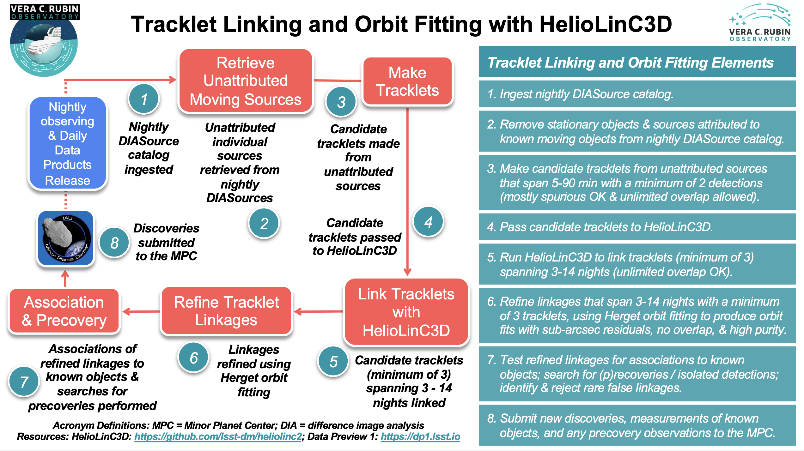

.. _moving-linking:

#############################################
Small body tracklet linking and orbit fitting
#############################################

Small body tracklet linking and orbit fitting is done with the `HelioLinC3D` package.

The goal of the HelioLinC3D software package is to discover previously unknown asteroids amid the millions of new difference-image detections every night.
The algorithm identifies and links together little sequences of typically 6-20 sources that could comprise repeated detections of a new asteroid moving in its orbit around the Sun.

These sets of detections (called 'linkages') are formed in two stages.
First, ‘tracklets’ of observations are identified, where a tracklet comprises at least two images within a single night.
Next, tracklets from multiple nights are linked together.
LSST specifications state that a valid linkage must include at least three tracklets, each from a different night, and all within a 14-day period.
Each linkage meeting these criteria constitutes a candidate asteroid discovery.

After the full set of candidate linkages has been produced, they are culled and refined through orbit fitting and other analyses.
The final product is a purified set of thousands of non-overlapping linkages, each of which has an orbit-fit with sub-arcsecond astrometric residuals.
These linkages -- each comprising a probable new asteroid discovery -- are submitted to the `Minor Planet Center <https://minorplanetcenter.net>`_ (MPC) for confirmation and publication.
The tracklet linking and orbit fitting procedure is illustrated in the infographic provided above.

