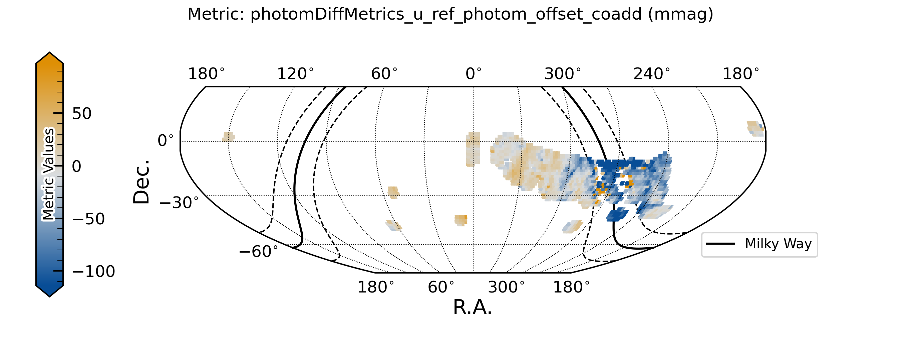
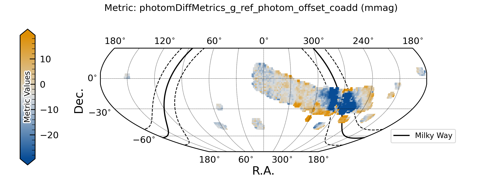
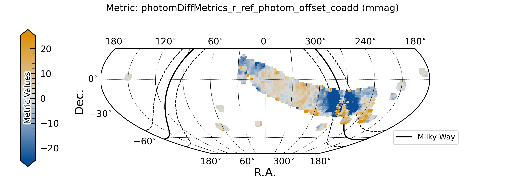
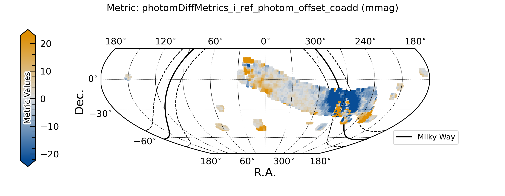
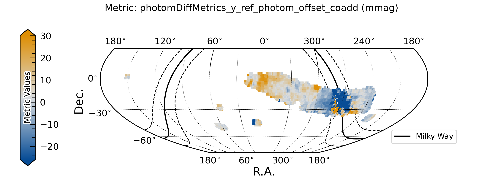

##################################
Data Quality: Photometry
##################################

The following plots show the photometric offset between calibration stars and the reference catalog.

    Figure 1: Photometric offset between calibration stars and the reference catalog, in u band. 

    Figure 1: Photometric offset between calibration stars and the reference catalog, in g band. 

    Figure 1: Photometric offset between calibration stars and the reference catalog, in r band. 

    Figure 1: Photometric offset between calibration stars and the reference catalog, in i band. 

    Figure 1: Photometric offset between calibration stars and the reference catalog, in z band. 

    Figure 1: Photometric offset between calibration stars and the reference catalog, in y band. 

