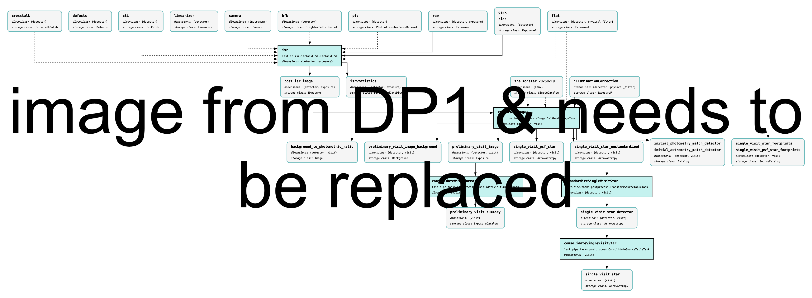
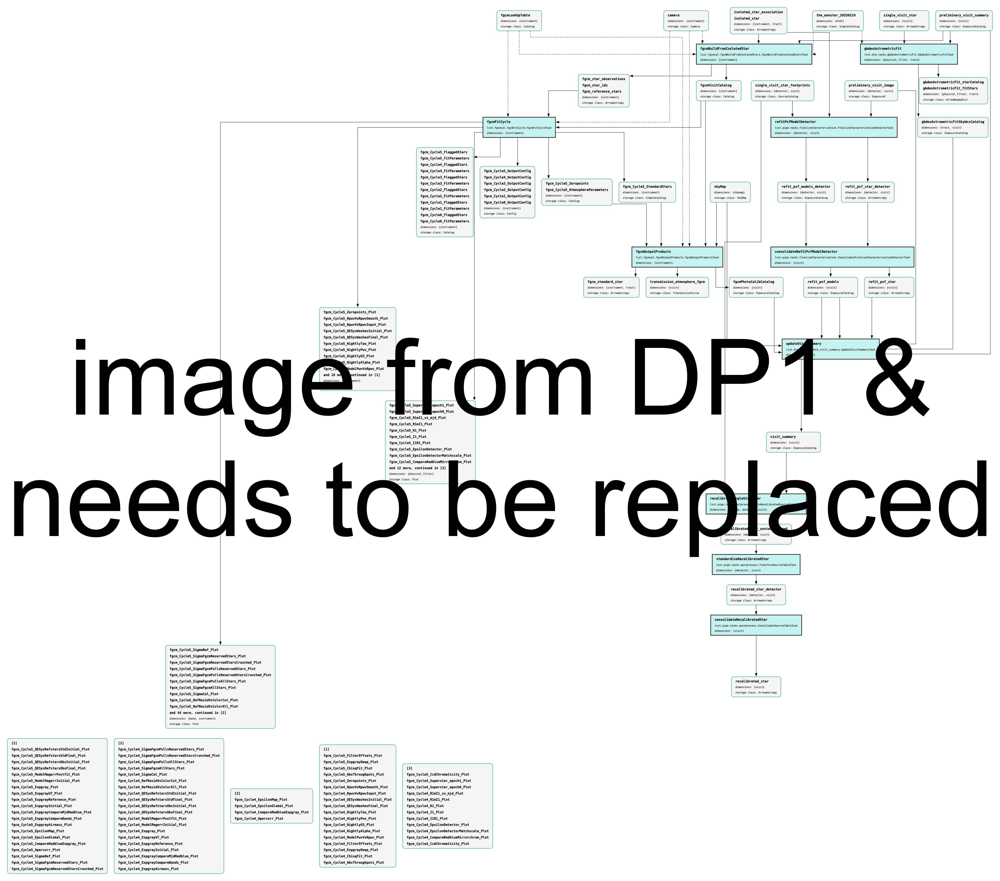
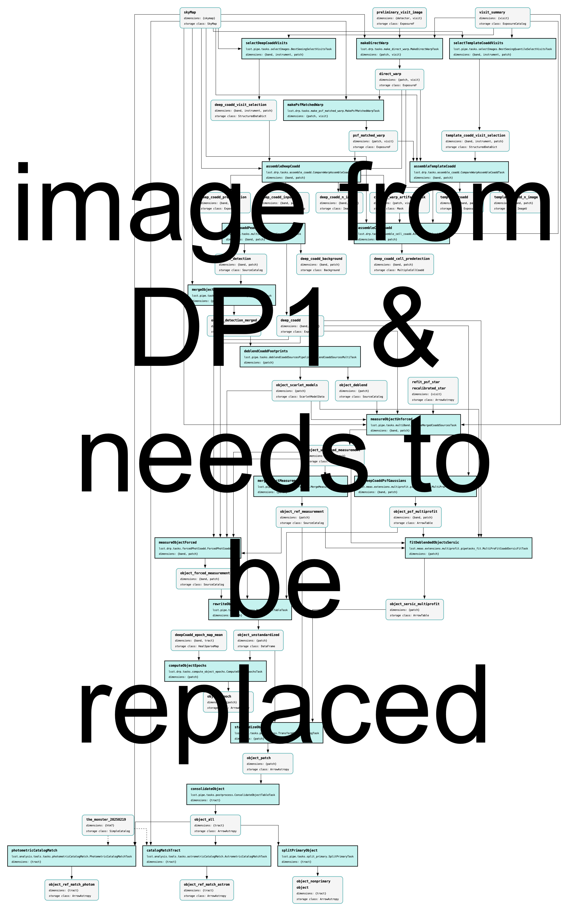
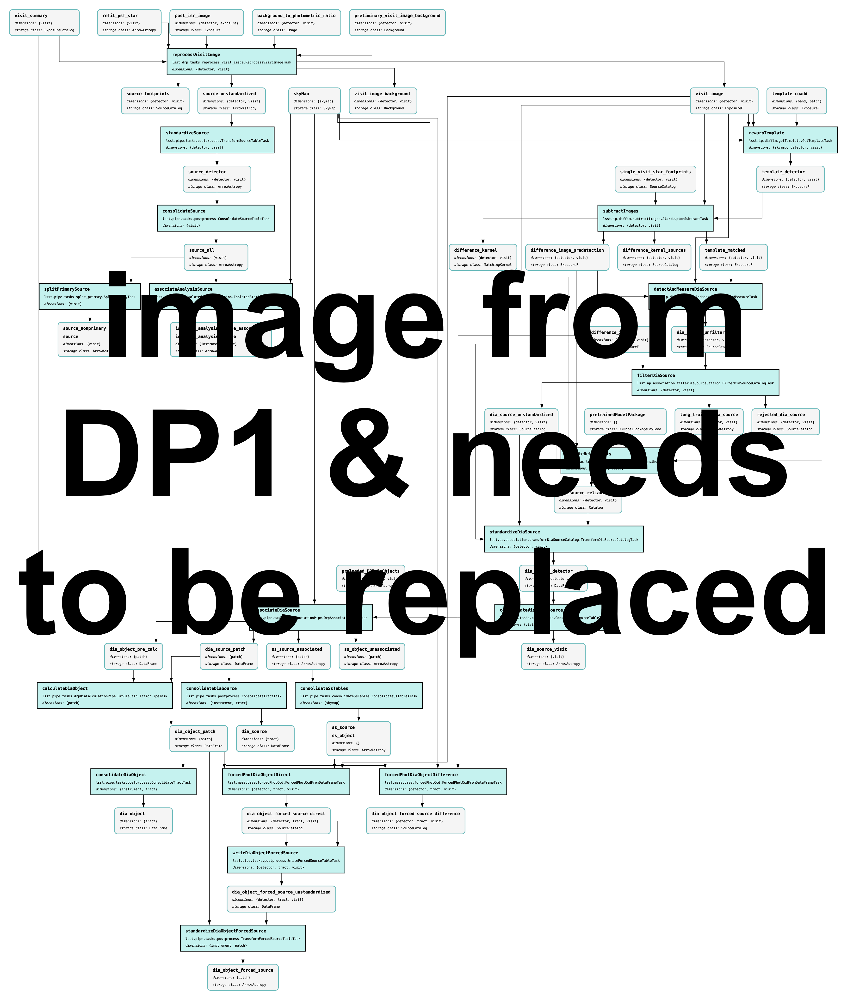

.. _processing_summary:

#######
Summary
#######

Pipeline graphs visualize the four stages of Data Release Processing (DRP).
Each stage finishes with all the analysis needed to validate that it is complete, and move onto the next stage.
DRP tasks designed to compute metrics and make plots are omitted from these graphs for simplicity.
Note that not every product in the graph is a final user-facing image or catalog (some are intermediate products).

Stage 1
=======

:ref:`Instrument Signature Removal (ISR) <isr>` applies the input :ref:`calibration data products <calibrations>` to :ref:`raw images <images-raw>` and produces "post_isr_images", which are matched to the :doc:`/processing/calibration/monster` to derive the initial single-detector calibrations.
Then, analysis is performed on the initial calibrated single-visit images in preparation for stage 2.

  **Figure 1:** Pipeline graph of DP2 DRP Stage 1, showing single visit processing steps.

:download:`Download the PDF for Stage 1 <images/DP2-stage1-figure.pdf>`.

Stage 2
=======

Multi-visit and full-visit recalibration, including :ref:`FGCM photometric calibration <photometric>` and :ref:`gbdes astrometric calibration <astrometric>`.

  **Figure 2:** Pipeline graph of DP2 DRP Stage 2, showing recalibration steps.

:download:`Download the PDF for Stage 2 <images/DP2-stage2-figure.pdf>`.

Stage 3
=======

The coaddition of single-visit images to create :ref:`deep_coadd <images-deep-coadd>` images.
These coadds are then processed through detection, deblending, and measurement algorithms, which results in the :ref:`Object <catalogs-object>` table.

  **Figure 3:** Pipeline graph of DP2 DRP Stage 3, showing coaddition steps.

:download:`Download the PDF for Stage 3 <images/DP2-stage3-figure.pdf>`.

Stage 4
=======

The :ref:`Source <catalogs-source>` catalogs are created (measurements for detections in single-visit images), and :ref:`difference imaging <dia>` and :ref:`detection-forcephot` are performed.

  **Figure 4:** Pipeline graph of DP2 DRP Stage 4, showing variability measurement steps.

:download:`Download the PDF for Stage 4 <images/DP2-stage4-figure.pdf>`.
