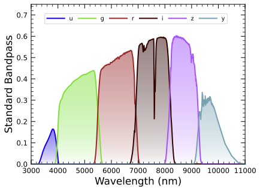

.. _bandpasses:

##########
Bandpasses
##########

LSSTComCam filter bandpasses.

.. (This line commented-out for now) |bandpasses_doi| [:download:`BibTeX </bib/butler-bandpasses.bib>`]

Access
======

The bandpasses are accessible via the Butler.

Butler
------

Examples of dataset types:

* ``('standard_passband', {band, instrument}, ArrowAstropy)``

Description
===========

There are six ``standard_passband`` datasets in the DP1 Butler repository -- one for each of the *ugrizy* bands.
These datasets tabulate the full-system transmission of the six LSSTComCam filters as a function of wavelength, which was used as a reference for the LSSTComCam DP1 photometry.
The ``standard_passband`` dataset is keyed by band and is in Astropy Table format.

    Figure 1: The LSSTComCam standard bandpasses, illustrating full system throughput as a function of wavelength.

Tutorials
---------

**UPDATE FOR DP2**

.. (This line commented-out for now) See the :ref:`200-level notebook <notebook-200>` tutorial on filter bandpasses for an example of how to retrieve them from the Butler.

