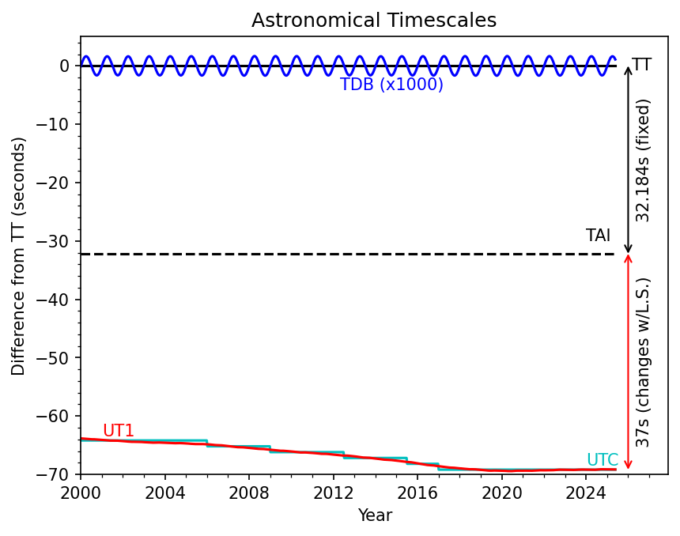

.. _time_measurements:

#################
Time Measurements
#################

Time measurements are in International Atomic Time (TAI).

The data products that contain time measurements include the mean epoch of an object in each of the ugrizy-band coadds (e.g., ``r_epoch``) in the :doc:`Object </products/catalogs/object>` catalog, ``expTime``, ``obsStart``, ``expMidptMJD``, ``expMidpt``, and ``obsStartMJD`` in both the :doc:`Visit </products/catalogs/visit>` and :doc:`VisitDetector </products/catalogs/visit_detector>` catalogs, ``time_processed`` in the :doc:`DiaSource </products/catalogs/dia_source>` catalog, and the ``discoverySubmissionDate`` in the :doc:`SSObject </products/catalogs/ss_object>` catalog.

The ``epoch`` provided in the :doc:`MPCORB </products/catalogs/mpcorb>` catalog is the only time measurement that is not measured in TAI, but Terrestrial Time (TT).

Time scale definitions
======================

TAI is a weighted average of the time kept by more than 450 atomic clocks in over 80 national laboratories worldwide that are combined by the International Bureau of Weights and Measures (BIPM, France) to calculate the most stable time scale possible.

TAI differs from UTC (Coordinated Universal Time) by an integral number of seconds (currently 37) through the addition of "leap seconds" used to keep UTC within 0.9 seconds of UT1.

Universal Time (UT or UT1) is a time standard based on Earth's rotation. UT1 is computed from a measure of the Earth's angle with respect to the International Celestial Reference Frame (ICRF), called the Earth Rotation Angle (ERA), which is linearly scaled to match historical definitions of mean solar time at 0° longitude.

TAI differs from Terrestrial Time (TT) by a fixed TT-TAI=32.184 sec. Terrestrial Time (TT) is an astronomical time standard defined by the International Astronomical Union, primarily for time measurements of astronomical observations made from the surface of Earth, defined such that the unit of TT is the SI (International System on Units) second at mean sea level.

Finally, TDB (or barycentric dynamical time) is a relativistic coordinate time scale that applies to the Solar-System-barycentric reference frame, hence it is a dynamical time at the barycenter. TDB differs from TT in periodic terms, with a difference of at most 2 milliseconds. TDB is intended to account for time dilation when calculating orbits and astronomical ephemerides of planets, asteroids, comets and interplanetary spacecraft in the Solar System.

    Figure 1: Differences in the various astronomical time scales over the past 25 years (credit: Tim Lister).

Converting between time scales
==============================

To convert between time scales, the astropy python library has helpful resources.

Using the astropy ``Time`` object, declare times from TAP catalog queries as e.g., ``t = Time(60623, format='mjd', scale='tai')``. Conversion to a different time scale and format can be done using, e.g., ``t.utc.datetime`` or ``t.tt.jd``. It is advised to always include a ``scale='xxx'`` when defining astropy ``Time`` objects, since astropy assumes times are in UTC.

