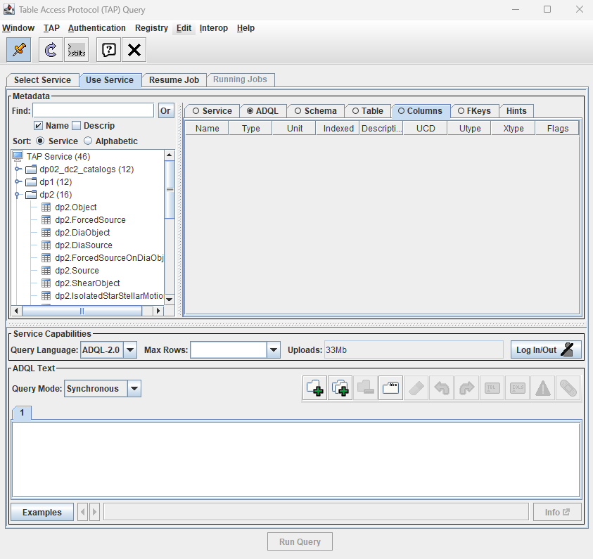
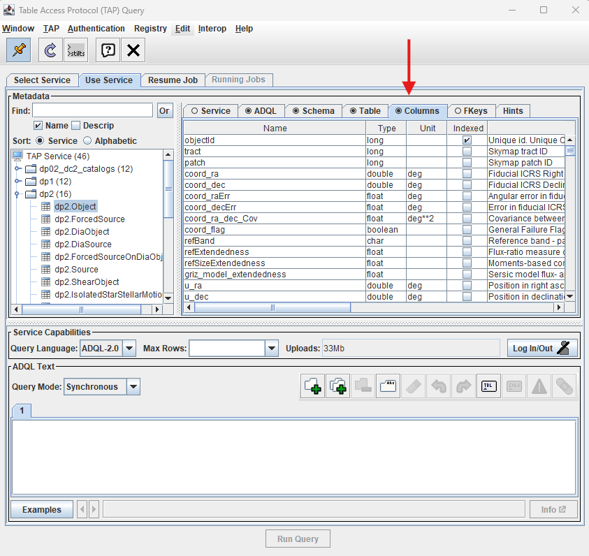
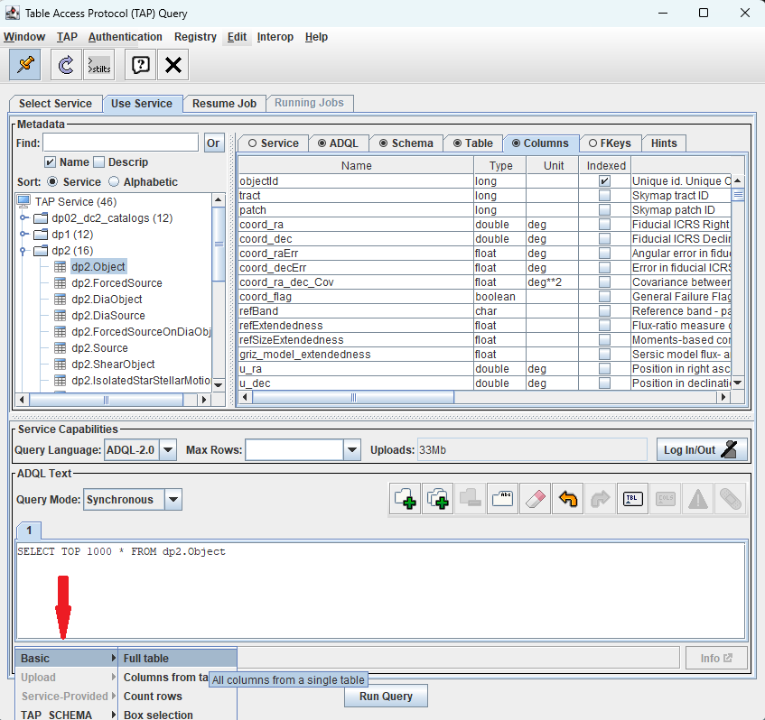
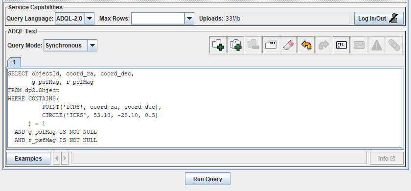
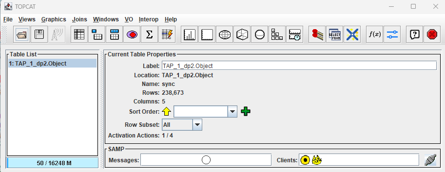
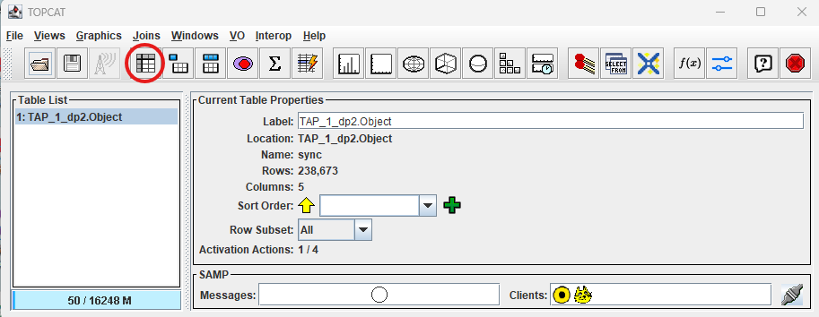
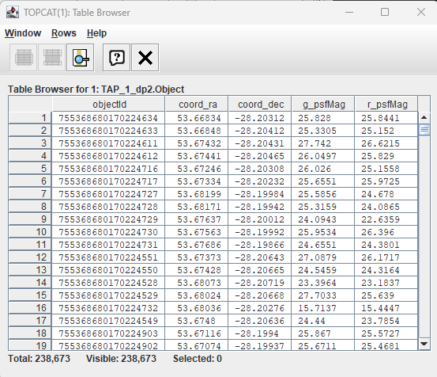

.. _api-101-1:

#####################################
101.1. How to get started with TOPCAT
#####################################

For the API Aspect of the Rubin Science Platform at data.lsst.cloud.

**Data Release:** DP1

**Last verified to run:** 2026-02-02

**Learning objective:** This tutorial provides a basic guide to set up `TOPCAT <http://www.star.bris.ac.uk/~mbt/topcat/>`_
to explore DP1.

**LSST data products:** The DP1 catalogs within the Rubin Science Platform (RSP) Table Access Protocol (TAP) service.

**Credit:** Based on tutorials developed by the Rubin Community Science team. Please consider acknowledging them if this
tutorial is used for the preparation of journal articles, software releases, or other tutorials.

**Get Support:** Everyone is encouraged to ask questions or raise issues in the `Support Category <https://community.lsst.org/c/support/6>`_
of the Rubin Community Forum. Rubin staff will respond to all questions posted there.

**1. Create an RSP access token.**

See the `Creating user tokens webpage <https://rsp.lsst.io/guides/auth/creating-user-tokens.html>`_
for a step-by-step guide for creating an RSP access token.  It is recommended that the token you create has the
following properties:  a name that includes "TOPCAT" as a substring, a scope of ``read:tap``,
and no expiration date.) The token will only be visible once.
*You must cut-and-paste the token to a secure file for future use.*
A new token is not needed for every TOPCAT session; the token can be reused, but it must be kept secure.

.. Important::
    **Note that tokens should be treated like passwords:  they should not be shared with others.
    Take precautions to keep tokens secure.  Never store tokens in git-tracked files.**

**2. Start up TOPCAT on your own computer.**

See `TOPCAT homepage <http://www.star.bris.ac.uk/~mbt/topcat/>`_ for download and install instructions.

**3. Click on "Table Access Protocol (TAP) Query" under the “VO” menu.**

This will open up a separate Table Access Protocol (TAP) Query window.

.. figure:: images/api-101-1-1.png
    :name: api-101-1-1
    :alt: A screenshot of the main TOPCAT window with the Table Access Protocol item
	  highlighted by the cursor under the VO drop-down menu.

    Figure 1:  The main TOPCAT window, with the "VO" menu pulled down and the "Table Access Protocol (TAP) Query" highlighted.

**4. In “TAP URL”, at the bottom of the window, fill in the relevant TAP service address, then click the “Use Service” button.**

For DP1, use ``https://data.lsst.cloud/api/tap``.

.. figure:: images/api-101-1-2.png
    :name: api-101-1-2
    :alt: A screenshot of the the Table Access Protocol (TAP) Query window in which the value
          for the TAP URL has been filled in with the URL
	  https://data.lsst.cloud/api/tap .  A blue oval indicates the location of the
          Selected TAP Service panel in the window.

    Figure 2:  The Table Access Protocol (TAP) Query window with the location of the "Selected TAP Service" panel indicated by a blue oval.

**5. Populate the "Authenticate" window.**

Fill in ``x-oauth-basic`` for the "User" and your security token for the "Password" and click "OK".

.. figure:: images/api-101-1-3.png
    :name: api-101-1-3
    :alt: A screenshot of the Authentication window. The user has been filled in with a value of x-oauth-basic,
	  and the password is shown (for security purposes) as a series of filled black circles.

    Figure 3:  The Authentication window with the values for the user and the password filled in.

**6. Note that the RSP TAP service is now accessible from your instance of TOPCAT.**

An indicator that the service is now accessible is that a list of DP1 tables available has appeared in the Metadata panel of the TAP Query window.

          The Table Access Protocol (TAP) Query window shows three panels, stacked vertically.  The
	  top panel is the Metadata panel, and it shows a list of DP1 schemas and tables that
	  are available to query.  The middle panel is the Service Capabilities panel, and it shows that
	  the available Query Language is ADQL-2.0.  The bottom panel is the ADQL Text panel, and it
	  indicates the current Mode is Synchronous; the bottom panel text box is currently empty.

    Figure 4:  The Table Access Protocol (TAP) Query window; a list of DP1 tables
    available for query can be be seen in the Metadata panel.

**7. In the left Metadata panel of the Table Access Protocol (TAP) Query window, click on the dp1.Object table.**

In the right Metadata panel, click the "columns" tabs to change the view.
Note that the column names, data types, units, and descriptions for the columns of the dp1.Object table are shown.

	  It appears the same as in Figure 4, but the dp1.Object table is highlighted
	  in the left-hand Metadata panel and the column names, data types, units, and
	  descriptions for the columns in the dp1.Object table are shown in the
	  right-hand Metadata panel.

    Figure 5:  The Table Access Protocol (TAP) Query window as in Figure 4, but here
    the dp1.Object table is highlighted in the left-hand Metadata panel and the
    column names, data types, units, and descriptions for the columns in the dp1.Object
    table are shown in the right-hand Metadata panel.

**8. Explore sample ADQL queries.**

Within the ADQL Text panel of the Table Access Protocol (TAP) Query window, select the Examples button located at the lower left and choose Full Table from the Basic menu.
A sample ADQL query will then be displayed in the text box. Figure 6 demonstrates a query that retrieves the top 1000 entries from the dp1.Object table.

This type of query is generally not recommended for routine use, as some tables contain a large volume of data.
The queries provided in the Examples menu are intended as starting templates and should be adapted within the ADQL text box to meet specific requirements,
or replaced with a predefined query (such as the one presented in Step 9).

	  It appears the same as in Figure 5, but the Example button has been clicked
	  and the Full Table menu item from the Basic menu item has been chosen and
	  highlighted.

    Figure 6:  The Table Access Protocol (TAP) Query window as in Figure 5, with
    the Full Table menu item from the Basic menu item chosen after clicking on
    the Examples button at the bottom of the ADQL Text panel.

**9. Avoid full-table queries. Construct a specific query to access information from the dp1.Object table.**

Because the dp1.Object table is large, it is good practice to always include spatial constraints and only retrieve necessary columns.

Search for objects within 0.5 degrees of the center of the Extended Chandra Deep Field South (ECDFS) field, RA, Dec =  53.13, -28.10 and retrieve g-band and r-band PSF magnitudes.
Copy the code block below and paste it into the ADQL text box, then click "Run Query".

.. code-block:: sql

  SELECT objectId, coord_ra, coord_dec,
         g_psfMag, r_psfMag
  FROM dp1.Object
  WHERE CONTAINS(
            POINT('ICRS', coord_ra, coord_dec),
            CIRCLE('ICRS', 53.13, -28.10, 0.5)
        ) = 1
    AND g_psfMag IS NOT NULL
    AND r_psfMag IS NOT NULL

	  It appears the same as in Figure 5 with the code block in the ADQL Text box.

    Figure 7:  The Table Access Protocol (TAP) Query window as in Figure 5, with
    the code block in the ADQL Text box.

**10. Note that a new table, TAP_1_dp1.Object, has appeared in the Table List panel of the main TOPCAT window.**

	  1. A row of icons along the top of the window.  2. A Table List panel on the left
	  of the window; this currently shows one table, called TAP_1_dp1.Object,
	  and it is highlighted.  3. A Current Table Properties panel on the right of the window.
	  4. A small SAMP panel just below the Current Table Properties panel.

    Figure 8:  The main TOPCAT window with a new table, TAP_1_dp1.Object, appearing in the Table List panel.

**11. Find the table of results in the "Table List" panel of the main TOPCAT window, and then click on the "Display table cell data" icon.**

It is the 4th icon from the left in the row of icons at the top of the main TOPCAT window (it looks like a table with the first row and first column grayed out).

	  1. A row of icons along the top of the window.  2. A Table List panel on the left
	  of the window; this currently shows one table, called TAP_1_dp1.CcdVisit,
	  and it is highlighted.  3. A Current Table Properties panel on the right of the window.
	  4. A small SAMP panel just below the Current Table Properties panel.
          The "Display table cell data" icon is indicated by a red circle.

    Figure 9:  As in Figure 8, but with the "Display table cell data" icon indicated by a blue circle.

**12. View the contents of the TOPCAT Table Browser window that has opened.**

This particular table contains 321,139 rows and 5 columns.  Vertical and horizontal scrollbars in this window permit viewing the full contents of the table.

	  called TAP_1_dp1.Object.

    Figure 10:  The Table Browser Window, showing the contents of the newly created table.

**13. Explore.**

At this stage, the Rubin DP1 data set can be further explored via TOPCAT.  A future tutorial
will showcase plotting Rubin DP1 data with TOPCAT plotting functions.

