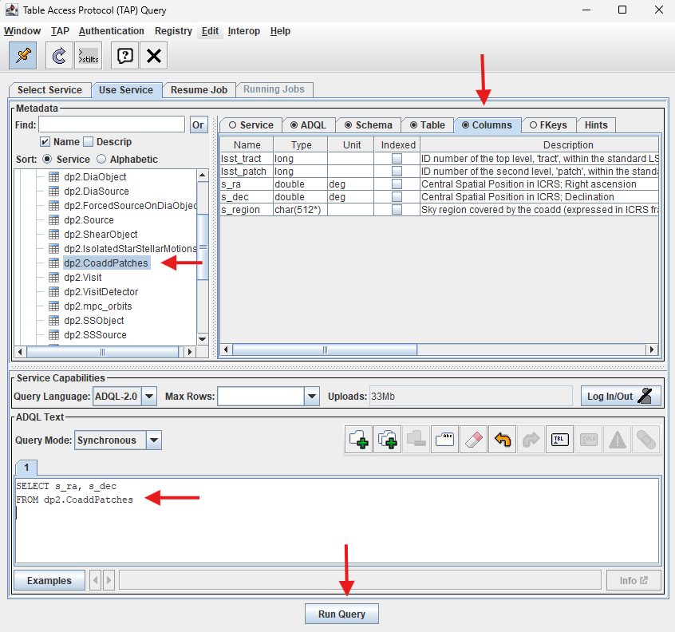
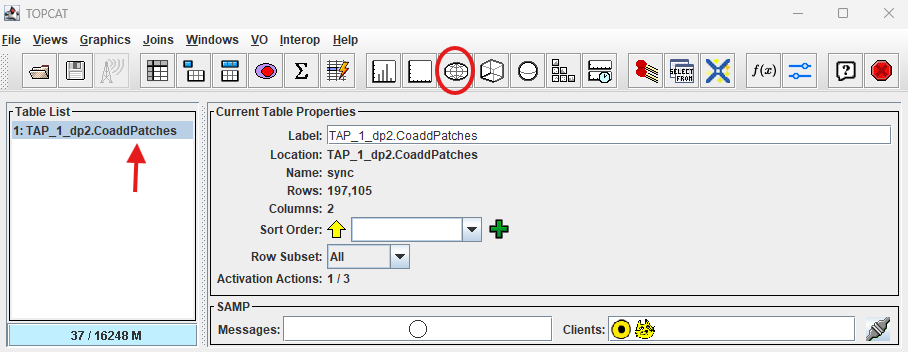
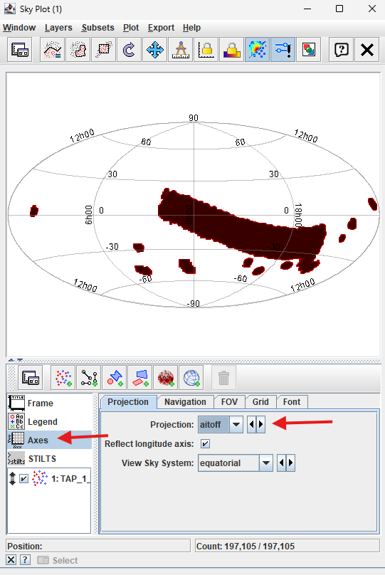
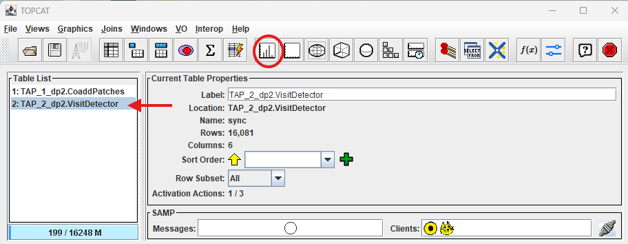
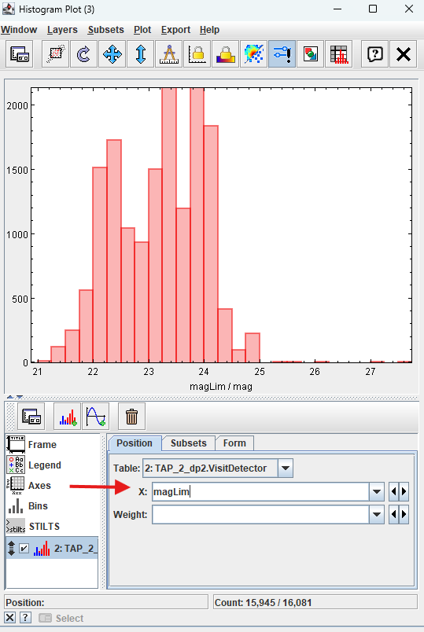
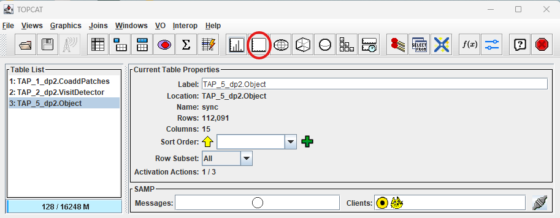
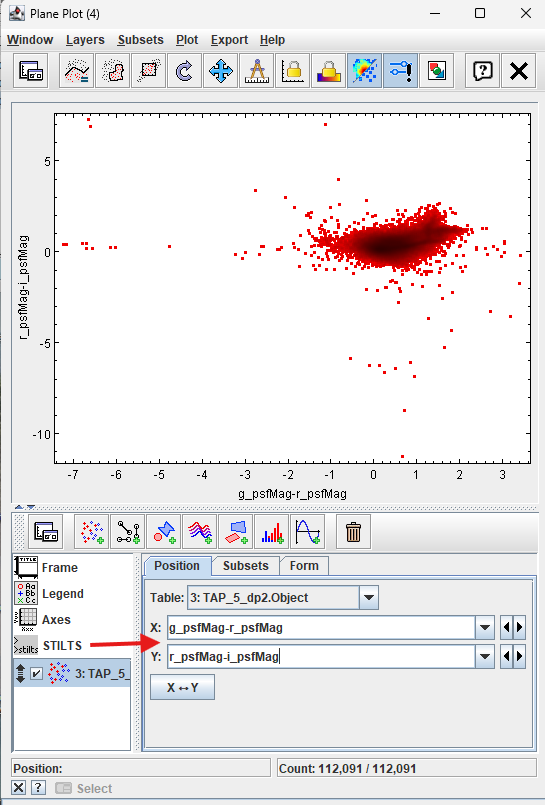

.. _api-101-2:

####################################
101.2. Plot catalog data with TOPCAT
####################################

For the API Aspect of the Rubin Science Platform at data.lsst.cloud.

**Data Release:** DP2

**Last verified to run:** 2026-08-07

**Learning objective:** This tutorial provides a basic guide to plotting data within `TOPCAT <http://www.star.bris.ac.uk/~mbt/topcat/>`_
to explore DP2.

**LSST data products:** The DP2 catalogs within the Rubin Science Platform (RSP) Table Access Protocol (TAP) service.

**Credit:** Based on tutorials developed by the Rubin Community Science team. Please consider acknowledging them if this
tutorial is used for the preparation of journal articles, software releases, or other tutorials.

**Get Support:** Everyone is encouraged to ask questions or raise issues in the `Support Category <https://community.lsst.org/c/support/6>`_
of the Rubin Community Forum. Rubin staff will respond to all questions posted there.

**1. Open TOPCAT and access DP2 Data.**

See `API Tutorial 101-1 <https://dp1.lsst.io/tutorials/api/api-101-1.html>`_ for instructions on how to access Rubin DP2 data with "Tool for OPerations on Catalogues And Tables" (TOPCAT).

**2. Create DP2 Skymap**

Create a skymap of the Data Preview 2 Dataset using TOPCAT and an `"aitoff" <https://en.wikipedia.org/wiki/Aitoff_projection>`_ projection.

**2.1 Use TAP Query window**

After starting TOPCAT and accessing the Rubin DP2 data through the VO protocol, click on "dp2.CoaddPatches" in the Table Access
Protocol (TAP) Query Metadata section (top left arrow).
Click on "Columns" in the right panel (top right arrow) to see a description of each of the columns in this table.

	  TOPCAT window to add ADQL query.

    Figure 1:  TAP Query window with dp2.CoaddPatches table selected, column descriptions visible, and ADQL query in ADQL Text box.

**2.2 Run ADQL query**

Within the ADQL Text panel of the Table Access Protocol (TAP) Query window (Figure 1 bottom left arrow), copy the ADQL query below and paste into the ADQL text window, then click "Run Query" (Figure 1 bottom center arrow).
This query will retrieve the RA/DEC of each of the Coadd Patches within DP2. A temporary window called "Load New Table" will appear with a status bar showing query progress.
The window will close when the table is loaded and a new table name will appear in the main TOPCAT window. The query should take a few seconds to run.

**NOTE: It is recommended to construct a TAP query using spatial constraints but that is not necessary in this case because the dp2.CoaddPatches table is small.
See examples of queries with spatial constraints in API 101-1 (linked above) or step 3.1 below.**

.. code-block:: sql

  SELECT s_ra, s_dec
  FROM dp2.CoaddPatches

**2.3 Create Skymap of DP2 fields using the Sky plotting window and Aitoff projection**

A new window will open which shows the "Table List" (red arrow) and "Current Table Properties". Notice this table has 197,105 rows for each of the Coadd Patches and 2 columns (for RA and DEC).
To create a Skymap of data returned from the query, click on the "Sky plotting window" (red circle).

    Figure 2:  Click "Sky plotting window".

The default plot shows the seven fields contained in Data Preview 2 on a rotating globe.
Click on "Axes", then select "aitoff" from the "Projection" drop-down menu to change the skymap.
Click the "X" in the upper right-hand corner to close the image.

    Figure 3:  Skymap of dp2 fields on aitoff projection.

**3. Create Histogram of dp2.VisitDetector table limiting magnitude in the ECDFS field**

Create a histogram in TOPCAT by using the Histogram button.

**3.1 Run ADQL query on dp2.VisitDetector table and plot histogram**

Return to the Table Access Protocol (TAP) Query window to execture a new ADQL query.
Copy the ADQL query below, add it to the window in the "ADQL Text" box (see Figure 1) and click "Run Query".
A temporary "Load New Table" window will appear. A new table will appear in the main TOPCAT window (see Figure 4).

.. code-block:: sql

  SELECT visitId, ra, dec, band, seeing, magLim
    FROM dp2.VisitDetector
  WHERE CONTAINS(POINT('ICRS', ra, dec),CIRCLE('ICRS', 53.16, -28.1, 1.0))=1

Notice a new table (red arrow) is available in the TOPCAT window. Click the histogram button (red circle) to create a histogram.

    Figure 4:  New table from dp2.VisitDetector query.

**3.2 Plot Histogram**

In the "Histogram Plot" window the default histogram will be plotted from the first column in the table (in this case the "ra").
To change the histogram value, select "magLim" from the "X:" drop-down menu (see Figure 5).
To close the histogram, click the "X" in the upper right-hand corner of this window.

    Figure 5:  Histogram of magLim for the ECDFS field in dp2.VisitDetector table.

**4. Create Color-Color Diagram (CCD) with TOPCAT**

Create a CCD in TOPCAT by using the "Plane plotting window".

**4.1 Run query**

Return to the Table Access Protocol (TAP) Query window to begin a new ADQL query.
Copy the following query into the "ADQL Text" box in the TAP Query window (see figure 1), then click "Run Query".
The "Load New Table" temporary window will appear and a new table will appear in the TOPCAT window when the search is complete (see Figure 6).
This table might take a few seconds to load.

.. code-block:: sql

  SELECT coord_ra, coord_dec,
         g_psfMag, i_psfMag, r_psfMag,
         g_cModelMag, i_cModelMag, r_cModelMag,
         g_psfFlux, g_psfFLuxErr,
         r_psfFlux, r_psfFLuxErr,
         i_psfFlux, i_psfFLuxErr,
         refExtendedness
  FROM dp2.Object
  WHERE CONTAINS(POINT('ICRS', coord_ra, coord_dec), CIRCLE('ICRS', 53, -28, 1))=1
        AND g_psfFlux/g_psfFluxErr > 5
        AND r_psfFlux/r_psfFluxErr > 5
        AND i_psfFlux/i_psfFluxErr > 5

**4.2 Create CCD**

Click on the "Plane plotting window" shown in Figure 7 with the blue circle.

    Figure 6:  Plane plotting window button (red circle).

Add ``g_psfMag-r_psfMag`` in the "X:" selection box and ``r_psfMag-i_psfMag`` in the "Y:" box (red arrow), then hit "Enter".

    Figure 7:  Color-Color Diagram of ECDFS field.

Notice there is a large concentration of stars with some outliers.
Place your mouse pointer over the concentration of stars and use the scroll function to zoom in.
