.. _api-101-3:

####################################################################
101.3. How to use TOPCAT and SIA to view DP1 images in ds9 or Aladin
####################################################################

**Data Release:** DP1

**Last verified to run:** 2026-06-12

**Learning objective:** This tutorial provides a basic guide to using `TOPCAT <http://www.star.bris.ac.uk/~mbt/topcat/>`_ with the
`Simple Image Access (SIA) <https://www.ivoa.net/documents/SIA/>`_ protocol and sending images directly to `SAOImageDS9 <https://ds9.si.edu/doc/install.html>`_ and `Aladin <https://aladin.cds.unistra.fr/>`_ to explore DP1 image data.

**LSST data products:** The DP1 catalogs and image data products within the Rubin Science Platform (RSP).

**Credit:** Based on tutorials developed by the Rubin Community Science team. Please consider acknowledging them if this
tutorial is used for the preparation of journal articles, software releases, or other tutorials.

**Get Support:** Everyone is encouraged to ask questions or raise issues in the `Support Category <https://community.lsst.org/c/support/6>`_
of the Rubin Community Forum. Rubin staff will respond to all questions posted there.

**1. Open TOPCAT and SAOImageDS9 or Aladin**

See `API Tutorial 101-1 <https://dp1.lsst.io/tutorials/api/api-101-1.html>`_ for instructions on how to access Rubin DP1 data with "Tool for OPerations on Catalogues And Tables" (TOPCAT).
Obtain an authentication token that includes  **read: image**.
Follow download and install instructions at `DS9 <https://ds9.si.edu/doc/install.html>`_ and `Aladin download <https://aladin.cds.unistra.fr/AladinDesktop/#Download>`_.
Screenshots for this tutorial were generated on a Windows computer using TOPCAT Version 4.10-7, SAOImageDS9 Verions 8.6, and Aladin (v 12.060).
Access to image‑retrieval features may depend on running an up‑to‑date version of these software programs and problems encountered during the workflow may be related to installation version or outdated software.
The steps within TOPCAT for viewing an image in **ds9** or **Aladin** are identical; the only difference is which viewer is opened at the start of the tutorial.

Open TOPCAT (minimum v4.10-4) and DS9 or TOPCAT and Aladin software programs.

**2. Verify TOPCAT and DS9 or TOPCAT and Aladin are open and communicating**

On the TOPCAT menu bar, click Interop, SAMP Status (Figure 1) to verify TOPCAT and DS9 (or TOPCAT and Aladin) are connected.
Note: for this tutorial, ds9 was used to generate all screenshots, except for section 4 where an image is displayed in Aladin.
As stated before, TOPCAT commands are identical for either option.

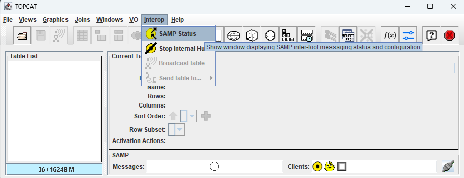

    Figure 1: TOPCAT window with Interop menu item selected.

A pop up window will open (Figure 2) showing SAMP Control active clients: Hub, topcat, and ds9, or Hub, topcat, and Aladin (depending on which software package was used).
This step will verify TOPCAT has the ability to send information to ds9 or Aladin.

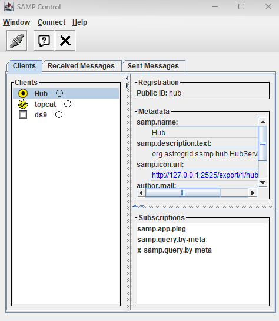

    Figure 2: SAMP Control window showing DS9 client is active.

If clients are active, no action is needed. Close SAMP control window by clicking the “X” in the upper right-hand corner of the window.

**2.1 Start a Simple Image Access (SIA) Query**

In the main TOPCAT window, click the VO menu item, then select Simple Image Access (SIA) Query.

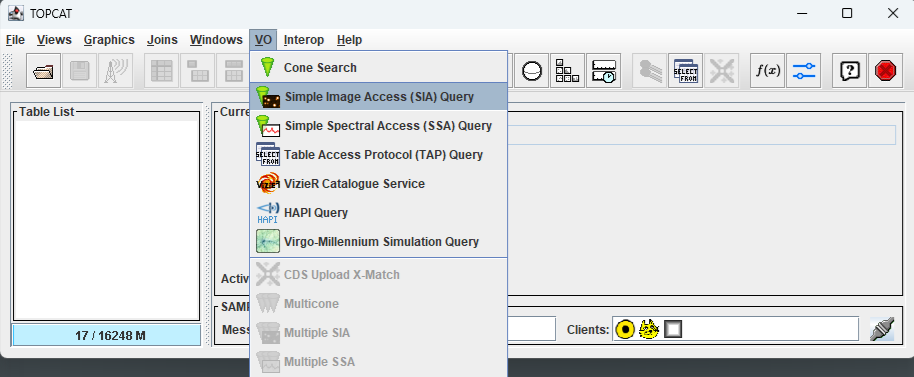

    Figure 3: Open a SIA query dialog box.

**2.2 Input search parameters**

At the bottom of the window, in the SIA Parameters (Figure 4) section of the Simple Image Access (SIA) Query window:

-	 add https\://data.lsst.cloud/api/sia/dp1/query into SIA URL:
-	Change SIA Version:  to 2.0 by using the drop down menu
-	Input 53.076 degrees into the RA: box and -28.110 degrees into the Dec: box (coordinates for the ECDFS field)
-	Change Angular Size: to 0.5 degrees
-	Click OK

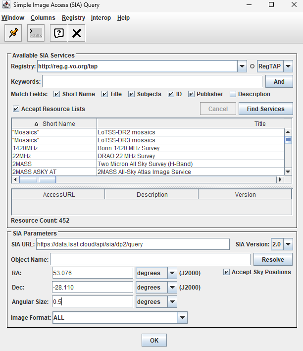

    Figure 4: Open a SIA query dialog box with appropriate SIA Parameters.

**2.3 Add authentication credentials**

Add the credentials created during API Tutorial 101, “How to get started with TOPCAT” (linked above)
(Note: click `Creating user tokens webpage <https://rsp.lsst.io/guides/auth/creating-user-tokens.html>`_ for instructions to get a token and create a token with "read:images").
Press Authenticate (Figure 5).

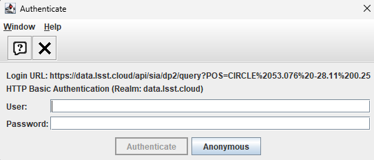

    Figure 5: Add authentication information obtained from tutorial “101.1 How to get started with TOPCAT”.

**2.4 TOPCAT will load the ObsCore table**

TOPCAT will retrieve the relevant sections of the ObsCore table (Figure 6).  The table retrieved by TOPCAT has 18,118 rows and 37 columns.

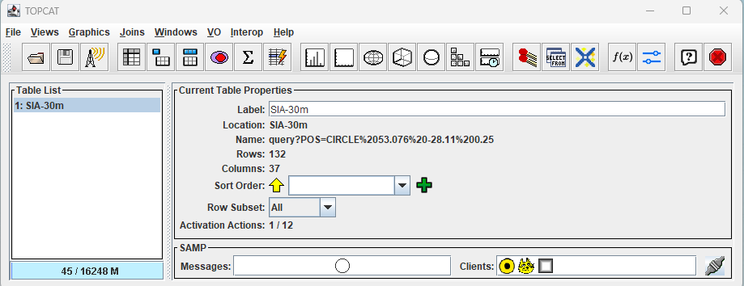

    Figure 6: Main TOPCAT window with data table loaded.

**2.5 Tell TOPCAT how to send data to ds9**

Click the "Display actions invoked when rows are selected" button (resembles a ladder with a lightning bolt) (Figure 7), to open the TOPCAT: Activation Actions window.

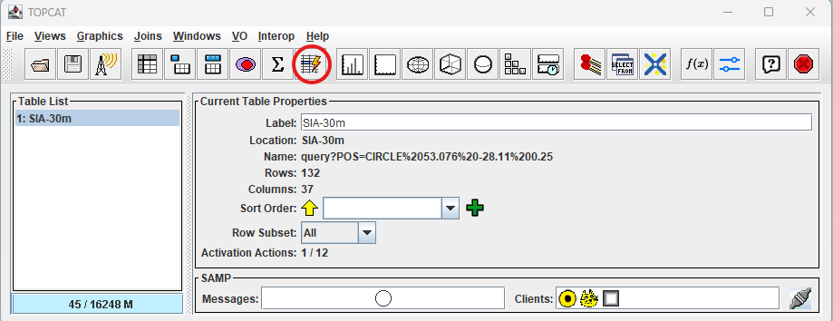

    Figure 7: Click Display actions invoked button to open the activation actions window.

**2.6  Click View URL**

Click the "View URL" option (Figure 8). (Note: older versions of TOPCAT might need to use "Send FITS Image" or "View Datalink Table" options).

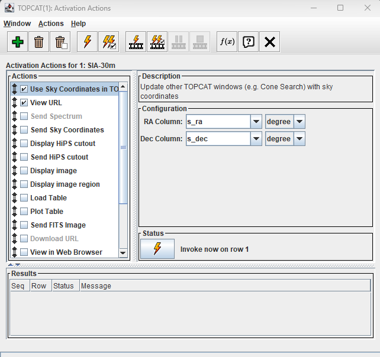

    Figure 8: Click View URL.

**2.7 Click Display table cell data**

Click on the "Display table cell data" button (Figure 9) to open the TOPCAT: Table Browser window (Figure 10).
Use the scroll bar on the side to scroll down the table and select a row that has calibration level 2 for the ECDFS field.
Row 6915 is selected in Figure 10.  A new window will open entitled View Datalink Table (Figure 11).

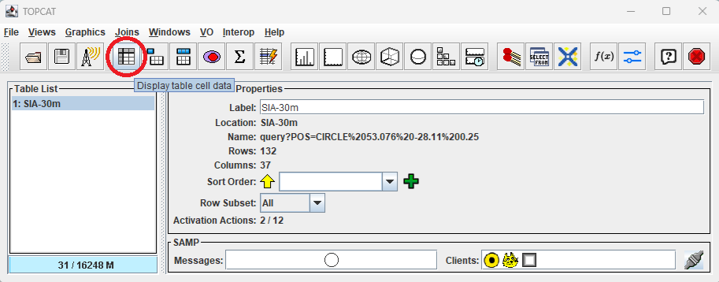

    Figure 9: Click Display table cell data button to open the TOPCAT: Table Browser.

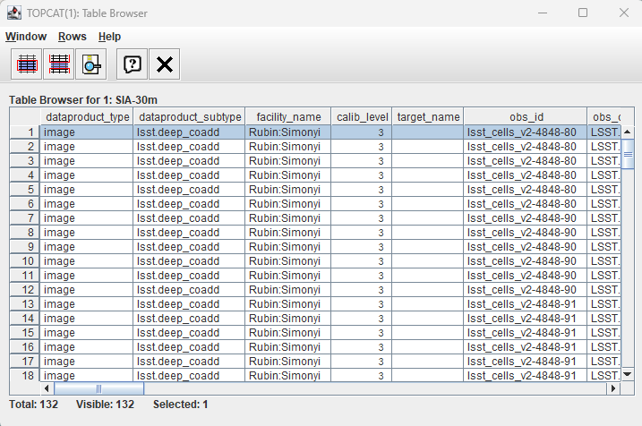

    Figure 10: Use scroll bar on the right to find an image with calibration level 2 within the ECDFS field. Click a row to open the View Datalink Table window.

**2.8 Click Send FITS Image from the Action: drop down**

Within the "View Datalink Table" window, click the dropdown menu for Action: (located at the bottom of Figure 11). Select "Send FITS Image", then click "Invoke".

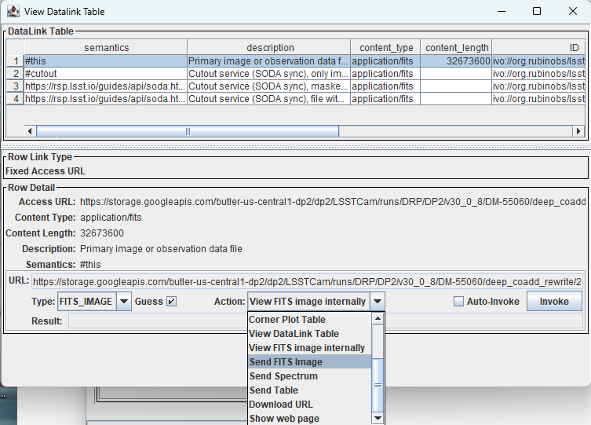

    Figure 11: Use the Action dropdown menu and select Send FITS Image.

**3. Image sent to ds9, change scale to view**

After clicking “Invoke” and a brief retrieval delay, the image is forwarded to ds9 for display.
Note: To improve image visibility, ``scale`` may need to be changed to ``zscale`` (Figure 12).
Clicking on additional rows in the TOPCAT: Table Browser window will open additional images if Auto-Invoke is selected.

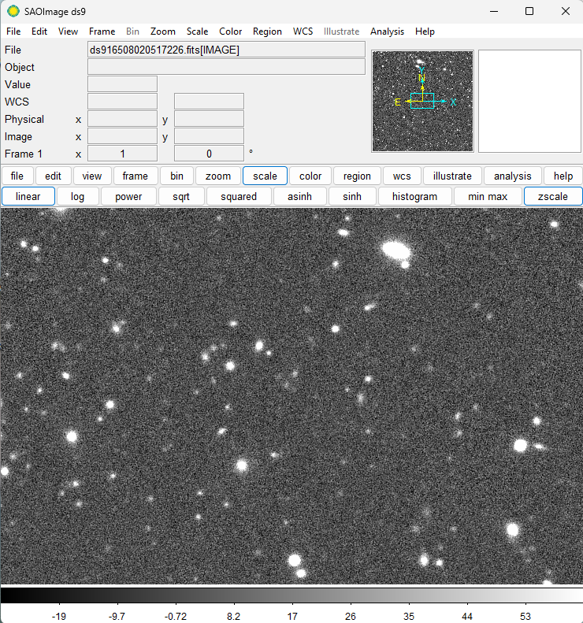

    Figure 12: Click scale and zscale in the ds9 window to view the image.

**4. Image sent to Aladin**

If using Aladin for image display, after completing step 2.8 (listed above), the following image will appear in Aladin (Figure 13). Use Aladin controls to scale or zoom within the image.

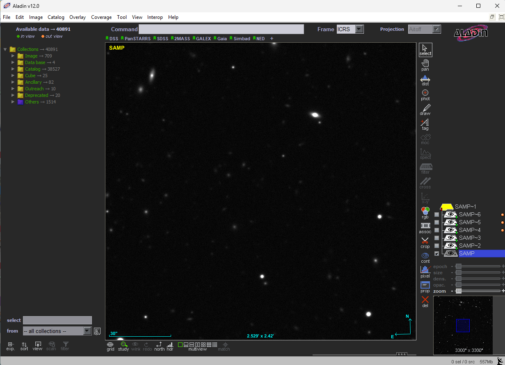

    Figure 13: DP1 image displayed in Aladin.

