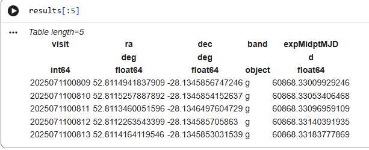

.. _api-102-1:

#################################################
102.1. How to get started with PyVO using TAP
#################################################

For the API Aspect of the Rubin Science Platform at data.lsst.cloud.

**Data Release:** DP1

**Last verified to run:** 2026-02-18

**Learning objective:** Query Rubin DP1 catalogs using the Table Access Protocol (TAP) with PyVO from a Python environment.

**LSST data products:** DP1 Visit catalogs accessed via the Rubin Science Platform TAP service.

**Credit:** Developed by Andrés A. Plazas Malagón and the Rubin Community Science Team (CST), and based on tutorials developed by the CST. Please consider acknowledging them if this tutorial is used for the preparation of journal articles, software releases, or other tutorials.

**Get Support:** Everyone is encouraged to ask questions or raise issues in the `Support Category <https://community.lsst.org/c/support/6>`_ of the Rubin Community Forum. Rubin staff will respond to all questions posted there.

Introduction
------------

This tutorial demonstrates how to access Rubin DP1 catalog data programmatically using the API Aspect of the Rubin Science Platform. The tutorial uses the Python Virtual Observatory (PyVO) package to authenticate with the Rubin Table Access Protocol (TAP) service and execute an asynchronous Astronomical Data Query Language (ADQL) query.

This workflow is suitable for users who prefer scripted or automated access to Rubin data from a local Python environment or from cloud-based environments such as Google Colab. Familiarity with basic Python syntax is assumed.

Related tutorials describe catalog access via graphical tools such as TOPCAT or interactive analysis in the Notebook Aspect of the Rubin Science Platform.

1. Create an RSP access token
-----------------------------

Create an RSP access token following the instructions on the `Creating user tokens webpage <https://rsp.lsst.io/guides/auth/creating-user-tokens.html>`_

Configure the token with the following properties:

- Include ``pyvo`` or ``tap`` in the token name.
- Select the ``read:tap`` scope.
- No expiration date.

Copy the token to a secure location. The token will not be shown again.

.. Important::

   Treat tokens like passwords.
   Do not share them and do not store them in version-controlled files.

2. Install and import the Python packages
-----------------------------------------

Install the required Python packages, ``PyVO`` and ``requests``, in the chosen environment (for example, in a local computer or in a Google Colab notebook).
See `the PyVO homepage <https://pyvo.readthedocs.io/en/latest/>`_ and `the "requests" documentation <https://requests.readthedocs.io/en/latest/>`_ for download and install instructions.

Note that in certain environments like Google Colab you may have to re-install these packages for each session.

Import the required packages.

.. code-block:: python

   import pyvo
   import requests

3. Store the access token
-------------------------

Store the access token in a Python variable or environment variable.

Read the token from an environment variable (recommended):

.. code-block:: python

   import os

   token = os.environ["RSP_TOKEN"]

Alternatively, assign the token directly:

.. code-block:: python

   token = "YOUR_TOKEN"

4. Create an authenticated HTTP session
---------------------------------------

Create a persistent HTTP session and attach the access token using the ``Authorization`` header.

.. code-block:: python

   session = requests.Session()
   session.headers["Authorization"] = f"Bearer {token}"

This session ensures that all TAP requests are authenticated using the provided token.

5. Connect to the Rubin TAP service
-----------------------------------

Define the `Rubin ObsTAP service endpoint <https://data.lsst.cloud/api-aspect>`_ and initialize a PyVO TAP service object.

.. code-block:: python

   rsp_tap_url = "https://data.lsst.cloud/api/tap"
   service = pyvo.dal.TAPService(rsp_tap_url, session=session)

The TAP service object represents the remote catalog service and manages job submission and result retrieval.

6. Define the ADQL query
------------------------

Define an ADQL query that retrieves the ``visit`` table, as in `DP1 Notebook tutorial 201.10 <https://dp1.lsst.io/tutorials/notebook/201/notebook-201-10.html>`_

.. code-block:: python

   query = """
   SELECT visit, ra, dec, band, expMidptMJD
   FROM dp1.Visit
   WHERE CONTAINS(
         POINT('ICRS', ra, dec),
         CIRCLE('ICRS', 53.13, -28.10, 3)
       ) = 1
     AND band IN ('g', 'r')
   ORDER BY expMidptMJD ASC
   """

7. Submit and run the TAP job
-----------------------------

Submit the query as an asynchronous TAP job and start execution.

.. code-block:: python

   job = service.submit_job(query)
   job.run()

Wait for the job to complete or fail.

.. code-block:: python

   job.wait(phases=["COMPLETED", "ERROR"])
   print("Job phase:", job.phase)

If the job ends in an error state, raise the server-side exception.

.. code-block:: python

   if job.phase == "ERROR":
       job.raise_if_error()

8. Retrieve and inspect the results
-----------------------------------

Fetch the query results, convert them to an Astropy table, and print the length of the table.

.. code-block:: python

   results = job.fetch_result().to_table()
   print(len(results))

In this case, the length should be 467.

Optionally display the first few rows.

.. code-block:: python

   results[:5]

   Figure 1: Preview of the DP1 ``visit`` table query results returned by the TAP service.
