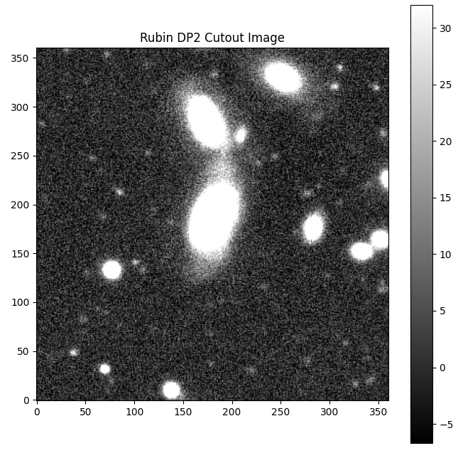

.. _api-102-3:

#################################################
102.3. How to get started with PyVO using SODA
#################################################

For the API Aspect of the Rubin Science Platform at data.lsst.cloud.

**Data Release:** DP1

**Last verified to run:** 2026-03-17

**Learning objective:** Create image cutouts from Rubin DP1 images using the Server-side Operations for Data Access (SODA) protocol with PyVO from a Python environment.

**LSST data products:** DP1 image cutouts accessed via the Rubin Science Platform SODA service.

**Credit:** Developed by Andrés A. Plazas Malagón and the Rubin Community Science Team (CST), and based on tutorials developed by the CST. Please consider acknowledging them if this tutorial is used for the preparation of journal articles, software releases, or other tutorials.

**Get Support:** Everyone is encouraged to ask questions or raise issues in the `Support Category <https://community.lsst.org/c/support/6>`_ of the Rubin Community Forum. Rubin staff will respond to all questions posted there.

Introduction
------------

This tutorial demonstrates how to create image cutouts from Rubin DP1 data programmatically using the API Aspect of the Rubin Science Platform. The tutorial uses the Python Virtual Observatory (PyVO) package to authenticate with the Rubin SODA cutout service and request spatial cutouts of images.

SODA is a protocol of the International Virtual Observatory Alliance (IVOA) that provides server-side data processing capabilities, including spatial and spectral cutouts. Learn more in the `IVOA SODA documentation <https://www.ivoa.net/documents/SODA/>`_.

The Rubin SODA cutout service supports three service types that control how much image data is returned:

- ``cutout-sync``: Returns the image pixels with a WCS and the primary header. This is the default and is sufficient for most use cases.
- ``cutout-sync-maskedimage``: Returns the image pixels, WCS, and the primary header, plus the mask and variance planes.
- ``cutout-sync-exposure``: Returns the full set of image extensions, including the PSF and provenance planes. This is most useful within the RSP Notebook Aspect where the ``lsst.afw`` package can read the result as an ``ExposureF`` object (see :doc:`/tutorials/notebook/103/notebook-103-4`).

The default ``cutout-sync`` mode improves performance by reducing data transfer, particularly for deep coadd images where the PSF and provenance planes can significantly increase the size of the results.

This workflow is suitable for users who prefer scripted or automated access to Rubin data from a local Python environment or from cloud-based environments such as Google Colab. Familiarity with basic Python syntax is assumed.

Related tutorials describe full image downloads via SIA (:doc:`api-102-2`) and catalog access via TAP (:doc:`api-102-1`). For a more comprehensive treatment of SODA cutouts within the RSP Notebook Aspect, see :doc:`/tutorials/notebook/103/notebook-103-4`.

1. Create an RSP access token
------------------------------

Create an RSP access token following the instructions on the `Creating user tokens webpage <https://rsp.lsst.io/guides/auth/creating-user-tokens.html>`_

Configure the token with the following properties:

- Include ``pyvo`` or ``soda`` in the token name.
- Select the ``read:image`` scope.
- No expiration date.

Copy the token to a secure location. The token will not be shown again.

.. Important::

   Treat tokens like passwords.
   Do not share them and do not store them in version-controlled files.

2. Install and import the Python packages
------------------------------------------

Install the required Python packages in the chosen environment (for example, in a local computer or in a Google Colab notebook).

Required packages: ``PyVO``, ``requests``, ``astropy``, ``matplotlib``, and ``numpy``.

See the following documentation for download and install instructions:

- `PyVO homepage <https://pyvo.readthedocs.io/en/latest/>`_
- `requests documentation <https://requests.readthedocs.io/en/latest/>`_
- `Astropy documentation <https://www.astropy.org/>`_
- `Matplotlib documentation <https://matplotlib.org/>`_
- `NumPy documentation <https://numpy.org/>`_

Note that in certain environments like Google Colab you may have to re-install these packages for each session.

Import the required packages.

.. code-block:: python

   import io
   import numpy as np
   import matplotlib.pyplot as plt
   import pyvo
   import requests
   from astropy import units as u
   from astropy.coordinates import Angle
   from astropy.io import fits
   from pyvo.dal.adhoc import DatalinkResults, SodaQuery

3. Store the access token
--------------------------

Store the access token in a Python variable or environment variable.

Read the token from an environment variable (recommended):

.. code-block:: python

   import os

   token = os.environ["RSP_TOKEN"]

Alternatively, assign the token directly:

.. code-block:: python

   token = "YOUR_TOKEN"

4. Create an authenticated HTTP session
----------------------------------------

Create a persistent HTTP session and attach the access token using the ``Authorization`` header.

.. code-block:: python

   session = requests.Session()
   session.headers["Authorization"] = f"Bearer {token}"

This session ensures that all requests are authenticated using the provided token.

5. Find an image using SIA
---------------------------

Use the Simple Image Access (SIA) service to find an image that covers the region of interest. For details on SIA queries, see tutorial :doc:`api-102-2`.

Define the SIA service endpoint and create a SIA service object.

.. code-block:: python

   rsp_sia_url = "https://data.lsst.cloud/api/sia/dp1/query"
   sia_service = pyvo.dal.SIA2Service(
       rsp_sia_url, session=session, check_baseurl=False
   )

Search for a calibrated image at the target position. For this example, search for images in a circular region centered at RA, Dec = 53.1246023, -27.7404715 degrees.

.. code-block:: python

   from astropy.time import Time

   target_ra = 53.1246023
   target_dec = -27.7404715
   eff_wl = 622.1e-09
   time1 = Time(60623.256, format="mjd", scale="tai")
   time2 = Time(60623.259, format="mjd", scale="tai")

   circle = (target_ra, target_dec, 0.05)

   results = sia_service.search(
       pos=circle,
       calib_level=2,
       dpsubtype="lsst.visit_image",
       band=eff_wl,
       time=(time1, time2),
   )
   print(len(results))

Extract the DataLink access URL from the first result. This URL uniquely identifies the image and provides access to the SODA cutout service for that image.

.. code-block:: python

   datalink_url = results[0].access_url
   print("DataLink URL:", datalink_url)

6. Access the SODA cutout service
-----------------------------------

Create a DataLink results object from the access URL obtained in the previous step.

.. code-block:: python

   dl_result = DatalinkResults.from_result_url(datalink_url, session=session)

Create a SODA query from the DataLink resource. Use the ``cutout-sync`` service type, which returns the image pixels with WCS and the primary header.

.. code-block:: python

   sq = SodaQuery.from_resource(
       dl_result, dl_result.get_adhocservice_by_id("cutout-sync"), session=session
   )

7. Create and display a circular cutout
-----------------------------------------

Define a circular cutout region centered at the target position with a radius of 0.01 degrees. The circle shape produces a square cutout with edge size equal to the circle diameter.

.. code-block:: python

   Radius = 0.01 * u.deg
   sq.circle = (target_ra * u.deg, target_dec * u.deg, Radius)

Execute the SODA query and parse the result as a FITS file.

.. code-block:: python

   cutout_bytes = sq.execute_stream().read()
   sq.raise_if_error()
   hdul = fits.open(io.BytesIO(cutout_bytes))

Inspect the FITS file structure. The result contains a primary HDU with header metadata and an image HDU with the pixel data.

.. code-block:: python

   hdul.info()

Extract the image data from the image extension and display the cutout.

.. code-block:: python

   image_data = hdul[1].data

   plt.figure(figsize=(8, 8))
   plt.imshow(
       image_data,
       cmap="gray",
       origin="lower",
       vmin=np.percentile(image_data, 5),
       vmax=np.percentile(image_data, 95),
   )
   plt.title("Rubin DP1 Cutout Image")
   plt.colorbar()
   plt.show()

The cutout image is displayed with contrast adjusted using the 5th and 95th percentiles of the pixel values.

   Example of a SODA cutout image.

8. Retrieve a cutout with mask and variance planes
----------------------------------------------------

To obtain the mask and variance planes in addition to the image pixels, use the ``cutout-sync-maskedimage`` service type.

Create a new SODA query with the ``cutout-sync-maskedimage`` service type and the same circular region.

.. code-block:: python

   sq_masked = SodaQuery.from_resource(
       dl_result,
       dl_result.get_adhocservice_by_id("cutout-sync-maskedimage"),
       session=session,
   )
   sq_masked.circle = (target_ra * u.deg, target_dec * u.deg, Radius)

Execute the query and inspect the FITS file structure.

.. code-block:: python

   cutout_bytes_masked = sq_masked.execute_stream().read()
   sq_masked.raise_if_error()
   hdul_masked = fits.open(io.BytesIO(cutout_bytes_masked))
   hdul_masked.info()

The result contains additional HDUs for the mask and variance planes, in addition to the image pixels.

To retrieve the full set of image extensions including the PSF and provenance planes, use the ``cutout-sync-exposure`` service type instead. This mode is most useful within the RSP Notebook Aspect where the ``lsst.afw`` package can read the result as an ``ExposureF`` object (see :doc:`/tutorials/notebook/103/notebook-103-4`).
