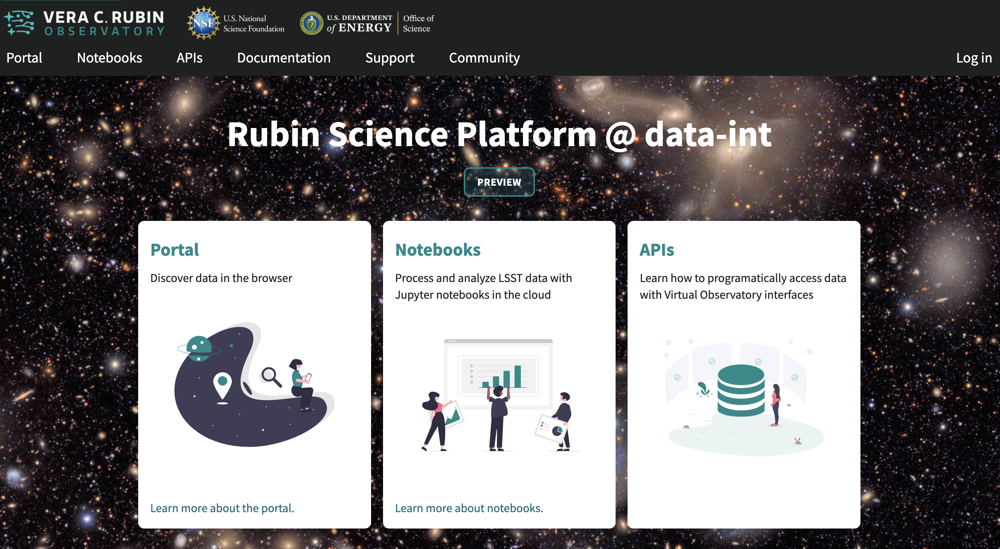
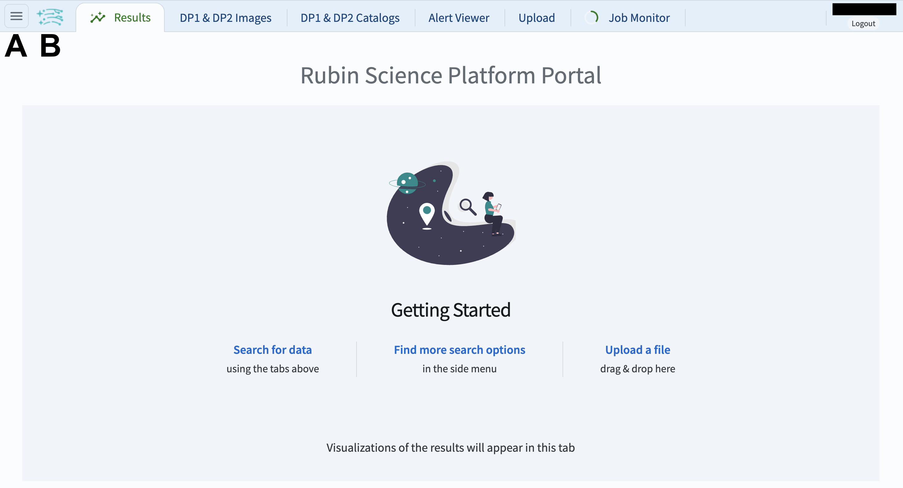
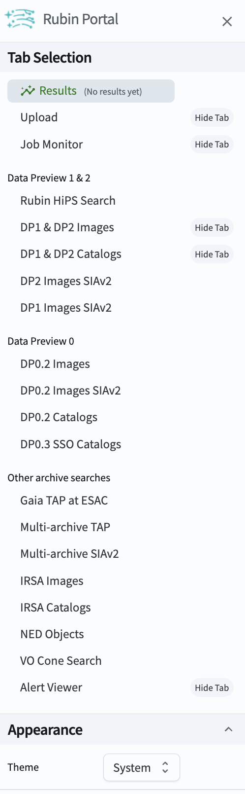

.. _portal-101-1:

#######################################
101.1. Navigate the user interface (UI)
#######################################

For the Portal Aspect of the Rubin Science Platform (RSP) at data.lsst.cloud.

**Data Release:** Data Preview 2

**Last verified to run:** 2026-08-06

**Learning objective:** Navigate the main components of the Portal's user interface (UI).

**LSST data products:** N/A

**Credit:** Originally developed by the Rubin Community Science team.
Please consider acknowledging them if this tutorial is used for the preparation of journal articles, software releases, or other tutorials.
DOI: `10.11578/rubin/dc.20250909.20 <https://doi.org/10.11578/rubin/dc.20250909.20>`_

**Get Support:** Everyone is encouraged to ask questions or raise issues in the `Support Category <https://community.lsst.org/c/support/6>`_ of the Rubin Community Forum.
Rubin staff will respond to all questions posted there.

----

**1. Go to the RSP.**
In a web browser go to the RSP using the URL `data.lsst.cloud <https://data.lsst.cloud/>`_.

    Figure 1: The main landing page of the Rubin Science Platform.

**2. Log in.**
On the RSP landing page (Figure 1), if "Log in" appears at upper right instead of your username, click "Log in" and follow the prompts to authenticate.

**3. Enter the Portal.**
On the RSP landing page (Figure 1) click on the Portal square to enter the Portal Aspect.

    Figure 2: The main landing page of the Portal Aspect.

**4. Review the layout.**
On the Portal landing page (Figure 2) notice the icons and tabs across the top of the screen, and that the default selected tab of the landing page is labeled Results.

**5. View the information window.**
On the Portal landing page click on the Rubin logo (labeled B in Figure 2) to open a window with Rubin Portal Version Information.
Dismiss the window by clicking on the OK button or on the X in its upper right corner.
(Window is not shown in a figure in this tutorial.)

**6. Open the sidebar menu.**
On the Portal landing page click on the menu icon (three horizontal lines at upper left; labeled A in Figure 2) to open the sidebar menu.

    Figure 3: The sidebar menu of the Portal Aspect.

**7. Review the sidebar menu.**
In the sidebar menu (Figure 3) under **Tab Selection**, notice that some of the menu options are for older data releases (e.g., DP0.2 Catalogs) and external data servers (e.g., Gaia TAP at EAC).
Which tabs you see in the Portal landing page are configurable with the "Hide Tab" option.
At the bottom of the sidebar menu under **Appearance** there is an option to switch your Portal interface between light and dark mode.
Dismiss the sidebar by clicking on the X in the upper right corner of the menu.

**8. Review the Portal's default tabs.**

All Portal functionality can be accessed via the sidebar:

* **Results:** Data query results interface.
* **DP1 & DP2 Images:** Query interface for image data.
* **DP1 & DP2 Catalogs:** Query interface for catalog (tabular) data.
* **Alert Viewer:** Query interface for alerts (see the `Prompt products tutorials <https://prompt-products.lsst.io/tutorials/index.html>`_).
* **Upload:** Upload tables to the Portal.
* **Job Monitor:** Get the URL for, or stop the execution of, submitted query jobs.
