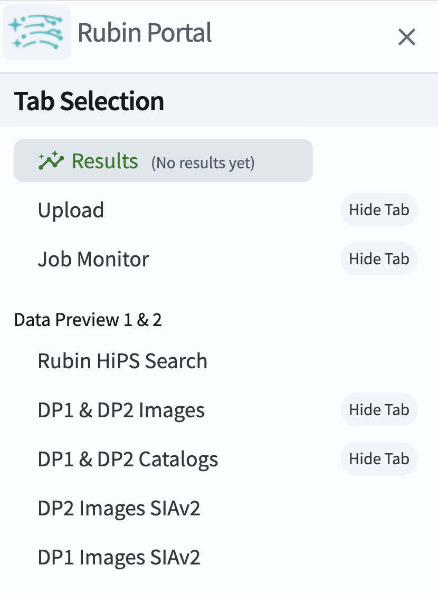
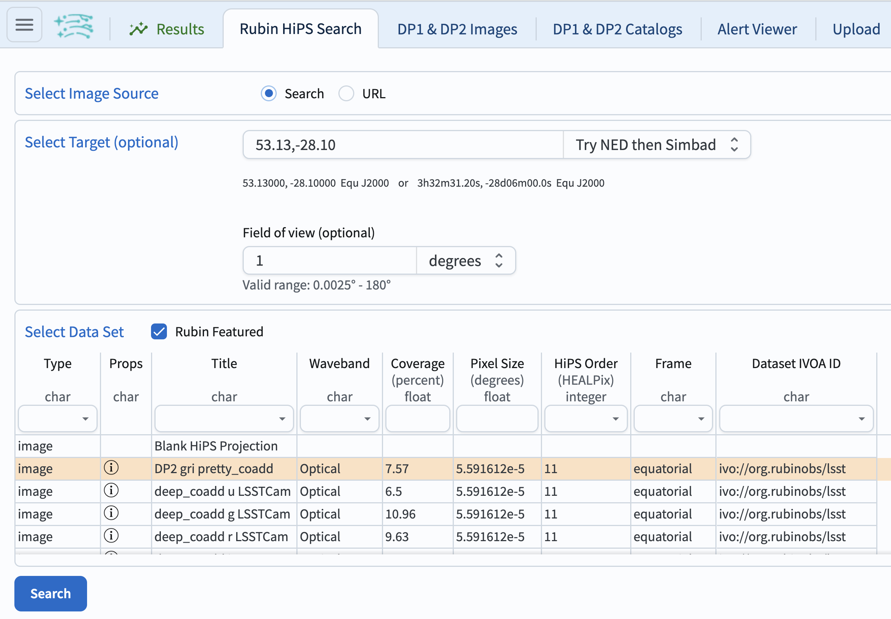
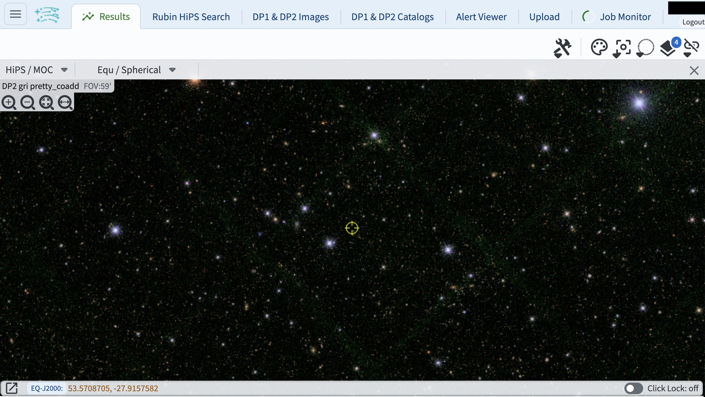

.. _portal-101-2:

###########################
101.2. Browse the HiPS maps
###########################

For the Portal Aspect of the Rubin Science Platform (RSP) at data.lsst.cloud.

**Data Release:** Data Preview 2

**Last verified to run:** 2026-08-06

**Learning objective:** Browse the all-sky color `HiPS maps <https://dp2.lsst.io/products/maps/hips.html>`_ (Hierarchical Progressive Surveys (HiPS) map representation of the tiled multiband coadded images).

**LSST data products:** HiPS maps

**Credit:** Originally developed by the Rubin Community Science team.
Please consider acknowledging them if this tutorial is used for the preparation of journal articles, software releases, or other tutorials.
DOI: `10.11578/rubin/dc.20250909.20 <https://doi.org/10.11578/rubin/dc.20250909.20>`_

**Get Support:** Everyone is encouraged to ask questions or raise issues in the `Support Category <https://community.lsst.org/c/support/6>`_ of the Rubin Community Forum.
Rubin staff will respond to all questions posted there.

----

**1. Go to the RSP and enter the Portal Aspect.**
In a web browser, go to `data.lsst.cloud <https://data.lsst.cloud/>`_, log in and click on the "Portal" panel.

**2. In the sidebar select "Rubin HiPS Search".**
Click on the sidebar menu (three vertical lines in the upper left hand corner) and click on Rubin HiPS Search (Figure 1).

    Figure 1: Select Rubin HiPS Search from sidebar.

**3. Select the target and data set.**
Next to "Select Target" enter the coordinates ``53.13,-28.10``, which are the center of the Extended Chandra Deep Field South (ECDFS) field, and field of view of ``1`` degree.
Under "Select Data Set" click on the row "DP2 gri pretty coadd", as in Figure 2, then click "Search" at lower left.

    Figure 2: Enter coordinates and field of view.

**4. Results.**
Results of the search are shown in Figure 3.
To zoom in and pan around the image use the scroll features on your mouse or use the zoom in and out buttons
(magnifying glass icons in the upper left-hand corner of the image).

    Figure 3: The DP2 gri pretty coadd HiPS map centered on the ECDFS field.

**5. Direct links to the DP2 HiPS maps.**
Use the following links to go to a DP2 region, then zoom out to explore.

* `Random spot in the contiguous region <https://data.lsst.cloud/portal/app/?api=hips&uri=https://data.lsst.cloud/api/hips/v2/dp2/color_gri&ra=284.1701404&dec=-25.0224338&sr=2d>`_

Deep drilling fields:

* `DDF ELAIS S1, 00h38m00s -44d00m00s <https://data.lsst.cloud/portal/app/?api=hips&uri=https://data.lsst.cloud/api/hips/v2/dp2/color_gri&ra=9.5&dec=-44&sr=2d>`_
* `DDF ECDFS, 03h32m00s -28d06m00s <https://data.lsst.cloud/portal/app/?api=hips&uri=https://data.lsst.cloud/api/hips/v2/dp2/color_gri&ra=53&dec=-28.1&sr=2d>`_
* `DDF EDFS a, 03h56m48s -49d12m00s <https://data.lsst.cloud/portal/app/?api=hips&uri=https://data.lsst.cloud/api/hips/v2/dp2/color_gri&ra=59.2&dec=-49.2&sr=2d>`_
* `DDF EDFS b, 04h12m48s -47d48m00s <https://data.lsst.cloud/portal/app/?api=hips&uri=https://data.lsst.cloud/api/hips/v2/dp2/color_gri&ra=63.2&dec=-47.8&sr=2d>`_
* `DDF COSMOS, 10h00m24s +02d06m00s <https://data.lsst.cloud/portal/app/?api=hips&uri=https://data.lsst.cloud/api/hips/v2/dp2/color_gri&ra=150.1&dec=2.1&sr=2d>`_

Small field areas:

* `M49, 12h25m12s +06d54m00s <https://data.lsst.cloud/portal/app/?api=hips&uri=https://data.lsst.cloud/api/hips/v2/dp2/color_gri&ra=186.3&dec=6.9&sr=2d>`_
* `Prawn, 16h54m00s -41d00m00s <https://data.lsst.cloud/portal/app/?api=hips&uri=https://data.lsst.cloud/api/hips/v2/dp2/color_gri&ra=253.5&dec=-41&sr=2d>`_
* `Trifid-Lagoon, 18h06m48s -23d54m00s <https://data.lsst.cloud/portal/app/?api=hips&uri=https://data.lsst.cloud/api/hips/v2/dp2/color_gri&ra=271.7&dec=-23.9&sr=2d>`_
* `New Horizons, 19h17m36s -20d12m00s <https://data.lsst.cloud/portal/app/?api=hips&uri=https://data.lsst.cloud/api/hips/v2/dp2/color_gri&ra=289.4&dec=-20.2&sr=2d>`_
* `Rubin SV 212 -7, 14h06m48s -07d00m00s <https://data.lsst.cloud/portal/app/?api=hips&uri=https://data.lsst.cloud/api/hips/v2/dp2/color_gri&ra=211.7&dec=-7&sr=2d>`_
* `Rubin SV 216 -17, 14h24m24s -16d42m00s <https://data.lsst.cloud/portal/app/?api=hips&uri=https://data.lsst.cloud/api/hips/v2/dp2/color_gri&ra=216.1&dec=-16.7&sr=2d>`_
* `Rubin SV 225 -40, 15h00m00s -39d30m00s <https://data.lsst.cloud/portal/app/?api=hips&uri=https://data.lsst.cloud/api/hips/v2/dp2/color_gri&ra=225&dec=-39.5&sr=2d>`_
* `Rubin SV 280 -48, 18h40m24s -48d00m00s <https://data.lsst.cloud/portal/app/?api=hips&uri=https://data.lsst.cloud/api/hips/v2/dp2/color_gri&ra=280.1&dec=-48&sr=2d>`_
* `Rubin SV 320 -15, 21h20m48s -15d06m00s <https://data.lsst.cloud/portal/app/?api=hips&uri=https://data.lsst.cloud/api/hips/v2/dp2/color_gri&ra=320.2&dec=-15.1&sr=2d>`_
