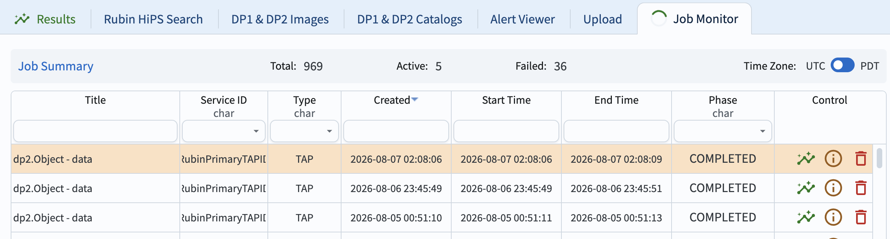
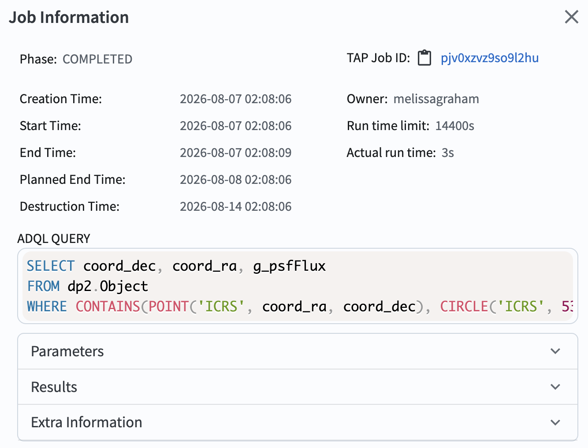

.. _portal-101-4:

#############################################
101.4. Use the query job monitor (get job ID)
#############################################

For the Portal Aspect of the Rubin Science Platform at data.lsst.cloud.

**Data Release:** Data Preview 2

**Last verified to run:** 2026-08-06

**Learning objective:** Use the Job Monitor to obtain the status and ID of, and delete, submitted query jobs.

**LSST data products:** ``Object`` table

**Credit:** Originally developed by the Rubin Community Science team. Please consider acknowledging them if this tutorial is used for the preparation of journal articles,
software releases, or other tutorials.
DOI: `10.11578/rubin/dc.20250909.20 <https://doi.org/10.11578/rubin/dc.20250909.20>`_

**Get Support:** Everyone is encouraged to ask questions or raise issues in the `Support Category <https://community.lsst.org/c/support/6>`_ of the Rubin Community Forum.
Rubin staff will respond to all questions posted there.

----

**1. Log into the Portal from the RSP.**
In a web browser go to the Rubin Science Platform (RSP) using the URL `data.lsst.cloud <https://data.lsst.cloud/>`_.
Select the "Portal" box.
Click on the "DP1 & DP2 Catalogs" tab.

**2. Create a sample job.**
For the purpose of this tutorial, click the "Edit ADQL" box in the upper right hand corner and paste the following query into the box.
Hit the "Search" button in the lower left corner to execute the query.

.. code-block:: sql

  SELECT coord_dec,coord_ra,g_psfFlux
    FROM dp2.Object
    WHERE CONTAINS(POINT('ICRS', coord_ra, coord_dec),CIRCLE('ICRS', 53.13, -28.1, 0.0027))=1

**3.  Examine the job monitor.**
Click on the "Job Monitor" tab.
The job monitor will have all jobs submitted by you (created within the retention period).
The jobs listed are in the chronological order (most recent first), in Coordinated Universal Time (UTC).

    Figure 1: The Portal's job monitor interface.

**4. Learn about individual jobs.**
In the "Control" column click on the green "plot" icon to go to the results interface for that job.
Click on the circle with a letter "i" to see information about the submitted job, such as the ADQL statement and the job ID, as in Figure 2.
Clicking on the red "garbage can" will delete the job.

    Figure 2: The job information pop-up window.

