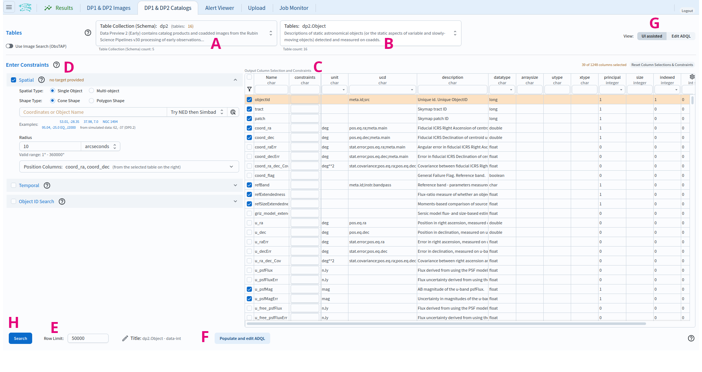
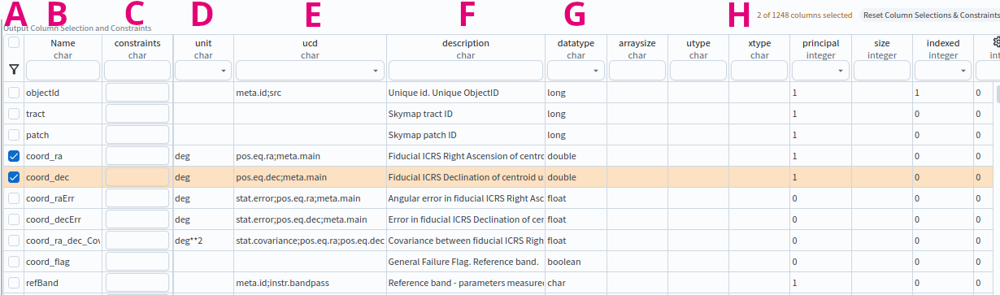
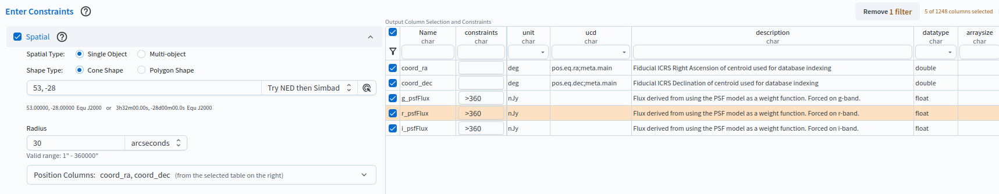

.. _portal-102-1:

#############################
102.1. Query for catalog data
#############################

For the Portal Aspect of the Rubin Science Platform (RSP) at data.lsst.cloud.

**Data Release:** Data Preview 2

**Last verified to run:** 2026-09-07

**Learning objective:** Set up and execute a spatial query for catalog data with the Portal's graphical user interface (UI), without writing ADQL.

**LSST data products:** ``Object`` table

**Credit:** Originally developed by the Rubin Community Science team.
Please consider acknowledging them if this tutorial is used for the preparation of journal articles, software releases, or other tutorials.
DOI: `10.11578/rubin/dc.20250909.20 <https://doi.org/10.11578/rubin/dc.20250909.20>`_

**Get Support:** Everyone is encouraged to ask questions or raise issues in the `Support Category <https://community.lsst.org/c/support/6>`_ of the Rubin Community Forum.
Rubin staff will respond to all questions posted there.

----

**1. Go to the RSP and enter the Portal Aspect.**
In a web browser, go to `data.lsst.cloud <https://data.lsst.cloud/>`_, click on the "Portal" panel, and log in.

**2. Select the DP1 & DP2 Catalogs tab.**
On the Portal landing page, click on the tab labeled "DP1 & DP2 Catalogs".

**3. Mouse-over for pop-up notes.**
In the "DP1 & DP2 Catalogs" tab (Figure 1) use the mouse to hover over the components of the UI, or click on the question marks, to see pop-up explanations of the functionality.

    Figure 1: The Portal user interface (UI) for querying catalogs.

**4. Review the UI components.**
In the Portal UI (Figure 1) review the main components labeled A through H, which are used together to query (search) and retrieve data.

* A: "Table Collection (Schema)" drop-down. ``dp2`` (Data Preview 2 catalog products and coadded images) is selected by default.
* B: "Tables" drop-down of the tables available for the selected collection. ``dp2.Object`` is selected by default.
* C: The schema interface table, labelled "Output Column Selection and Constraints". Tick a column to include it in the results, and type in the "constraints" field to limit the values returned. "Reset Column Selections & Constraints" (upper right) clears all selections and constraints.
* D: "Enter Constraints" area, with expandable "Spatial", "Temporal", and "Object ID Search" panels for constraining the query.
* E: "Row Limit" entry field, the maximum number of rows to return.
* F: "Populate and edit ADQL" button, which converts the constraints set in C, D, and E into an editable ADQL statement.
* G: "View" toggle, to switch between "UI assisted" (this graphical interface) and "Edit ADQL".
* H: "Search" button, to execute the query and retrieve the data into the Results tab.

    Figure 2: The schema interface table for the ``Object`` table, with columns selected (e.g., ``coord_ra``, ``coord_dec``).

**5. Review the schema interface table.**
In the schema interface table (Figure 2) review the components labeled A through H.

* A: Selection boxes. Tick a box to include that column in the results. The funnel icon at the top of the column filters the table to show only selected rows.
* B: "Name". Column names are short, descriptive, and unique within a table. Click "Name" to sort by name.
* C: "constraints". Apply limits on column values by typing in the desired constraint (e.g., :math:`>, <, =, !=`).
* D: "unit". The units of the values that will be returned.
* E: "ucd". Unified Content Descriptor, a vocabulary standard set by the `International Virtual Observatory Alliance <https://www.ivoa.net/>`_.
* F: "description". A description of the column's data.
* G: "datatype". E.g., ``double``, ``float``, ``long``, ``boolean``.
* H: "Reset Column Selections & Constraints", which clears all column selections and constraints.

**6. Find columns of interest.**
In the schema interface table (Figure 2) notice that the columns are searchable.
Type a word in the entry field at the top of any column to filter the rows.
For example, type "Flux" under "Name" and press "enter" or "return" to see all column names that contain "Flux".
Clear the entry field and press "enter" or "return" again to see all column names.

**7. Enter constraints.**
At left, expand the "Spatial" panel.
Set "Spatial Type" to "Single Object" and "Shape Type" to "Cone Shape",
enter ``53, -28`` (the approximate center of the ECDFS field) in the "Coordinates or Object Name" field, and set the radius to 30 arcseconds.
In the schema interface table, tick ``coord_ra``, ``coord_dec``, ``g_psfFlux``, ``r_psfFlux``, and ``i_psfFlux`` to return those columns,
and in the "constraints" field for each of ``g_psfFlux``, ``r_psfFlux``, and ``i_psfFlux`` type ``>360`` so that only objects brighter than 360 nJy in all three bands are returned.
Click the funnel icon at the top left of the table to collapse it to just the five selected rows (Figure 3); click it again to show all columns.
This is an example of a very simple query.

    Figure 3: An example query for the DP2 ``Object`` catalog, set up in the UI.

**8. Click Search.**
At lower left, click the blue button labeled "Search".
This query returns 22 rows of the ``Object`` table.

**Next steps:** the 103-series tutorials show how to convert a UI query like this one to ADQL and build queries directly in ADQL.
The 104-series tutorials show how to work with catalog results in the results interface.
