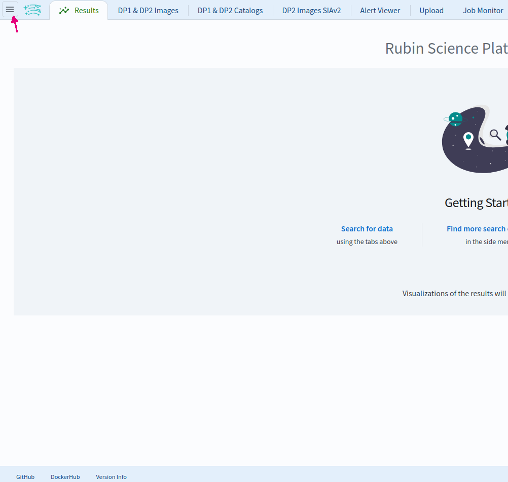
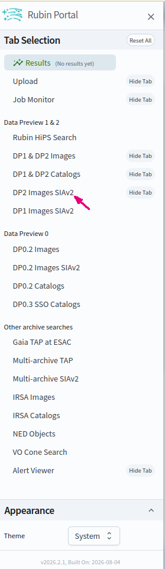
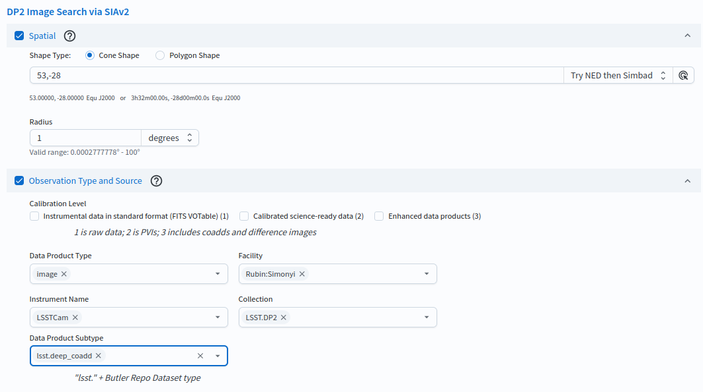
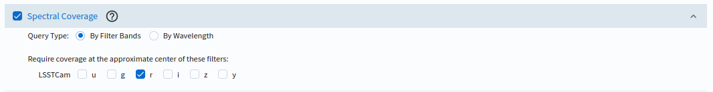
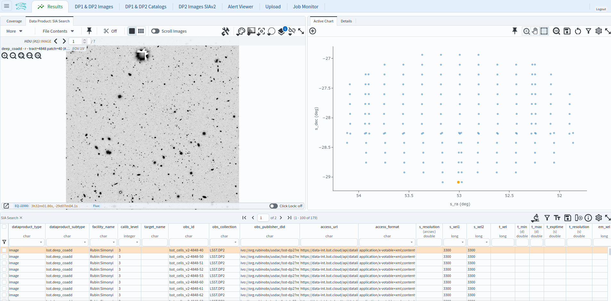

.. _portal-102-2:

##################################
102.2. Query for images with SIAv2
##################################

For the Portal Aspect of the Rubin Science Platform (RSP) at data.lsst.cloud.

**Data Release:** Data Preview 2

**Last verified to run:** TBD

**Learning objective:** Use the Simple Image Access version 2 (SIAv2) service to set up and execute an image query with the Portal's graphical user interface (UI), without writing ADQL.

**LSST data products:** ``deep_coadd``

**Credit:** Originally developed by the Rubin Community Science team.
Please consider acknowledging them if this tutorial is used for the preparation of journal articles, software releases, or other tutorials.
DOI: `10.11578/rubin/dc.20250909.20 <https://doi.org/10.11578/rubin/dc.20250909.20>`_

**Get Support:** Everyone is encouraged to ask questions or raise issues in the `Support Category <https://community.lsst.org/c/support/6>`_ of the Rubin Community Forum.
Rubin staff will respond to all questions posted there.

----

.. note::

   Early Data Preview 2 provides ``deep_coadd`` images only.
   Visit, difference, and template images are added with the full DP2 release; once available, the same
   SIAv2 interface can be used to query for them by selecting the corresponding calibration level and
   data product subtype.

**1. Go to the RSP and enter the Portal Aspect.**
In a web browser, go to `data.lsst.cloud <https://data.lsst.cloud/>`_, click on the "Portal" panel, and log in.

**2. Open the sidebar menu.**
The SIAv2 image search is not one of the default tabs; it is reached from the sidebar.
At the upper left of the Portal, click the menu icon (three horizontal lines).

    Figure 1: The menu icon at the upper left of the Portal opens the sidebar.

**3. Open the SIAv2 image search interface.**
In the sidebar, under the "Data Preview 1 & 2" heading, click on "DP2 Images SIAv2".
This opens the "DP2 Images SIAv2" tab, headed "DP2 Image Search via SIAv2".
(SIAv2 image search is provided per data release; a separate "DP1 Images SIAv2" entry queries DP1.)

    Figure 2: Select "DP2 Images SIAv2" from the sidebar.

**4. Set the spatial constraints.**
Check the box next to "Spatial".
For "Shape Type" select "Cone Shape".
In the "Coordinates or Object Name" field enter the approximate centre of the ECDFS field, RA, Dec = 53, -28 degrees.
Set the radius to 1 and its units to "degrees", roughly the extent of the field.

**5. Set the observation type and source.**
Check the box next to "Observation Type and Source".
Set the data product type to "image",
the facility to "Rubin:Simonyi",
the instrument name to "LSSTCam",
the collection to "LSST.DP2",
and the data product subtype to "lsst.deep_coadd".

    Figure 3: Setting the constraints on the images' Spatial and Observation Type and Source.

**6. Set the spectral coverage (band).**
Check the box next to "Spectral Coverage".
For "Query Type" select "By Filter Bands", and under "LSSTCam" tick the *r* band.

    Figure 4: Setting the constraint on the images' Spectral Coverage.

**7. Execute the search.**
Click on the "Search" button at lower left.

**8. Review the results.**
The results interface enables interactive visualization of the 179 ``deep_coadd`` images which meet the
search criteria: the *r*-band coadd of every ECDFS patch that falls within the search cone.

    Figure 5: The image results interface.

**Next steps:** tutorial 102.3 performs a similar image query with the ObsTAP service instead of SIAv2, and
the 105-series tutorials show how to work with image results in the Firefly viewer.
