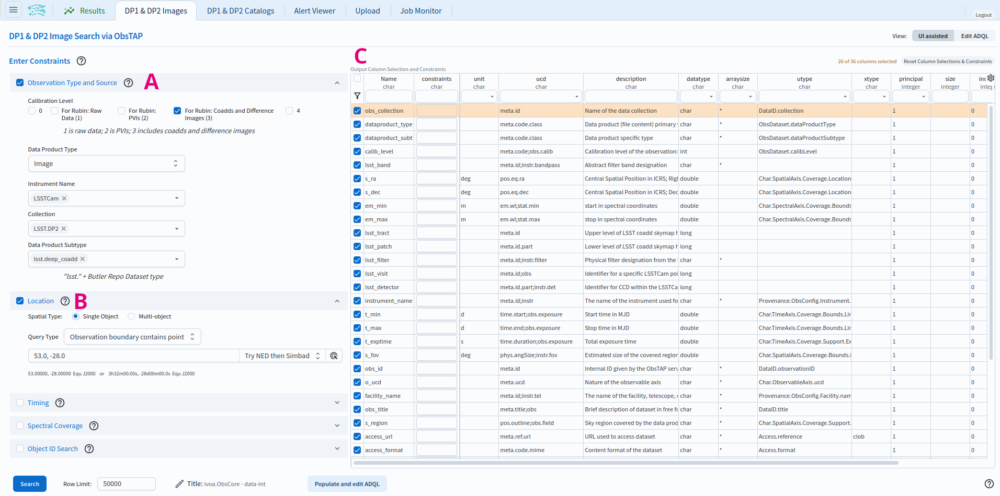
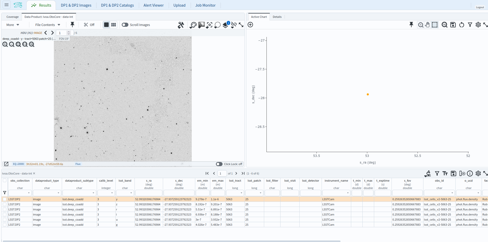

.. _portal-102-3:

###################################
102.3. Query for images with ObsTAP
###################################

For the Portal Aspect of the Rubin Science Platform (RSP) at data.lsst.cloud.

**Data Release:** Data Preview 2

**Last verified to run:** 2026-09-07

**Learning objective:** Use the ObsTAP service (the ``ivoa.ObsCore`` image metadata table) to set up and execute an image query with the Portal's graphical user interface (UI), without writing ADQL.

**LSST data products:** ``deep_coadd``

**Credit:** Originally developed by the Rubin Community Science team.
Please consider acknowledging them if this tutorial is used for the preparation of journal articles, software releases, or other tutorials.
DOI: `10.11578/rubin/dc.20250909.20 <https://doi.org/10.11578/rubin/dc.20250909.20>`_

**Get Support:** Everyone is encouraged to ask questions or raise issues in the `Support Category <https://community.lsst.org/c/support/6>`_ of the Rubin Community Forum.
Rubin staff will respond to all questions posted there.

----

.. note::

   Early Data Preview 2 provides ``deep_coadd`` images only.
   Visit, difference, and template images are added with the full DP2 release; once available, the same
   ObsTAP interface can be used to query for them by selecting the corresponding calibration level and
   data product subtype.

**1. Go to the RSP and enter the Portal Aspect.**
In a web browser, go to `data.lsst.cloud <https://data.lsst.cloud/>`_, click on the "Portal" panel, and log in.

**2. Open the image search interface.**
Click on the tab labeled "DP1 & DP2 Images".
The same interface is also reached from the "DP1 & DP2 Catalogs" tab by switching on the "Use Image Search (ObsTAP)" toggle, which selects the ``ivoa.ObsCore`` table.

**3. Mouse-over for pop-up notes.**
In the "DP1 & DP2 Images" tab (Figure 1) hover over the components of the UI, or click on the question marks, to see pop-up explanations of the functionality.

    Figure 1: The Portal user interface (UI) for querying images with ObsTAP.

**4. Review the UI components.**
In the Portal UI (Figure 1) review the main components labeled A through C, which are used together to query (search) and retrieve images.

* A: "Observation Type and Source" panel. Set the calibration level, data product type, instrument, collection, and data product subtype, to choose which image product is returned.
* B: "Location" panel. Set the spatial constraint. The "Query Type" drop-down chooses how the region relates to each image's footprint (e.g., "Observation boundary contains point").
* C: The ``ivoa.ObsCore`` table holds all image metadata. It is recommended to use all pre-selected columns.

The "Timing" and "Spectral Coverage" panels below "Location" add optional temporal and band constraints; neither is used here, as a time constraint does not apply to coadds, which combine many epochs.

**5. Set the observation type and source.**
Expand the "Observation Type and Source" panel.
Set the calibration level to "For Rubin: Coadds and Difference Images (3)",
the data product type to "Image",
the instrument name to "LSSTCam",
the collection to "LSST.DP2",
and the data product subtype to "lsst.deep_coadd".

**6. Set the location.**
Expand the "Location" panel.
Set "Spatial Type" to "Single Object" and "Query Type" to "Observation boundary contains point",
and enter ``53, -28`` (the approximate center of the ECDFS field) in the coordinates field.

**7. Execute the search.**
Click on the "Search" button at lower left.

**8. Review the results.**
The results interface enables interactive visualization of the six ``deep_coadd`` images which meet the
search criteria: the ``u``, ``g``, ``r``, ``i``, ``z``, ``y`` coadds of the single ECDFS patch whose
footprint contains the target point.

    Figure 2: The image results interface, showing the six ``deep_coadd`` images (one per band) that meet the search criteria.

**Next steps:** tutorial 102.2 performs a similar image query with the SIAv2 service instead of ObsTAP,
tutorial 103.4 writes the equivalent ObsTAP query directly in ADQL, and the 105-series tutorials show how
to work with image results in the Firefly viewer.
