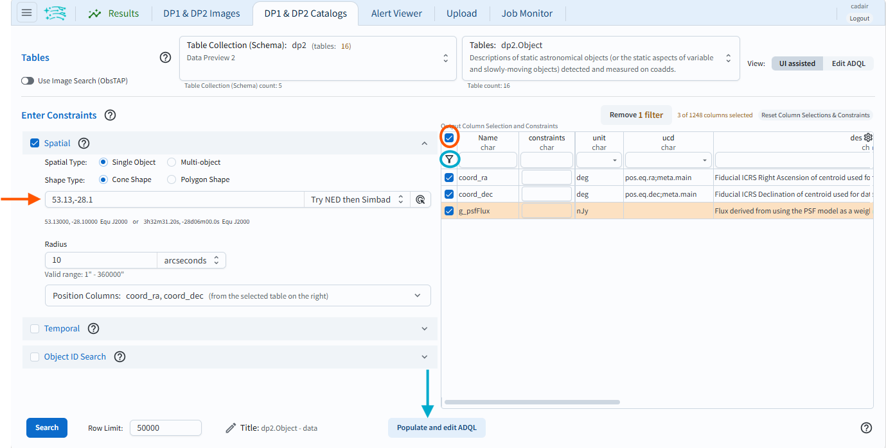
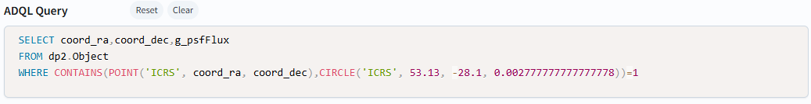

.. _portal-103-1:

#################################
103.1. Convert a UI query to ADQL
#################################

For the Portal Aspect of the Rubin Science Platform at data.lsst.cloud.

**Data Release:** Data Preview 2

**Last verified to run:** 2026-08-14

**Learning objective:** Convert a query from the graphical user interface into an
`Astronomy Data Query Language (ADQL) <https://www.ivoa.net/documents/latest/ADQL.html>`_ statement.

**LSST data products:** ``Object`` table

**Credit:** Originally developed by the Rubin Community Science team.
Please consider acknowledging them if this tutorial is used for the preparation of journal articles, software releases, or other tutorials.
DOI: `10.11578/rubin/dc.20250909.20 <https://doi.org/10.11578/rubin/dc.20250909.20>`_

**Get Support:** Everyone is encouraged to ask questions or raise issues in the `Support Category <https://community.lsst.org/c/support/6>`_ of the Rubin Community Forum.
Rubin staff will respond to all questions posted there.

----

**1. Select DP1 & DP2 Catalogs tab.**
Navigate to the “DP1 & DP2 Catalogs” tab in the Portal UI to create an ADQL query from the DP2 catalogs.

**2. Set up a query in the user interface.**
An ADQL query is built from items selected in both the **Enter Constraints** area and the **Column selection** table.

At left, click on “Spatial” (orange arrow in Figure 1) to include spatial constraints (a cone search) centered on RA, Dec = 53.13, -28.10 deg. Limit the radius to 10 arcseconds.
Click the check box above the funnel icon (orange circle in Figure 1) to select all rows, and then again to deselect all rows in the table.
Then select the ``coord_ra``, ``coord_dec``, and ``g_psfFlux`` to construct the ADQL query using only those constraints.
Finally, click the funnel icon (teal circle in Figure 1) to show only the selected rows.

    Figure 1: The Portal user interface with a query set up. Use the funnel icon (teal circle) to limit the table to only display selected rows.

**3. Convert UI to ADQL query.**
Click on the button labeled "Populate and edit ADQL", located bottom-center (teal arrow in Figure 1).
The UI will switch to the ADQL interface and will populate the ADQL Query box with an ADQL statement that represents the exact same query (Figure 2).

    Figure 2: The Portal's ADQL interface, automatically populated with the UI query from Figure 1, converted into an ADQL statement.

**4. Edit and/or execute query.**
Edit the query or click the Search button at lower left to execute it.
Results will appear in the Results tab.

**Warning!**
If changes are made to the ADQL statement and then the interface is toggled back to the "Single Table (UI assisted)" interface using the button at lower right in Figure 1,
those changes will not be reflected in the UI.
The conversion only works in one direction: from the UI to ADQL.

