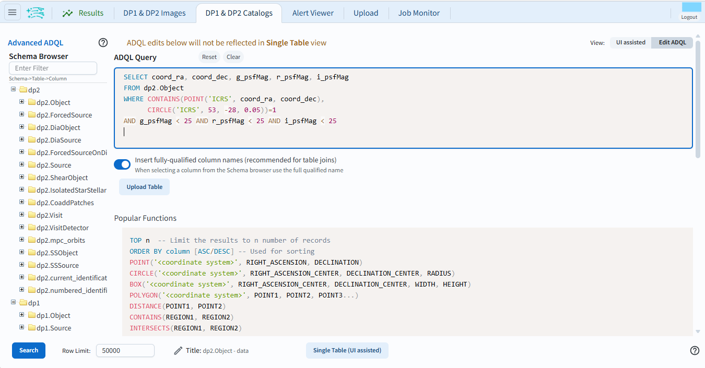
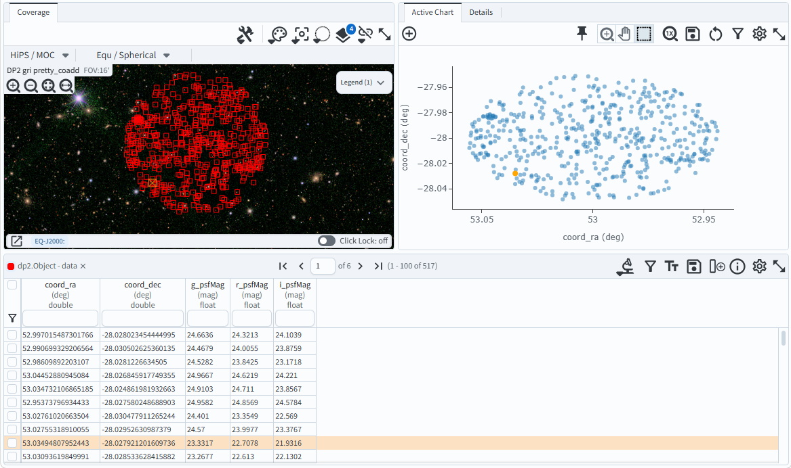

.. _portal-103-2:

#######################################
103.2. Query for catalog data with ADQL
#######################################

For the Portal Aspect of the Rubin Science Platform at data.lsst.cloud.

**Data Release:** Data Preview 2

**Last verified to run:** 2026-08-14

**Learning objective:** Prepare and execute an `Astronomy Data Query Language (ADQL) <https://www.ivoa.net/documents/latest/ADQL.html>`_ query in the Portal.

**LSST data products:** ``Object`` table

**Credit:** Originally developed by the Rubin Community Science team.
Please consider acknowledging them if this tutorial is used for the preparation of journal articles, software releases, or other tutorials.
DOI: `10.11578/rubin/dc.20250909.20 <https://doi.org/10.11578/rubin/dc.20250909.20>`_

**Get Support:** Everyone is encouraged to ask questions or raise issues in the `Support Category <https://community.lsst.org/c/support/6>`_ of the Rubin Community Forum. Rubin staff will respond to all questions posted there.

----

An introduction to ADQL
=======================

`ADQL documentation <http://www.ivoa.net/documents/ADQL>`_
includes more information about syntax, keywords, operators, functions, and constructing a query.
ADQL is similar to SQL (Structured Query Langage).

A typical ADQL statement has at least three components:

.. code-block:: SQL

  SELECT <columns> FROM <catalog> WHERE <constraints>

where ``<columns>`` is a comma-separated list of the columns to return, ``<catalog>`` is the name of the catalog to retreive data from, and ``<constraints>`` imposes a restriction that only rows with column values that meet the constraints are returned.

For example, say there is a catalog called "mysurveydata" with 5 columns, "col1", "col2", and so on.
The following ADQL statement would return a table that has three columns, and as many rows as meet both restrictions in the ``WHERE`` statement.

.. code-block:: SQL

  SELECT col3, col4, col5 FROM mysurveydata WHERE col1 > 0.5 AND col5 < 10

In the RSP Portal Aspect, ADQL queries are submitted to the TAP (Table Access Protocol) service.

----

**1. Go to the DP1 & DP2 Catalogs ADQL interface.**
Click the "Edit ADQL" button in the upper right corner to switch from the user interface to the ADQL interface.

**2. Review the ADQL interface.**
Browse the available tables in the TAP service in the left sidebar.
Scroll down to see examples of ADQL queries.
The interface should look like Figure 1.

    Figure 1: The ADQL interface.

**3. Enter the ADQL statement in the box.**
The following ADQL query selects the coordinates RA and Dec, and the *gri* PSF magnitudes for objects that are within a small circular region of the center of the ECDFS field
(RA, Dec = 53, -28; radius = 0.05 degrees) and are brighter than 25th magnitude in all three filters. Copy the query and paste it into the "ADQL Query" box.

.. code-block:: SQL

  SELECT coord_ra, coord_dec, g_psfMag, r_psfMag, i_psfMag
  FROM dp2.Object
  WHERE CONTAINS(POINT('ICRS', coord_ra, coord_dec),
        CIRCLE('ICRS', 53, -28, 0.05))=1
  AND g_psfMag < 25 AND r_psfMag < 25 AND i_psfMag < 25

**4. Execute the ADQL query.**
Click the "Search" button at lower left.
The query runs and returns 517 objects, shown in the data table along with their coordinates and *gri* PSF magnitudes.

    Figure 2: The default results view for the query.

