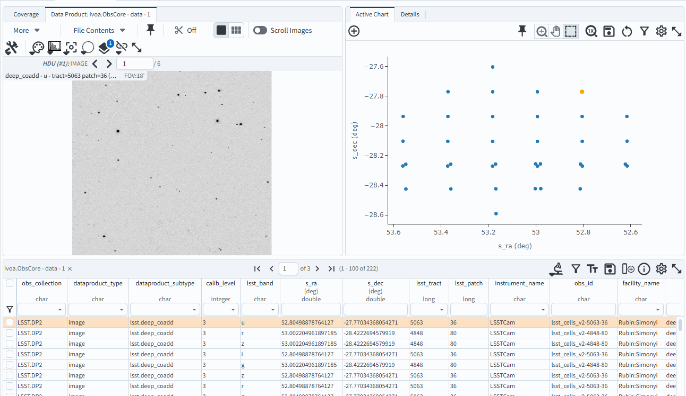

.. _portal-103-4:

#################################
103.4. Query for images with ADQL
#################################

For the Portal Aspect of the Rubin Science Platform at data.lsst.cloud.

**Data Release:** Data Preview 2

**Last verified to run:** 2026-08-14

**Learning objective:** Query for image data with `Astronomy Data Query Language (ADQL) <https://www.ivoa.net/documents/latest/ADQL.html>`_.

**LSST data products:** ``deep_coadd``

**Credit:** Originally developed by the Rubin Community Science team.
Please consider acknowledging them if this tutorial is used for the preparation of journal articles, software releases, or other tutorials.
DOI: `10.11578/rubin/dc.20250909.20 <https://doi.org/10.11578/rubin/dc.20250909.20>`_

**Get Support:** Everyone is encouraged to ask questions or raise issues in the `Support Category <https://community.lsst.org/c/support/6>`_ of the Rubin Community Forum.
Rubin staff will respond to all questions posted there.

----

**1. Go to the DP1 & DP2 Images ADQL interface.**
Click on the "DP1 & DP2 Images" tab, then click the "EDIT ADQL" button in the upper right corner.

**2. Create an ADQL query for images.**
When building an ADQL query for images, select the columns needed to identify and retrieve the image products.
For Early Data Preview 2, only deep‑coadd images are available, so the query below includes only the metadata relevant to calibration‑level 3 coadds.
This query retrieves deep-coadd images that overlap the coordinates RA, Dec = 53.13, -28.1 degrees in the ECDFS field.

.. code:: sql

   SELECT obs_collection,dataproduct_type,dataproduct_subtype,calib_level,lsst_band,s_ra,s_dec,
          lsst_tract,lsst_patch,instrument_name,
          obs_id,facility_name,obs_title,s_region,access_url,access_format
   FROM ivoa.ObsCore
   WHERE CONTAINS(POINT('ICRS', s_ra, s_dec),CIRCLE('ICRS', 53.13, -28.1, 0.5))=1
         AND obs_collection = 'LSST.DP2'
         AND calib_level = 3
         AND dataproduct_type = 'image'
         AND instrument_name = 'LSSTCam'
         AND dataproduct_subtype = 'lsst.deep_coadd'

**3. Execute the query.**
Copy-paste the query above into the ADQL query box and click "Search".

**4. View the results.**
The 222 deep‑coadd images that match the query are listed in the results table, with the selected image preview shown at upper right.

    Figure 1: The screenshot of the image, the scatter plot, and the table that result from executing the ADQL query.

