.. _portal-105-2:

#################################################
105.2. Use the Firefly image viewer (Coming Soon)
#################################################

For the Portal Aspect of the Rubin Science Platform at data.lsst.cloud.

**Data Release:** DP2

**Last verified to run:** 2026-09-17

**Learning objective:** Use the components of the Firefly image viewer.

**LSST data products:**

**Credit:** Originally developed by the Rubin Community Science team.
Please consider acknowledging them if this tutorial is used for the preparation of journal articles, software releases, or other tutorials.

**Get Support:** Everyone is encouraged to ask questions or raise issues in the `Support Category <https://community.lsst.org/c/support/6>`_ of the Rubin Community Forum.
Rubin staff will respond to all questions posted there.

----

**1. Execute an ADQL query for deep coadd images.**
Log in to the Portal Aspect, select the "DP1 & DP2 Images" tab and click on "Edit ADQL" at upper right.
Enter the following ADQL statement and click "Search" at lower left.
This query will return all *r*-band deep coadd images that overlap coordinates RA, Dec = 53.0, -28.0 degrees.

.. code-block:: SQL

  SELECT dataproduct_type,dataproduct_subtype,calib_level,
           lsst_band,em_min,em_max,lsst_tract,lsst_patch,
           lsst_filter,s_ra,s_dec,s_fov,obs_id,obs_collection,
           o_ucd,facility_name,instrument_name,obs_title,
           s_region,access_url,access_format
  FROM ivoa.ObsCore
  WHERE obs_collection = 'LSST.DP2'
        AND dataproduct_subtype = 'lsst.deep_coadd'
        AND lsst_band = 'r'
        AND CONTAINS(POINT('ICRS', 53.0, -28.0), s_region)=1

**2. Examine the various image planes.**
Hide the active chart window.
Cycle through the available image planes by using the arrows at the upper left of the image, as seen in Figure 1.

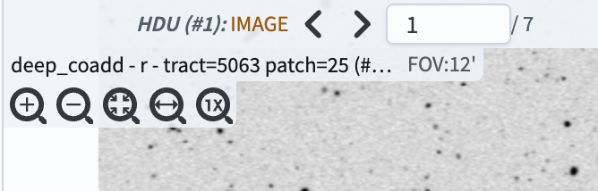

    Figure 1: The buttons to cycle through image planes in Firefly. They appear above the displayed image.

By default the "IMAGE" plane (HDU #1) will be displayed. By pressing the left and right arrow buttons, one can toggle through additional image planes that are associated with the image.

Advance to the third plane, the VARIANCE. Using the stretch drop down tool, change the image stretch to "Z Scale Linear". The result should look like Figure 2.

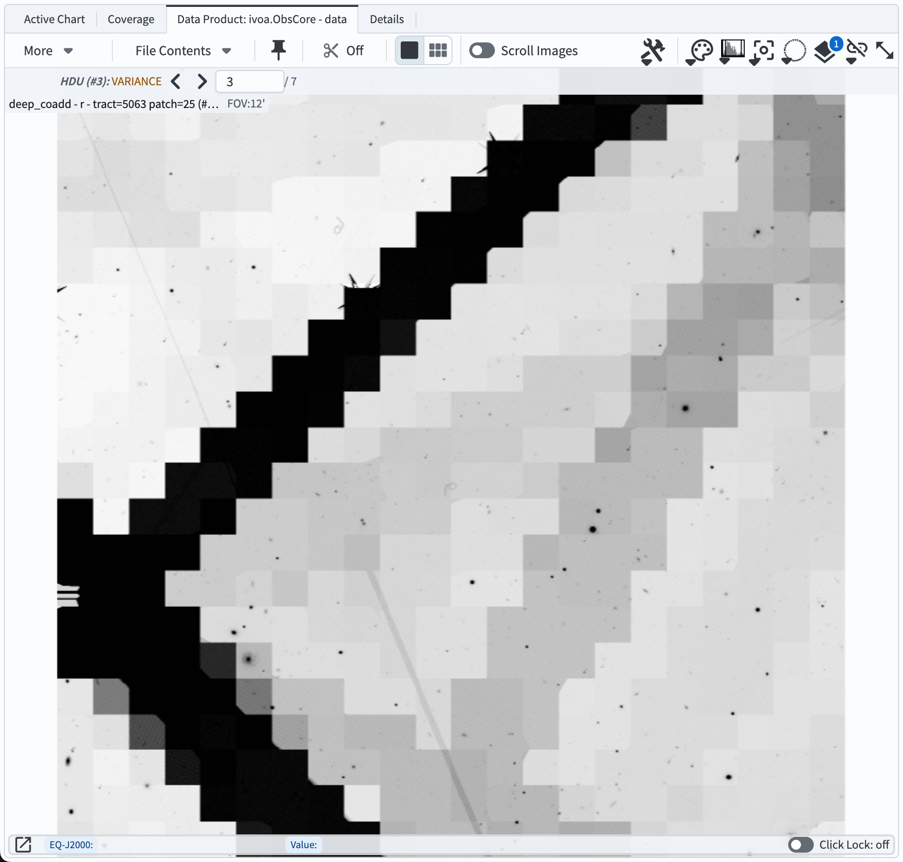

    Figure 2: The VARIANCE image plane with "Z Scale Linear" stretch applied. Features corresponding to the size of cells are seen, showing where the noise properties change due to different numbers of input visit images contributing to different cells.

The coadd image planes are:

- IMAGE (HDU #1) -- the deep coadd image.
- MASK (HDU #2) -- the mask plane showing pixels that have been masked for various reasons.
- VARIANCE (HDU #3) -- the variance plane corresponding to the pixel variance (in nJy2).
- MASK_FRACTION (HDU #4) -- the fraction of input visit images that were masked.
- NOISE_REALIZATION (HDU #5) -- a noise realization to be used for shear measurements.
- BACKGROUND/FIELDS/PRETTY/DATA (HDU #10) -- the difference between the deep coadd background and the "pretty coadd" background. Restoring this will roughly reproduce the "pretty coadds" that are used in the HiPS maps.
- BACKGROUND/FIELDS/OBJECT/DATA (HDU #11) -- the background that was subtracted from the deep coadd image.

Notice that the background images are binned to lower resolution than the full images.

**3. Change the orientation of the image.**

Toggle the image plane view to return to the original deep coadd image.

Click the "Tools" drop-down and then the "rotate image" tool (labeled "A" in Figure 3) in the "Rotate/Flip" portion of the Tools menu.
Rotate the image to an angle 135 degrees East of North by either using the slider or manually entering 135 in the box.
The result should appear as in Figure 4.

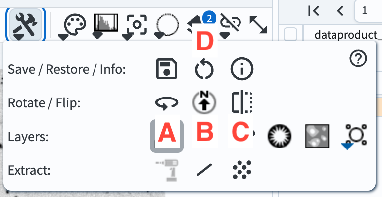

    Figure 3: The buttons to cycle through image planes in Firefly. They appear above the displayed image.

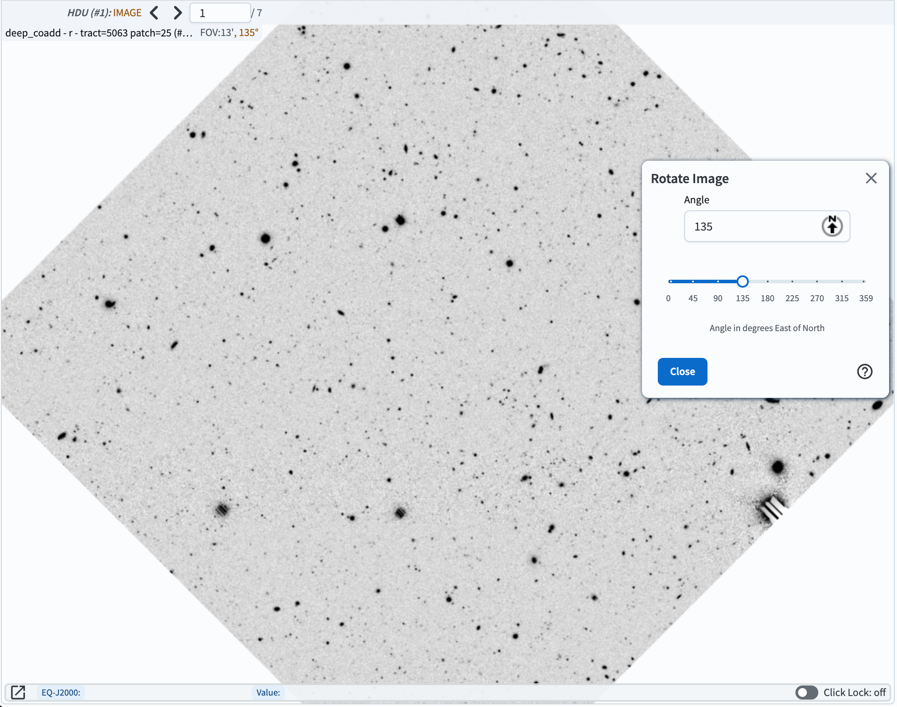

    Figure 3: The buttons to cycle through image planes in Firefly. They appear above the displayed image.

To restore the image to its original orientation with North up and East to the left, click the button with an up arrow pointing to a letter "N" (labeled "B" in Figure 3).

Before clicking the button to "flip" the image on the Y axis, first select the "North/East" compass from the "Layers" menu.
Now click on the "flip" button (labeled "C" in Figure 3) to flip the image in the X direction (i.e., flip it about the Y axis). Notice that East is now pointing to the right, as in Figure 5.

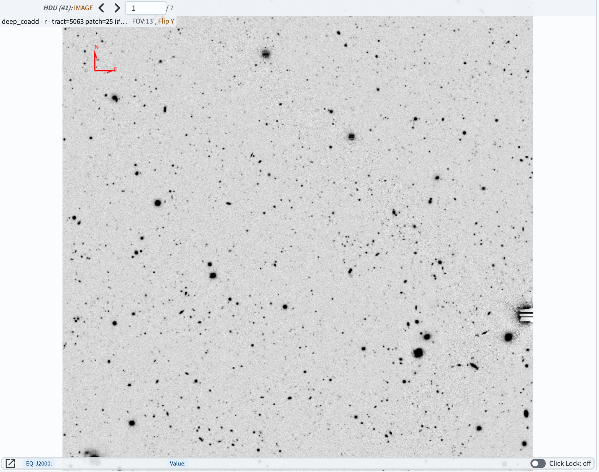

    Figure 3: The buttons to cycle through image planes in Firefly. They appear above the displayed image.

To return to the original view, click the "Restore to the defaults" button in the Tools menu (labeled "D" in Figure 3).

**4. Change the color map and image scaling.**

The color map used to display the image can be changed by clicking the "Color drop down" icon that looks like a painter's palette (labeled "A" in Figure 6).
Click the Color drop down and change the color mapping by clicking one of the options (as in Figure 7; the example selected there is the "plasma" colorbar).
Notice that there is a "reverse" option to the right of each colorbar.
Click one of these to get the "flipped" version of a color map.

The "Bias" and "Contrast" parameters can be manually adjusted using the sliders at the bottom of the Color drop down.

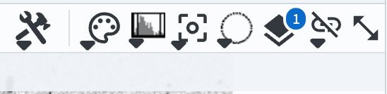

    Figure 6: The buttons to cycle through image planes in Firefly. They appear above the displayed image.

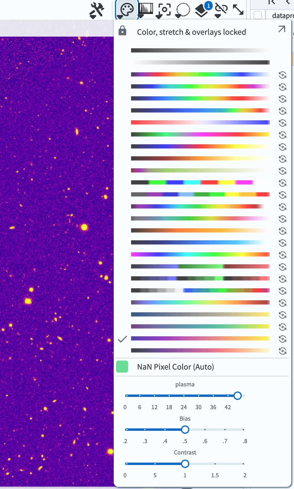

    Figure 7: The buttons to cycle through image planes in Firefly. They appear above the displayed image.

The image "stretch" can be changed using the "Stretch drop down" icon that looks like a histogram plot (labeled "B" in Figure 6).
Reset the colormap to the default ("Reverse Gray Scale").
Click the stretch drop down to reveal the options as seen in Figure 8.

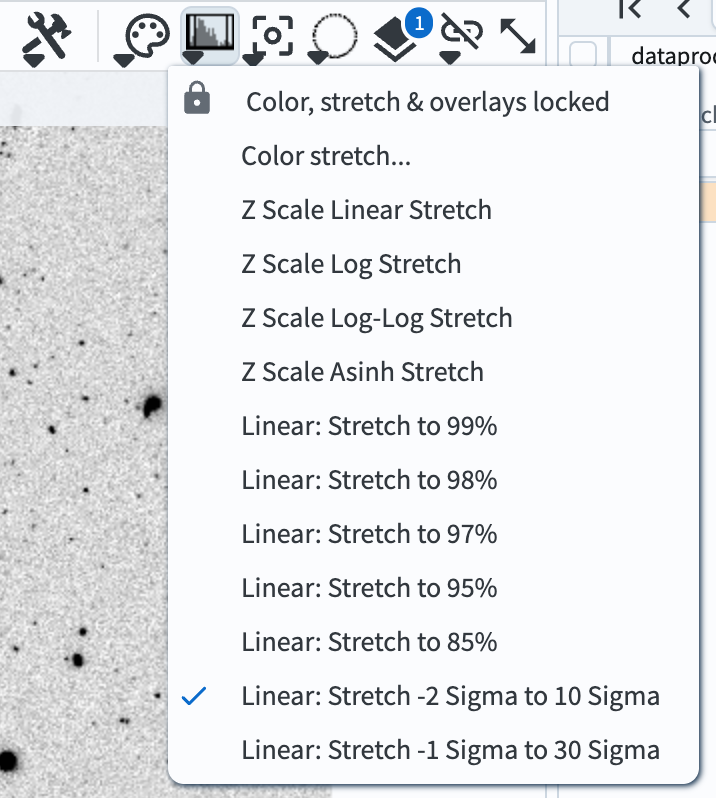

    Figure 8: The buttons to cycle through image planes in Firefly. They appear above the displayed image.

Change the stretch to "Z Scale Linear Stretch". Then change it to "Z Scale Asinh Stretch". The results should look like those seen in Figure 9.

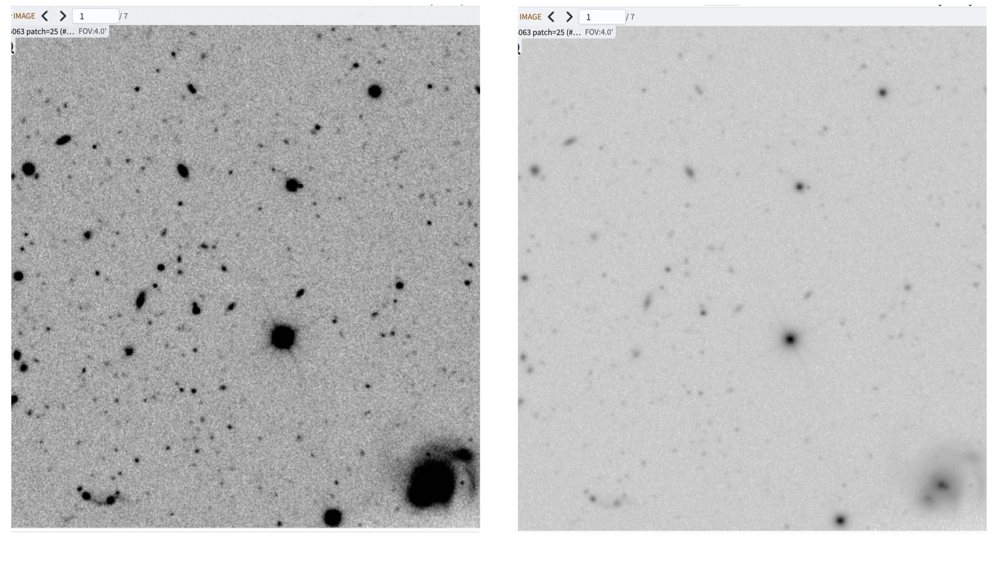

    Figure 9: The buttons to cycle through image planes in Firefly. They appear above the displayed image.

By clicking the "Color stretch..." button in the stretch drop down, the stretch parameters and type can be manually controlled using the widget that will appear.

**5. Select regions and operate on them.**

The "Select drop down" tool, which looks like a dashed open circle (labeled "C" in Figure 6), can be used to select regions of the image and perform operations on the selected region.

Click on the select drop down, then choose "Rectangular Selection".
By clicking at the desired position with your mouse, then dragging the rectangle until it's the desired size, select a rectangular region of the image.
Notice that the rectangle's shape, size, and position can be adjusted as long as the select tool is active.

To recenter the image at the rectangle you selected, click the "Recenter image to selected area" button in the new selection tools menu that appears above the image when a selection is made (see Figure 10).
The "Recenter image" button is labeled "A" in Figure 10.

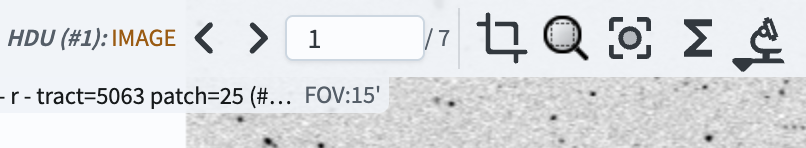

    Figure 10: The buttons to cycle through image planes in Firefly. They appear above the displayed image.

Click the button (labeled "B" in Figure 10) to "Show statistics for the selected area".
A window displaying the pixel statistics within the selected rectangle will pop up.
An example of a rectangular selection and the statistics window is shown in Figure 11.

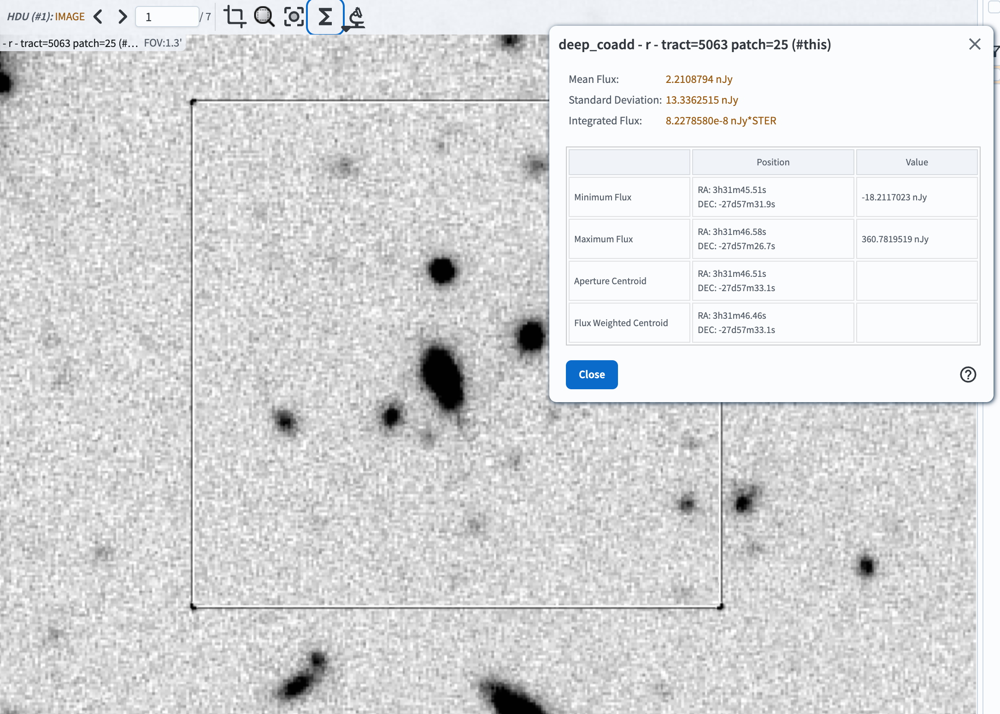

    Figure 11: The buttons to cycle through image planes in Firefly. They appear above the displayed image.

Mouse over each of the rows in the pop-up table, and note that an "x" appears at the position corresponding to each row's measurement.

Close the statistics window.

To search for catalog objects in the selected region, click the "Search this area" button that looks like a microscope (labeled "C" in Figure 10).
In the drop-down, select "Search (cone) using TAP..." to search a DP2 table with the radius enclosed by the box.

Clicking the search button will take you to the Catalog search view of the Portal, showing by default the Object table (others can be selected using the dropdown menus, as demonstrated in the 100-level Portal tutorials).
Keep all of the default column selections and click Search (at the lower left).

A catalog query results table will appear. In most cases, the display will show a lightcurve of the first object in the results table, as seen in Figure 12 (your display may show something slightly different, and have a different layout depending on what you have selected earlier).

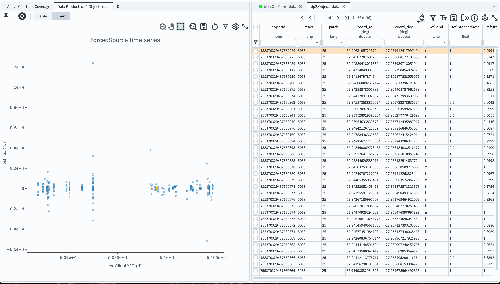

    Figure 12: The buttons to cycle through image planes in Firefly. They appear above the displayed image.

To return to a view of the HiPS map with the search results overlaid, click the "Coverage" button at the upper left.

To instead overlay the retrieved objects on the image from your previous search, change tabs in the Tables window to the one that says "ivoa.ObsCore - data". (You may also have to click on the "Data Product: ..." button in the image display window on the left.)

The objects from the search result will now be highlighted as in Figure 13 (the search results are the small magenta markers).

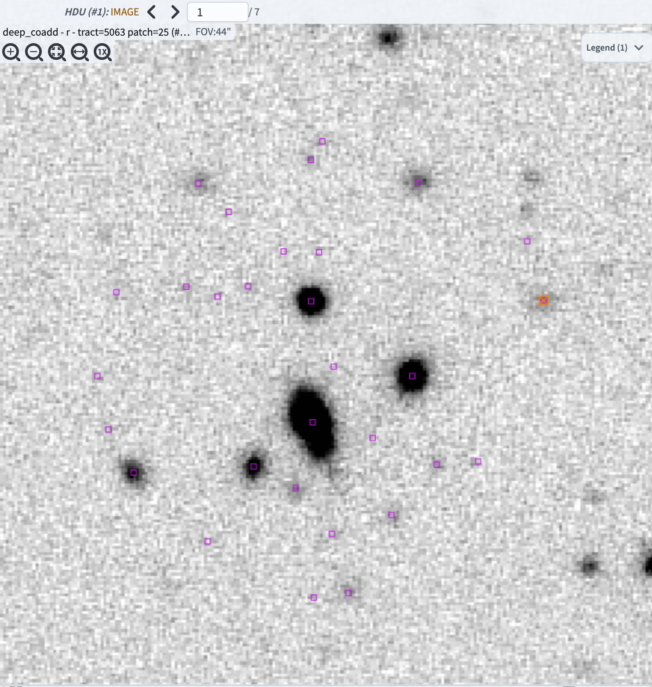

    Figure 13: The buttons to cycle through image planes in Firefly. They appear above the displayed image.

Note: the crop tool that appears when a selection is made is not currently functional. One should use the cutout tool instead to get a cutout image. Additionally, the zoom tool in that menu will zoom to the selected area, but then make the select tool inactive. If you want to perform additional operations on the selected area, you will need to select it again.
