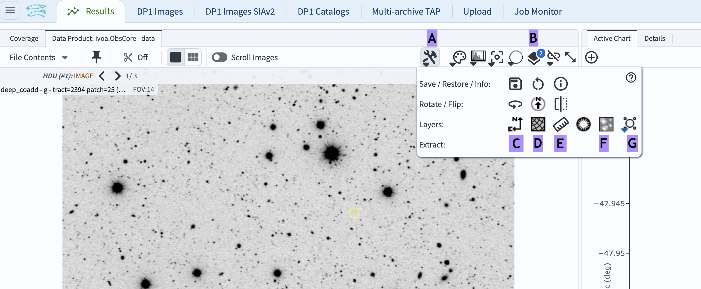
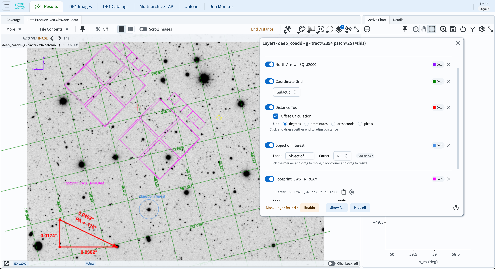

.. _portal-105-3:

######################################
105.3. Add layers to images in Firefly
######################################

For the Portal Aspect of the Rubin Science Platform at data.lsst.cloud.

**Data Release:** DP1

**Last verified to run:** 2026-04-07

**Learning objective:** Add overlays to images displayed in Firefly.

**LSST data products:** ``deep_coadd`` image

**Credit:** Originally developed by the Rubin Community Science Team.
Please consider acknowledging them if this tutorial is used for the preparation of journal articles, software releases, or other tutorials.

**Get Support:** Everyone is encouraged to ask questions or raise issues in the `Support Category <https://community.lsst.org/c/support/6>`_ of the Rubin Community Forum.
Rubin staff will respond to all questions posted there.

----

**1. Log in to the Portal Aspect of the RSP.**
Go to `data.lsst.cloud <https://data.lsst.cloud>`_ , select the Portal Aspect, and click on the "DP1 Images" tab at the top.

**2. Execute an ADQL query for an image.**
Click on "Edit ADQL" at upper right.
Enter the following ADQL statement and click "Search" at lower left.
This query statement will return one *g*-band image in the Euclid Deep Field South field.

.. code-block:: SQL

  SELECT dataproduct_type,dataproduct_subtype,calib_level,lsst_band,em_min,em_max,lsst_tract,lsst_patch,
         lsst_filter,lsst_visit,lsst_detector,t_exptime,t_min,t_max,s_ra,s_dec,s_fov,obs_id,
         obs_collection,o_ucd,facility_name,instrument_name,obs_title,s_region,access_url,
         access_format
  FROM ivoa.ObsCore
  WHERE CONTAINS(POINT('ICRS', 59.1, -48.73), s_region)=1
        AND (483e-9 BETWEEN em_min AND em_max)
        AND calib_level = 3 AND dataproduct_type = 'image' AND dataproduct_subtype = 'lsst.deep_coadd'
        AND (lsst_tract = 2394 AND lsst_patch = 25)

**3. Explore available image layer options.**
Click the "Tools" icon (A in Figure 1) to open the drop-down menu, then mouse-over each icon in the "Layers" row to see pop-up description boxes.

    Figure 1: The retrieved image displayed with Firefly, and the "Tools" drop-down menu.

**4. Add a compass.**
Click the "Compass" icon (the north-east arrow; C in Figure 1).
A compass will appear on the image.
Change its color to purple by clicking the "Layers" icon (B in Figure 1), and in the pop-up window (Figure 2) clicking "Color" to the right of "North Arrow", and selecting purple.

**5. Add a coordinate grid.**
Click the "Grid" icon (D in Figure 1) to display the coordinate grid on the image.
Change its coordinate system to the Galactic coordinate by opening the "Layers" pop-up window and selecting "Galactic" from the drop-down menu under "Grid" (Figure 2).

**6. Add a ruler to measure distance.**
Click the "Ruler" icon (E in Figure 1), click a starting point on the image, and drag to an endpoint.
In the "Layers" pop-up window, check "Offset Calculation" under "Distance Tool", and set "Unit" to degrees.

**7. Add a mask.**
To display image mask planes, do not use the "Mask" icon (F in Figure 1), which does not work properly with Rubin images.
Instead, click the "Layers" icon (B in Figure 1), and then click "Enable" in the lower-left corner next to where it says "Mask Layer found" (see Figure 2).
A list of many mask planes will appear, starting with "BAD," "SAT," "INTRP," "CR," "EDGE," and so on.
Click the toggle next to "bit # 5 - DETECTED" to display the mask for all pixels that are part of detected objects.
At the right side, change the color of this mask plane to green by clicking on the "Color" button and selecting green.
Turn the DETECTED mask display off by clicking the toggle at the left side.

**8. Add a marker.**
Click the "Marker" icon (G in Figure 1) and select "Add Marker" to place a marker (a circle) on the image.
Click and drag the marker to highlight an object of interest.
Resize the marker by clicking and dragging one of the little four boxes that appear around it.
Open the "Layers" window, set the label to "Object of interest", and change the label corner to "NE".

**9. Add a footprint.**
Click the "Footprint" icon (G in Figure 1) and select "NIRCAM" from "Add JWST footprint".
The footprint will appear in the center of the image.
Move it by clicking and dragging any part of it.
To rotate, click the "Layers" icon and enter "45" for "Angle" under "Footprint: JWST NIRCAM", or drag the rotate handle by 45 degrees.

    Figure 2: The "Layers" pop-up window with display controls.

**10. Remove a layer.**
In the "Layers" window, toggle the display of any layer on and off using the sliding buttons at left.
To completely remove a layer, click the "X" to the right of its "Color" box.
