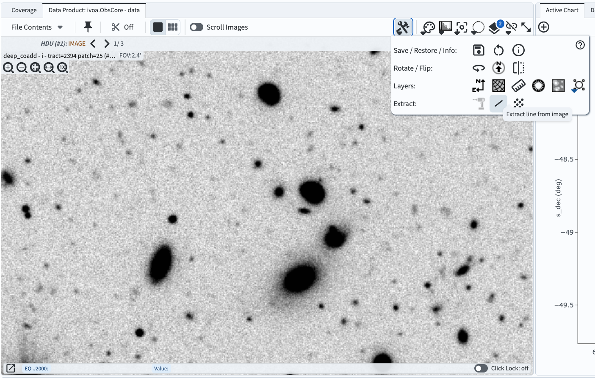
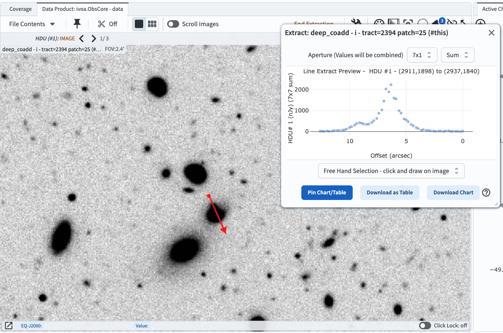
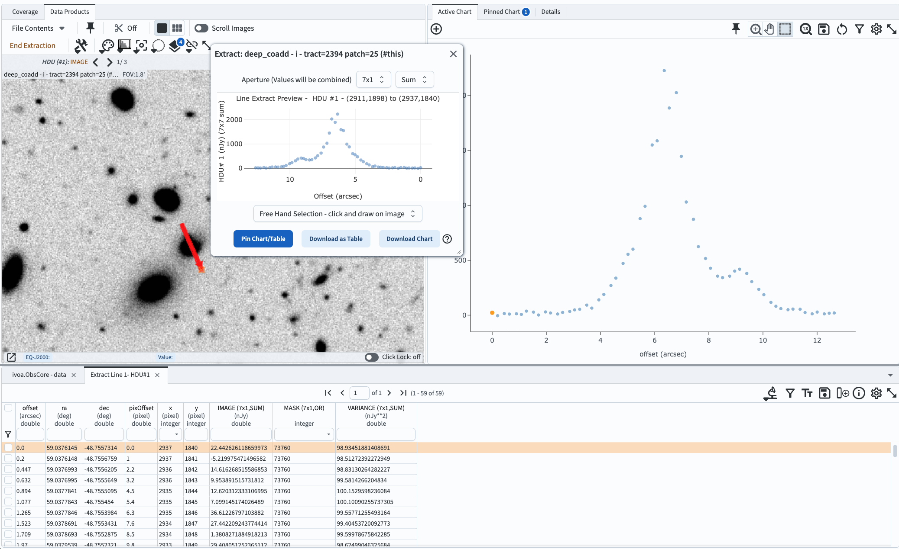
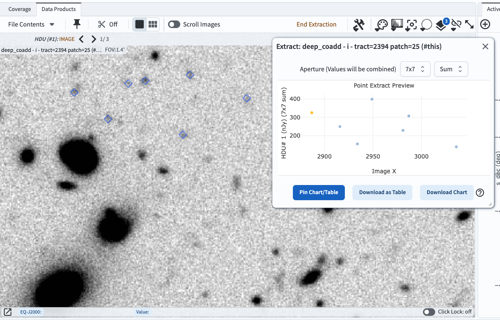

.. _portal-105-4:

#######################################
105.4. Extract pixel values from images
#######################################

For the Portal Aspect of the Rubin Science Platform at data.lsst.cloud.

**Data Release:** DP1

**Last verified to run:** 2025-09-25

**Learning objective:** Extract pixel values from an image with Firefly (e.g., line profiles, apertures).

**LSST data products:** ``deep_coadd`` image

**Credit:** Originally developed by the Rubin Community Science Team.
Please consider acknowledging them if this tutorial is used for the preparation of journal articles, software releases, or other tutorials.

**Get Support:** Everyone is encouraged to ask questions or raise issues in the `Support Category <https://community.lsst.org/c/support/6>`_ of the Rubin Community Forum.
Rubin staff will respond to all questions posted there.

----

**1. Log in to the Portal Aspect of the RSP.**
Go to `data.lsst.cloud <https://data.lsst.cloud>`_ , select the Portal Aspect, and click on the "DP1 Images" tab at the top.

**2. Execute an ADQL query for an image.**
Click on "Edit ADQL" at upper right.
Enter the following ADQL statement and click "Search" at lower left.
This query statement will return one *i*-band image in the Euclid Deep Field South field.

.. code-block:: SQL

  SELECT dataproduct_type,dataproduct_subtype,calib_level,lsst_band,em_min,em_max,lsst_tract,lsst_patch,
         lsst_filter,lsst_visit,lsst_detector,t_exptime,t_min,t_max,s_ra,s_dec,s_fov,obs_id,
         obs_collection,o_ucd,facility_name,instrument_name,obs_title,s_region,access_url,
         access_format
  FROM ivoa.ObsCore
  WHERE calib_level = 3 AND dataproduct_type = 'image' AND dataproduct_subtype = 'lsst.deep_coadd'
        AND CONTAINS(POINT('ICRS', 59.1, -48.73), s_region)=1
        AND (755e-9 BETWEEN em_min AND em_max)
        AND (lsst_tract = 2394 AND lsst_patch = 25)

**3. Zoom in.**
Click on the "zoom-in" icon (the magnifying glass with a "+" sign in the upper left of the image panel), or use the mouse, to zoom in on any object(s) of interest (as in Figure 1).

    Figure 1: The Firefly interface displays the retrieved image, zoomed-in, with the "Tools" window displayed.

**4. Extract a line profile.**
Click the "Tools" icon, then select the "Line" icon in the "Extract" row (see Figure 1).
The pop-up "Extract" window will appear.
In the image, click-and-drag to draw a line across any object(s), and the 1D brightness profile (line profile) will appear in the pop-up window (see Figure 2).

**5. Adjust the aperture.**
In the "Extract" window, aperture options are provided in the format "x-by-y".
The options will always be 1 along the direction of the line.
For a more horizontal line the options will be "1x3" to "1x7" (i.e., always 1 in the x-direction).
Whereras for a more vertical line the options will be "3x1" to "7x1" (i.e., always 1 in the y-direction).
The options to calculate the "Average" or "Sum" of the fluxes within the aperture are given.
Figure 2 demonstrates a "7x1" sum aperture used on a more vertical line profile across two blended objects.

    Figure 2: A line profile drawn across two blended objects, with the pop-up "Extract" window options set to use a "7x1" aperture and "Sum" the pixel values within the aperture.

**6. Pin or download the extracted line profile.**
In the pop-up "Extract" window click "Pin Chart/Table" to send the extracted fluxes to the table and chart panels of the results viewer, as shown in Figure 3.
Clicking either of the two download buttons will present options for downloadable file formats, including a DS9 region file.

    Figure 3: After clicking "Pin Chart/Table", the extracted line profile will appear in the table (bottom) and chart (right) for further analysis and manipulation.

**7. Clear the extracted line profile.**
Click the "x" at upper right in the chart (plot) and the "x" in the table tab named "Extract line".
Open the "Layers" pop-up window and click the "x" at far right in the "Extract Line" row, and then close the "Layers" window.

**8. Extract point fluxes.**
Click the "Tools" icon, then select the "Points" icon in the "Extract" row (see Figure 1).
Click on a few objects across the image; in Figure 4, faint objects were selected.
In the pop-up window, see that the single-pixel flux will be plotted as a function of the x-axis location.
Set the aperture to "7x7" and "Sum", as in the example in Figure 4 below.

    Figure 4: The summed flux in a 7x7 pixel aperture for each of the marked locations, plotted versus the x-axis location.

**9. Pin or download the extracted fluxes.**
As in step 6, send the extracted fluxes into the table and chart panels.
