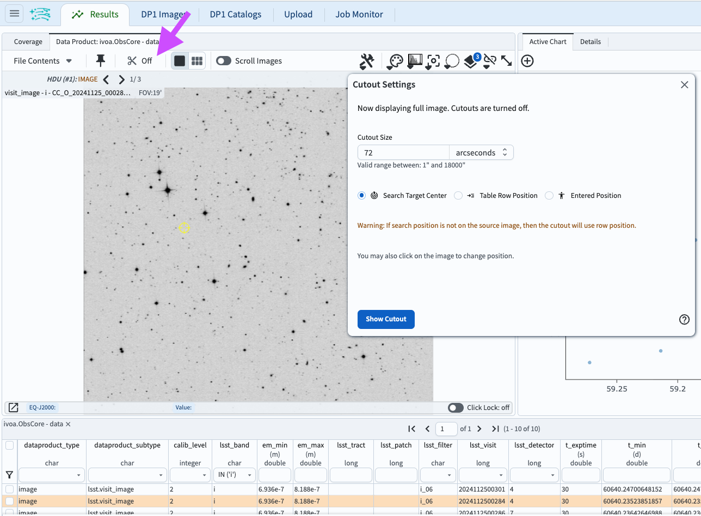
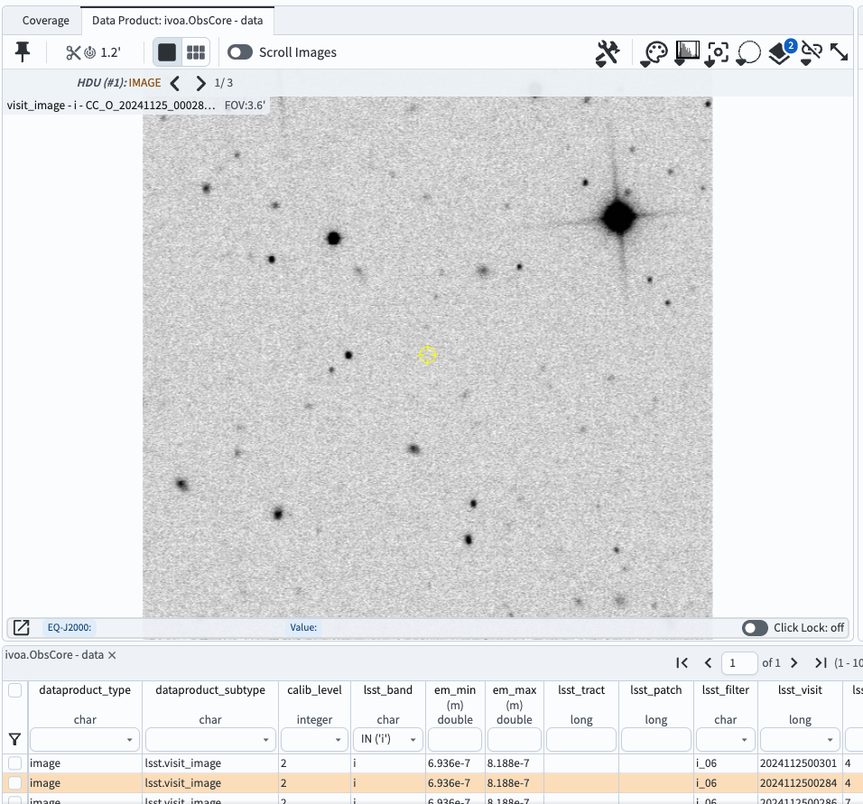
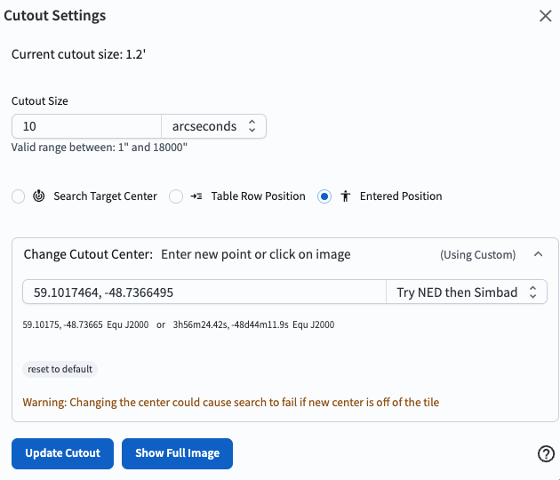
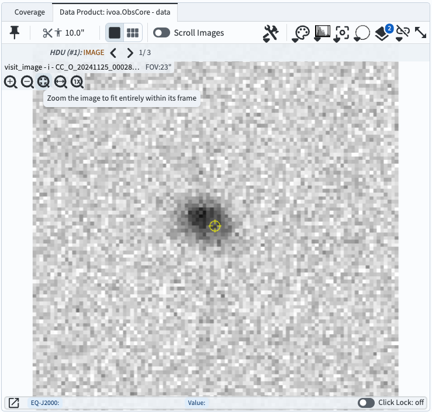
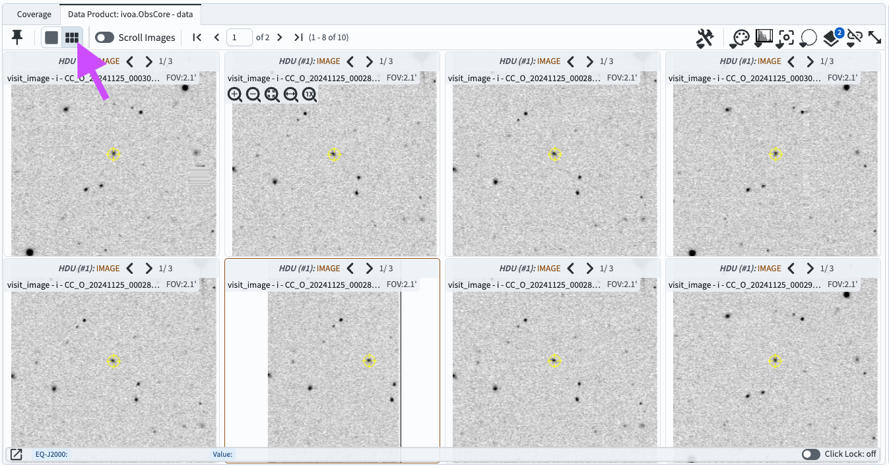
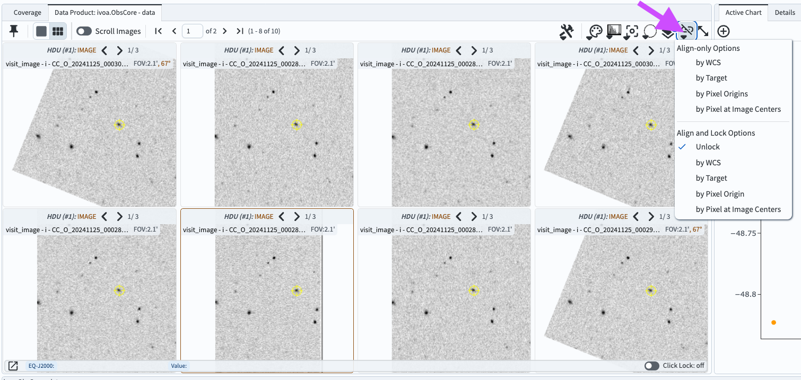

.. _portal-105-5:

################################
105.5. Use the image cutout tool
################################

For the Portal Aspect of the Rubin Science Platform at data.lsst.cloud.

**Data Release:** DP1

**Last verified to run:** 2025-09-25

**Learning objective:** View image cutouts instead of full-frame images in Firefly.

**LSST data products:** ``visit_image``

**Credit:** Originally developed by the Rubin Community Science team.
Please consider acknowledging them if this tutorial is used for the preparation of journal articles, software releases, or other tutorials.

**Get Support:** Everyone is encouraged to ask questions or raise issues in the `Support Category <https://community.lsst.org/c/support/6>`_ of the Rubin Community Forum.
Rubin staff will respond to all questions posted there.

----

**1. Log in to the Portal Aspect of the RSP.**
Go to `data.lsst.cloud <https://data.lsst.cloud>`_ , select the Portal Aspect, and click on the "DP1 Images" tab at the top.

**2. Execute an ADQL query for an image.**
Click on "Edit ADQL" at upper right.
Enter the following ADQL statement and click "Search" at lower left.
This query will return a subset of processed visit images in the Euclid Deep Field South field that overlap coordinates RA, Dec = 59.1, -48.73 deg.

.. code-block:: SQL

  SELECT dataproduct_type,dataproduct_subtype,calib_level,lsst_band,em_min,em_max,lsst_tract,lsst_patch,
         lsst_filter,lsst_visit,lsst_detector,t_exptime,t_min,t_max,s_ra,s_dec,s_fov,obs_id,
         obs_collection,o_ucd,facility_name,instrument_name,obs_title,s_region,access_url,access_format
  FROM ivoa.ObsCore
  WHERE CONTAINS(POINT('ICRS', 59.1, -48.73), s_region) = 1
        AND calib_level = 2 AND dataproduct_type = 'image' AND dataproduct_subtype = 'lsst.visit_image'
        AND (t_min <= 60641 AND 60638 <= t_max)

**3. Select a single i-band image.**
In the results view, in the table across the bottom, in the column with the header "lsst band" select "i" from the dropdown menu.
Click on the line for ``lsst_visit`` 2024112500284.
That row of the table will be highlighted, and that specific image displayed in the Firefly viewer at upper left, as in Figure 1.

**4. Open the cutout tool.**
Above the image on the upper left, click on "Cutout" tool icon (the scissors, as shown in Figure 1).
The "Cutout Settings" pop-up window displays the default cutout size and center (a radius of 72 arcseconds and "Search Target Center", respectively).

    Figure 1: The results view with *i*-band image for visit 2024112500284 displayed. The search coordinate is marked with a yellow symbol. Also shown is the pop-up window that appears after clicking on the "cutout" icon (the scissors, marked with an arrow).

**5. View the default cutout.**
In the "Cutout Settings" window, click on "Show Cutout".
The image displayed in the Firefly panel will update to be the default cutout, as in Figure 2.

    Figure 2: The default cutout, 72x72 arcseconds, centered on the original search coordinates (yellow symbol).

**6. Create a custom cutout.**
Open the "Cutout Settings" window and change the size to a radius of 10 arcseconds.
Click on the circle next to "Entered Position", then click on the "Change Cutout Center" box that appears and enter "59.1017464, -48.7366495".
These are the RA and Dec coordinates of a small faint extended object, in degrees.
As shown in Figure 3, click on "Update Cutout", and the result will be as shown in Figure 4.

    Figure 3: Cutout settings for a custom cutout that is 20 arcseconds per side, and centered on the provided RA and Dec in degrees.

    Figure 4: The cutout that results from the settings in Figure 3.

**7. Reset the cutout size to 60 arcseconds.**
Open the cutout setting window, enter 60 in the size box, and click "Update Cutout".
The following steps are better demonstrated with larger cutouts.

**8. Display multiple cutouts.**
Click on the "Tile" icon at upper left (six little rectangles; marked with an arrow in Figure 5).
Cutouts will be displayed from the first eight images in the table, as shown in Figure 5.
Notice that the visit images have different rotations, and that for visit image 20241125000283 (second from left on the bottom) the cutout center coordinates are close to that image's edge, and the cutout is not square.

    Figure 5: A tiled view of eight cutouts of eight different visit images, all made with 60 arcsecond radii and centered on the same coordinates.

**9. Align the tiled cutouts in sky coordinates.**
Click on the "image alignment" tool icon (marked with an arrow in Figure 6).
Under "Align and Lock" click on "by WCS" (World Coordinate System; sky coordinate).
As in Figure 6, all cutouts are now oriented north-up, east-left.

    Figure 6: A tiled view of the same eight cutouts as in Figure 5, but aligned by WCS and oriented north-up, east-left.

**10. Return to full image display.**
Return to full-image display by opening the cutout tool window and clicking "Show Full Image".

