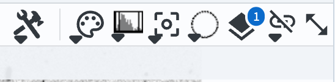
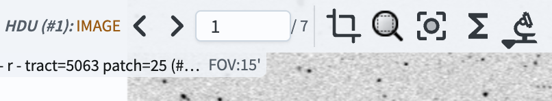
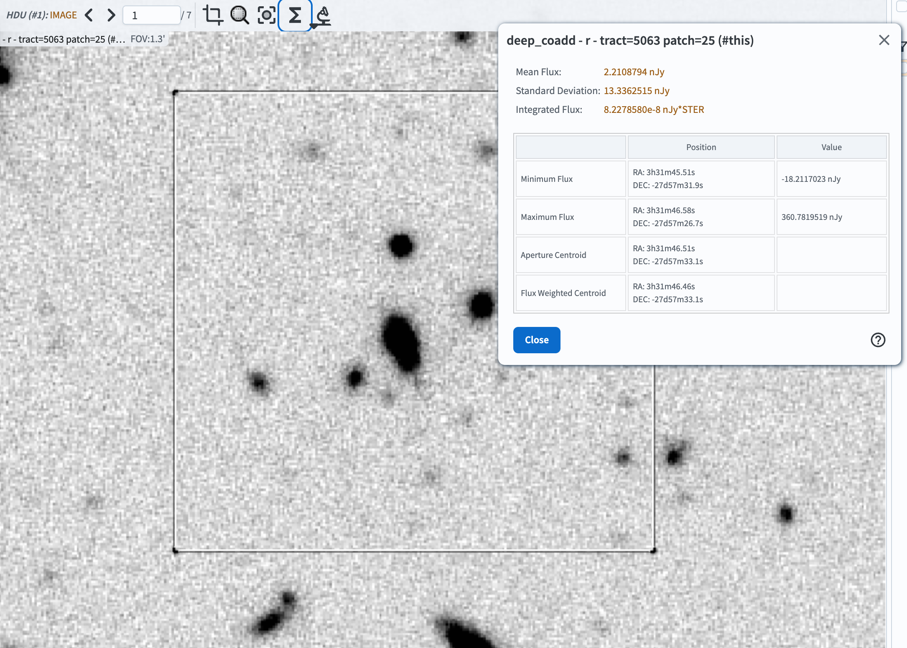
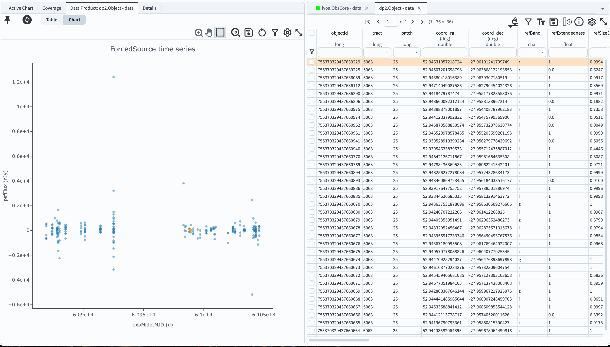
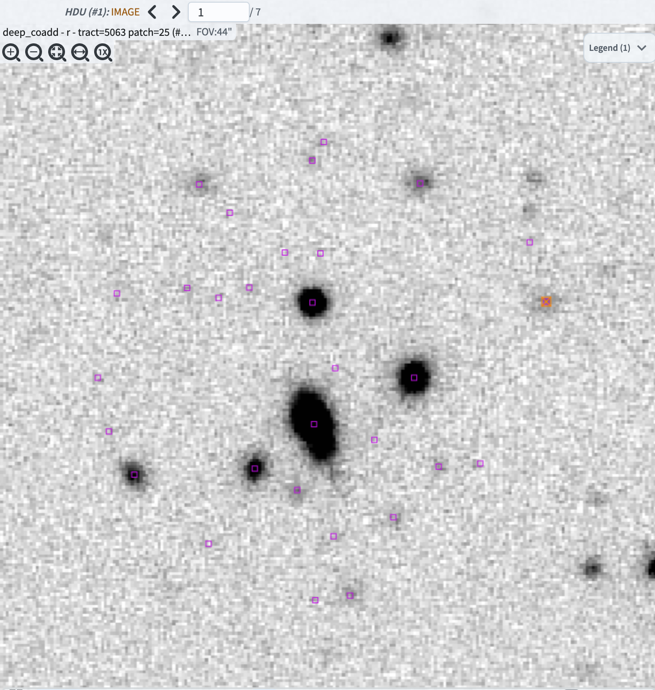

.. _portal-105-x:

########################################
105.x. Use the selection tool in Firefly
########################################

For the Portal Aspect of the Rubin Science Platform at data.lsst.cloud.

**Data Release:** DP2

**Last verified to run:** 2026-09-28

**Learning objective:** Use the selection tool in the Firefly image viewer.

**LSST data products:** ``deep_coadd`` image

**Credit:** Originally developed by the Rubin Community Science team.
Please consider acknowledging them if this tutorial is used for the preparation of journal articles, software releases, or other tutorials.
DOI: `10.11578/rubin/dc.20250909.20 <https://doi.org/10.11578/rubin/dc.20250909.20>`_

**Get Support:** Everyone is encouraged to ask questions or raise issues in the `Support Category <https://www.rubin.community/c/support/6>`_ of the Rubin Community Forum.
Rubin staff will respond to all questions posted there.

----

**1. Execute an ADQL query for a deep coadd image.**
Log in to the Portal Aspect, select the "DP1 & DP2 Images" tab and click on "Edit ADQL" at upper right.
Enter the following ADQL statement and click "Search" at lower left.
This query will return all *r*-band deep coadd images that overlap coordinates RA, Dec = 53.0, -28.0 degrees.

.. code-block:: SQL

  SELECT dataproduct_type,dataproduct_subtype,calib_level,
           lsst_band,em_min,em_max,lsst_tract,lsst_patch,
           lsst_filter,s_ra,s_dec,s_fov,obs_id,obs_collection,
           o_ucd,facility_name,instrument_name,obs_title,
           s_region,access_url,access_format
  FROM ivoa.ObsCore
  WHERE obs_collection = 'LSST.DP2'
        AND dataproduct_subtype = 'lsst.deep_coadd'
        AND lsst_band = 'r'
        AND CONTAINS(POINT('ICRS', 53.0, -28.0), s_region)=1

**2. Select a rectangular region of the image.**

The "Select drop down" tool, which looks like a dashed open circle (labeled "A" in Figure 1), can be used to select a region of the image and perform operations on the selected region.

Click on the select drop down, then choose "Rectangular Selection".
By clicking at the desired position with your mouse, then dragging the rectangle until it is the desired size, select a rectangular region of the image.
Notice that the rectangle's shape, size, and position can be adjusted as long as the select tool is active.

To recenter the image at the rectangle you selected, click the "Recenter image to selected area" button in the new selection tools menu that appears above the image when a selection is made (see Figure 2).
The "Recenter image" button is labeled "A" in Figure 2.

    Figure 1: The buttons to cycle through image planes in Firefly. They appear above the displayed image.

    Figure 2: The buttons to cycle through image planes in Firefly. They appear above the displayed image.

**3. Extract statistics for the pixels in the selected region.**

Click the button (labeled "B" in Figure 2) to "Show statistics for the selected area".
A window displaying the pixel statistics within the selected rectangle will pop up.
An example of a rectangular selection and the statistics window is shown in Figure 3.

    Figure 3: The buttons to cycle through image planes in Firefly. They appear above the displayed image.

Mouse over each of the rows in the pop-up table, and note that an "x" appears at the position corresponding to each row's measurement.

Close the statistics window.

**4. Search for catalog objects in the selected region.**

To search for catalog objects in the selected region, click the "Search this area" button that looks like a microscope (labeled "C" in Figure 10).
In the drop-down, select "Search (cone) using TAP..." to search a DP2 table with the radius enclosed by the box.

Clicking the search button will take you to the Catalog search view of the Portal, showing by default the Object table (others can be selected using the dropdown menus, as demonstrated in the 100-level Portal tutorials).
Keep all of the default column selections and click Search (at the lower left).

A catalog query results table will appear. In most cases, the display will show a lightcurve of the first object in the results table, as seen in Figure 12 (your display may show something slightly different, and have a different layout depending on what you have selected earlier).

    Figure 12: The buttons to cycle through image planes in Firefly. They appear above the displayed image.

To return to a view of the HiPS map with the search results overlaid, click the "Coverage" button at the upper left.

To instead overlay the retrieved objects on the image from your previous search, change tabs in the Tables window to the one that says "ivoa.ObsCore - data". (You may also have to click on the "Data Product: ..." button in the image display window on the left.)

The objects from the search result will now be highlighted as in Figure 13 (the search results are the small magenta markers).

    Figure 13: The buttons to cycle through image planes in Firefly. They appear above the displayed image.

Note: the crop tool that appears when a selection is made is not currently functional. One should use the cutout tool instead to get a cutout image. Additionally, the zoom tool in that menu will zoom to the selected area, but then make the select tool inactive. If you want to perform additional operations on the selected area, you will need to select it again.
