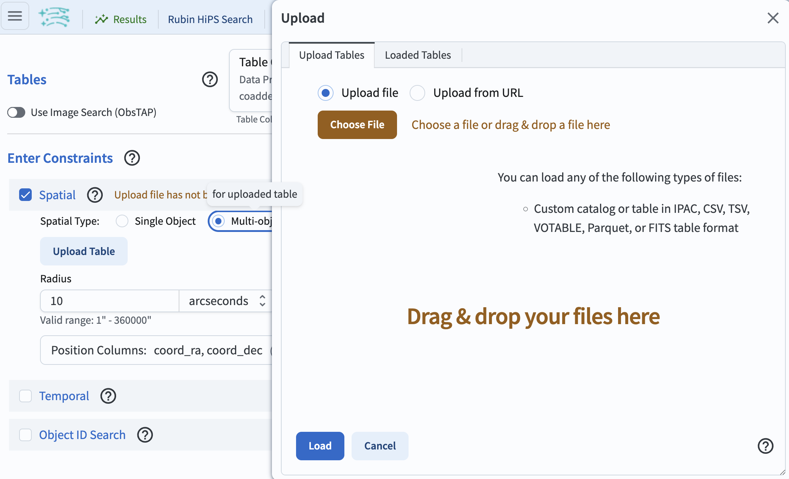
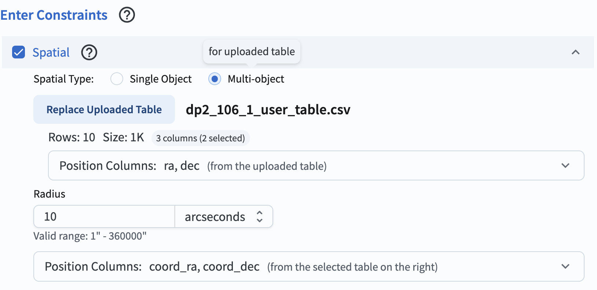
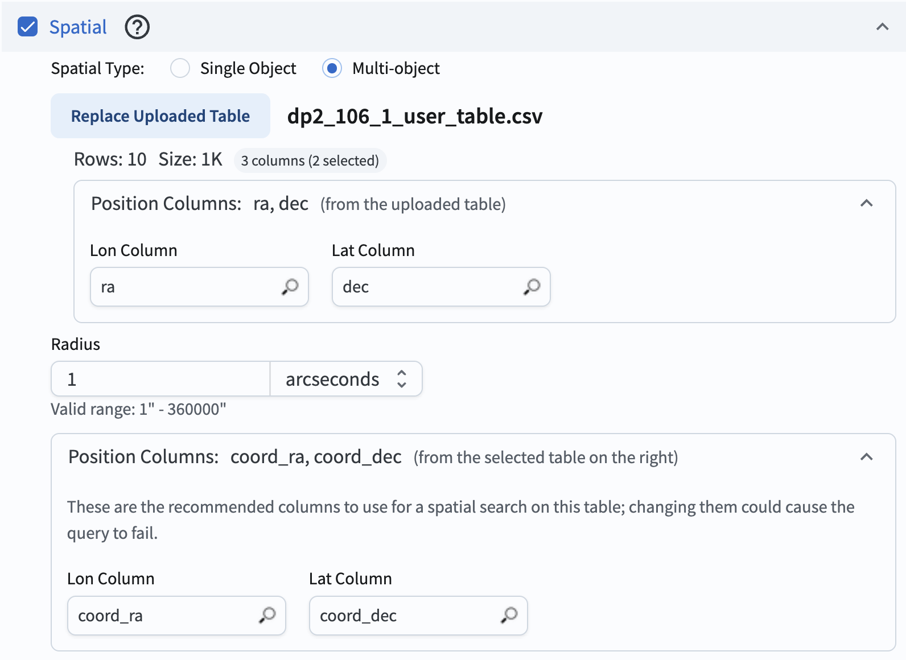
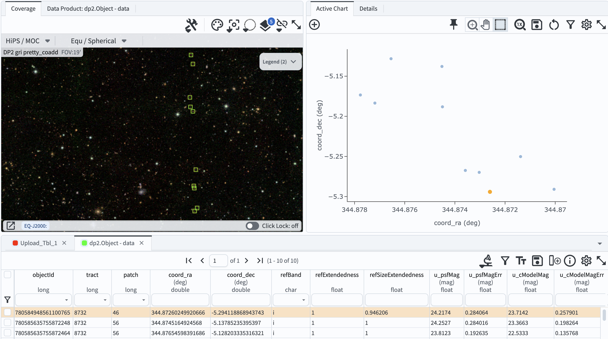

.. _portal-106-1:

###############################################
106.1. Upload a table and spatially cross-match
###############################################

For the Portal Aspect of the Rubin Science Platform at data.lsst.cloud.

**Data Release:** Data Preview 2

**Last verified to run:** 2026-09-03

**Learning objective:** How to upload a table and cross-match by coordinate.

**LSST data products:** ``Object`` table

**Credit:** Originally developed by the Rubin Community Science team.
Please consider acknowledging them if this tutorial is used for the preparation of journal articles, software releases, or other tutorials.
DOI: `10.11578/rubin/dc.20250909.20 <https://doi.org/10.11578/rubin/dc.20250909.20>`_

**Get Support:** Everyone is encouraged to ask questions or raise issues in the `Support Category <https://community.lsst.org/c/support/6>`_ of the Rubin Community Forum.
Rubin staff will respond to all questions posted there.

----

**1. Log in to the RSP and enter the Portal Aspect.**
In a web browser go to data.lsst.cloud, select the Portal Aspect, and log in.

**2. Select DP2 Catalogs tab.**
Navigate to the "DP1 & DP2 Catalogs" tab in the Portal UI to create an ADQL query from the DP2 catalogs.

**3. Enter Constraints.**
Check the box to the left of the "Spatial" section (uncheck the other two if checked), and click on the "Multi-object" button next to "Spatial Type". This will make a pop-up window appear with the interface to upload a table.

    Figure 1: The interface to upload a table.

**4. Create a table to upload.**
Copy the example table below and save it as a CSV file called ``dp2_106_1_user_table.csv``. Avoid using the "+" prefix for positive infinity (i.e., "+inf") in any of your columns. These values are not recognized as valid float values, and the entire column will be interpreted as a character type.

.. code-block::

    SDSS_objid,ra,dec
    1237680065347649938, 344.872589288903, -5.29412953356062
    1237680065347649939, 344.877186896095, -5.18342606769438
    1237680065347649940, 344.877794530448, -5.17340032770887
    1237680065347649937, 344.873602385501, -5.26745861467814
    1237680065347649936, 344.873036222136, -5.26977387877352
    1237680065347649935, 344.876528103134, -5.128174209936
    1237680065347649934, 344.874508490362, -5.18819130379492
    1237680065347649933, 344.874446935363, -5.13784242229324
    1237680065347649932, 344.871377794791, -5.25018994406145
    1237680065347649931, 344.870053717524, -5.29090967498696

**5. Upload a table to the Portal.**
In the pop-up window for table uploads, select "Upload file" and click on "Choose File".
Select the CSV file containing the user table and click the "Load Table" button.

    Figure 2. After a successful upload, the table appears in the "Spatial" section, displaying the file name, number of rows, and file size.

**6. Select columns and set the radius for cross-matching.**
Click the drop down menu under "Position Columns: ra, dec (from the uploaded table)."
Indicate which of the uploaded table columns to use for spatial matching (default ``ra`` and ``dec``).
Click the drop down menu under "Position Columns: coord_ra, coord_dec (from the selected table on the right)" and check that the default ``coord_ra`` and ``coord_dec`` are shown.
Set the search radius to 1 arcseconds.

    Figure 3. The interface to select the position columns and set the radius to be used for cross-matching.

**7. Click search.**
At the lower left, click the blue button named "Search".
Leave the default row limit.

**Warning for not a short table!**
Use the simple click "Search" only for short tables. To avoid slow queries on larger tables, skip the "Search" button and click "Populate and edit ADQL" at the bottom-center. When the ADQL interface opens and auto-fills the query box, replace the lines following the ``SELECT`` statement with these:

.. code-block::

    FROM dp2.Object AS d
    JOIN TAP_UPLOAD.upload_table AS ut
    ON DISTANCE(POINT('ICRS', d.coord_ra, d.coord_dec),
                POINT('ICRS', ut.ra, ut.dec)) < 0.0002777778

Joining the uploaded table with the ``Object`` table using ``DISTANCE`` makes a query highly efficient by targeting only the relevant chunks of data.

**8. Review the results**.
The search returns matches for all ten objects from the user-uploaded table.
The results interface includes a table with the default column selections from the DP2 ``Object`` table and the ``ra`` and ``dec`` columns from the uploaded table.

    Figure 4. The catalog results interface after the cross-match query was executed.

