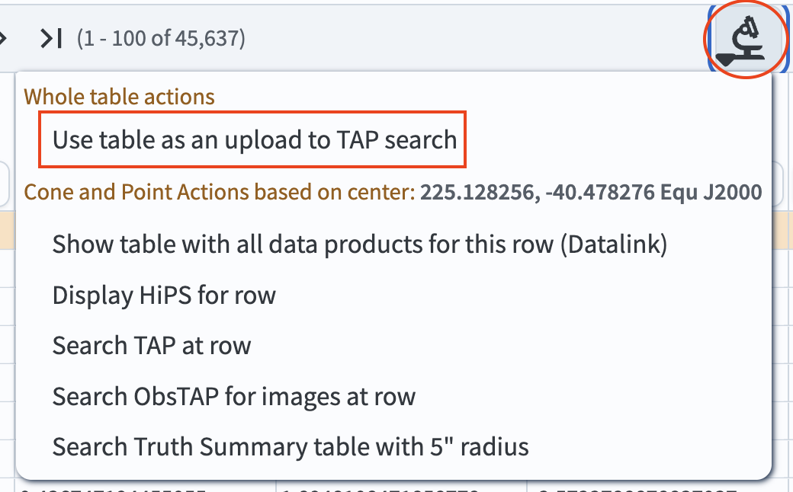
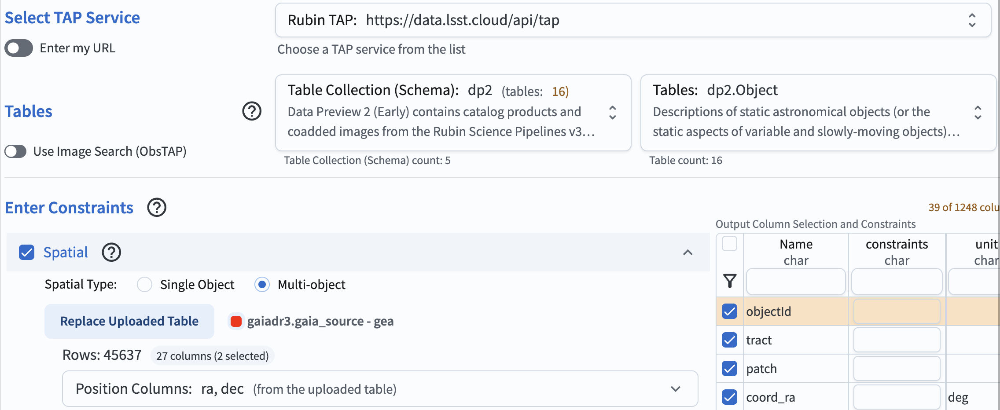
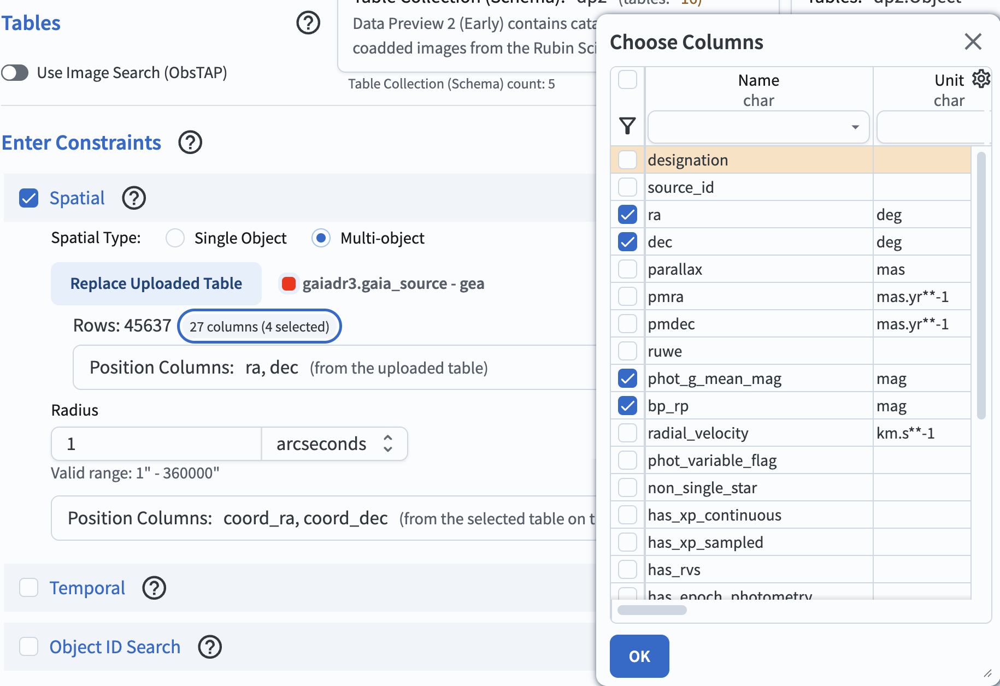

.. _portal-106-2:

###########################################################
106.2. Use query results as user uploads for cross-matching
###########################################################

For the Portal Aspect of the Rubin Science Platform at data.lsst.cloud.

**Data Release:** Data Preview 2

**Last verified to run:** 2026-09-10

**Learning objective:** How to use TAP query results as a custom table in a subsequent query.

**LSST data products:** ``Object`` table

**Credit:** Originally developed by the Rubin Community Science team.
Please consider acknowledging them if this tutorial is used for the preparation of journal articles, software releases, or other tutorials.
DOI: `10.11578/rubin/dc.20250909.20 <https://doi.org/10.11578/rubin/dc.20250909.20>`_

**Get Support:** Everyone is encouraged to ask questions or raise issues in the `Support Category <https://community.lsst.org/c/support/6>`_ of the Rubin Community Forum.
Rubin staff will respond to all questions posted there.

----

**1. Log in to the RSP and enter the Portal Aspect.**
In a web browser go to data.lsst.cloud, select the Portal Aspect, and log in.

**2. Select Multi-archive TAP tab.**
On the Portal landing page, click on the menu icon (three horizontal lines at upper left) to open the sidebar menu. Under "Other archive searches," select "Multi-archive TAP" if it is not already in your default tab list.

.. figure:: images/portal-106-2-1.png
    :name: portal-106-2-1
    :alt: A portion of the sidebar menu in the Portal Aspect, showing available options for archive searches.
    :width: 300

    Figure 1: A portion of the sidebar menu in the Portal Aspect, showing available options for archive searches.

**3. Query using Gaia TAP service.**
Select the Gaia TAP service and ensure ``gaiadr3.gaia_source`` table is selected. Under the "Spatial" section, as an example, enter "225, -40" for coordinates and set the search radius to 0.5 degrees. At the lower left, click the blue button named "Search".

**4. Upload the TAP query result as a custom table.**
In the results interface, click the "Actions" icon (circled in Figure 2) and select the "Use table as an upload to TAP search" option.

    Figure 2: A screenshot showing available action items when clicking the "Actions" icon.

**5. Switch to the Rubin TAP service.**
Once the query result is successfully uploaded as a custom table, the result interface is switched to the "Multi-archive TAP" tab and the custom table appears under the "Spatial" section. Switch to the Rubin TAP service by selecting "Rubin Tap" from the drop-down menu and ensure the ``Object`` table is selected.

    Figure 3: The expected view of the Portal interface following the successful upload of a custom table and selection of the Rubin TAP service.

**6. Use the custom table in a new TAP query.**
Under the "Spatial" section, ensure the position columns are set to ``ra`` and ``dec`` for the uploaded table, and ``coord_ra`` and ``coord_dec`` for the DP2 ``Object`` table. Set the search radius to 1 arcsecond to define a cross-matching tolerance. To incldue the ``photo_g_mean_mag`` and ``br_rp`` columns from the uploaded Gaia table in the final output, click the highlighted part next to "Rows: 45637" (circled in Figure 4). Select the two photometry columns from the pop-up window, and click "Ok". Finally, click "Search" in the lower-left corner of the page.

    Figure 4: The Portal search interface fully configured prior to execution. The spatial cross-match parameters, the 1-arcsecond search radius, and the additional output columns from the uploaded Gaia table are properly set.

**7. Review the results**.
The search returns 97 matches from the user-uploaded table.