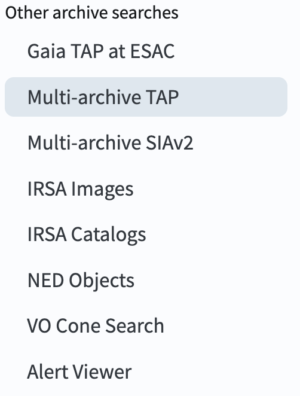

.. _portal-106-2:

######################################################
106.2. Upload a table and cross-match by identifiers
######################################################

For the Portal Aspect of the Rubin Science Platform at data.lsst.cloud.

**Data Release:** Data Preview 2

**Last verified to run:** 2026-09-03

**Learning objective:** How to upload a table and cross-match by identifiers.

**LSST data products:** ``IsolatedStarStellarMotions`` table

**Credit:** Originally developed by the Rubin Community Science team.
Please consider acknowledging them if this tutorial is used for the preparation of journal articles, software releases, or other tutorials.
DOI: `10.11578/rubin/dc.20250909.20 <https://doi.org/10.11578/rubin/dc.20250909.20>`_

**Get Support:** Everyone is encouraged to ask questions or raise issues in the `Support Category <https://community.lsst.org/c/support/6>`_ of the Rubin Community Forum.
Rubin staff will respond to all questions posted there.

----

**1. Log in to the RSP and enter the Portal Aspect.**
In a web browser go to data.lsst.cloud, select the Portal Aspect, and log in.

**2. Select Multi-archive TAP tab.**
On the Portal landing page, click on the menu icon (three horizontal lines at upper left) to open the sidebar menu. Under "Other archive searches," select "Multi-archive TAP" if it is not already in your default tab list.

    Figure 1: A portion of the sidebar menu in the Portal Aspect, showing available options for archive searches.

**3. Go to the ADQL interface.**
Ensure Gaia TAP service is selected and ``gaiadr3.gaia_source`` table is selected. Click the "Edit ADQL" button in the upper right corner to switch from the user interface to the ADQL interface. Copy the query below and paste it into the "ADQL Query" box.

.. code-block::

    SELECT source_id,ra,dec,parallax,pmra,pmdec,phot_g_mean_mag,bp_rp 
    FROM gaiadr3.gaia_source 
    WHERE CONTAINS(POINT('ICRS', ra, dec),CIRCLE('ICRS', 53.01, -28.35, 0.1))=1

