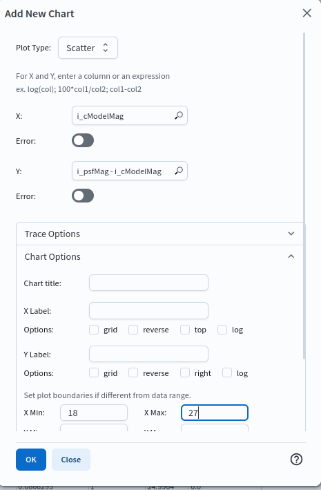
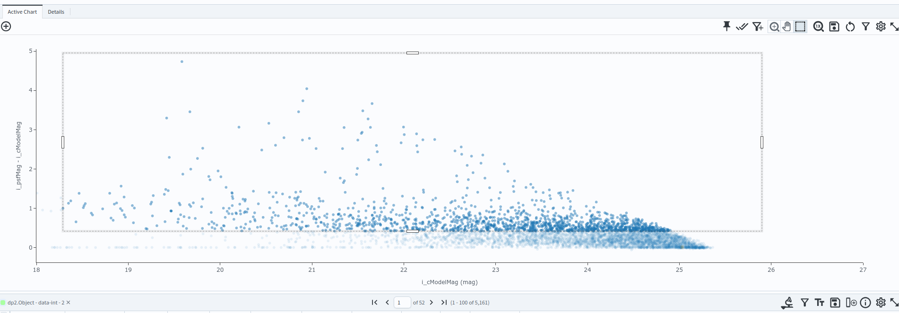
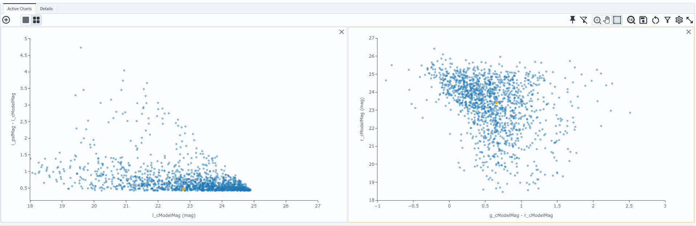
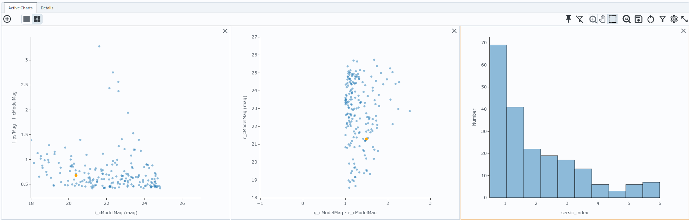
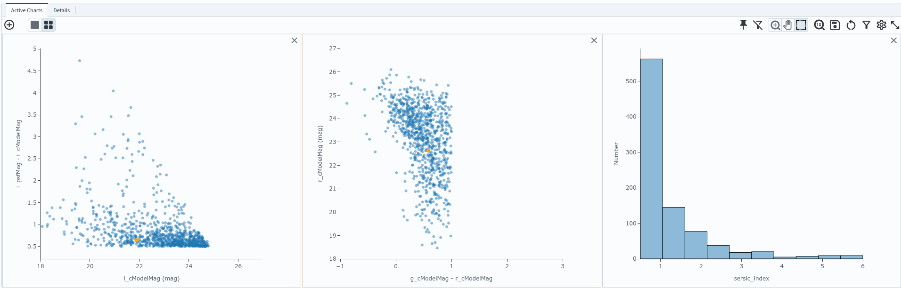

.. _portal-303-1:

###########################################
303.1. Explore galaxy shapes in a DP2 field
###########################################

For the Portal Aspect of the Rubin Science Platform (RSP) at data.lsst.cloud.

**Data Release:** Data Preview 2

**Last verified to run:** 2026-09-17

**Learning objective:** Query the DP2 catalogs for a field, separate stars from galaxies, and explore the galaxy population's colour-magnitude distribution and shapes with the Portal's results interface.

**LSST data products:** ``Object`` table

**Credit:** Originally developed by the Rubin Community Science team.
Please consider acknowledging them if this tutorial is used for the preparation of journal articles, software releases, or other tutorials.
DOI: `10.11578/rubin/dc.20250909.20 <https://doi.org/10.11578/rubin/dc.20250909.20>`_

**Get Support:** Everyone is encouraged to ask questions or raise issues in the `Support Category <https://community.lsst.org/c/support/6>`_ of the Rubin Community Forum.
Rubin staff will respond to all questions posted there.

**Related tutorials:** The 100-level Portal tutorials cover the interface and query tools; the 103-series covers ADQL. The notebook 303-series ("Galaxies") demonstrates galaxy photometry, shapes, and colour selection in more depth with Python.

----

1. Introduction
===============

The DP2 ``Object`` table contains photometry and morphology measurements for every source detected on the deep coadds, both stars and galaxies.
This tutorial works through a single field: it first separates stars from galaxies with an ADQL query and a diagnostic plot, then studies the galaxy population with a colour-magnitude diagram and a comparison of Sersic index histograms for red and blue galaxies.

The field used here is the Extended Chandra Deep Field-South (ECDFS), centred on RA, Dec = 53.13, -28.10 degrees.
ECDFS is a deep extragalactic field with a high surface density of galaxies and extensive multi-wavelength coverage from other observatories.

Galaxies are extended (resolved) sources, so a model fit measures their flux more accurately than a point-spread-function (PSF) fit does.
This tutorial uses ``cModel`` magnitudes, a combination of exponential and de Vaucouleurs profile fits, for galaxy photometry.

2. Separate stars from galaxies
================================

**2.1. Go to the catalog ADQL interface.**
Click on the "DP1 & DP2 Catalogs" tab, then click "Edit ADQL" at the upper right.

**2.2. Query the field.**
Copy the query below into the ADQL box and click "Search" at lower left.
It returns every well-measured source (star or galaxy) within 0.1 degrees of the field centre, with a signal-to-noise ratio above 10 in both the *i*-band PSF and ``cModel`` fluxes and no ``cModel`` failure flag set, along with all the columns needed for the rest of this tutorial.

.. code-block:: SQL

  SELECT coord_ra, coord_dec,
         g_cModelMag, r_cModelMag, i_cModelMag,
         g_cModelMagErr, r_cModelMagErr, i_cModelMagErr,
         sersic_index,
         i_psfMag, refExtendedness
  FROM dp2.Object
  WHERE CONTAINS(POINT('ICRS', coord_ra, coord_dec),
        CIRCLE('ICRS', 53.13, -28.10, 0.1))=1
    AND i_cModelFlux / i_cModelFluxErr > 10
    AND i_psfFlux / i_psfFluxErr > 10
    AND i_cModel_flag = 0

**2.3. Create a PSF-minus-cModel diagram.**
In the "Active Chart" panel, click the "Add New Chart" icon (a plus sign in a circle).
Choose "Plot Type: Scatter", plot ``i_cModelMag`` on the x-axis and ``i_psfMag - i_cModelMag`` on the y-axis, and set the x-axis range to 18 to 27 (Figure 1).
Click "OK".

    Figure 1: The "Add New Chart" dialog. The same dialog, with different X, Y, and axis-range values, is used for every chart in this tutorial.

**2.4. Interpret the diagram.**
Point sources fall in a narrow locus near ``i_psfMag - i_cModelMag`` = 0, because a PSF fit and a model fit measure the same flux for an unresolved source (Figure 2).
Extended sources sit above the locus, because a PSF fit misses the flux in the wings of a resolved profile.
``refExtendedness`` is the pipeline's star-galaxy classifier built on this same offset; it runs from 0 for point-like sources to 1 for extended ones.

    Figure 2: PSF-minus-cModel magnitude versus magnitude, separating point-like and extended sources.

**2.5. Filter to galaxies.**
On the PSF-minus-cModel diagram, click the "Select" (box) icon, then click and drag a box over the extended-source population above the point-source locus, spanning the full magnitude range.
Click the "Filter" (funnel) icon in the results table toolbar to restrict the table to just the selected rows.
This is now the galaxy sample used for the rest of the tutorial; note the resulting row count.
A box with its lower edge set just above the point-source locus selects essentially the same population as ``refExtendedness > 0.5``, directly from the diagnostic plot, draw the lower edge close to the locus and filter.

3. Colour-magnitude diagram
============================

**3.1. Create a colour-magnitude diagram.**
Add a chart with "Plot Type: Scatter", plot ``g_cModelMag - r_cModelMag`` on the x-axis and ``r_cModelMag`` on the y-axis, and set the x-axis range to -1 to 3.
Click "OK".

**3.2. Interpret the diagram.**
The galaxies span a broad range in :math:`g - r` colour at every magnitude, with a loose trend towards redder colours at brighter magnitudes, rather than splitting cleanly into a red sequence and a blue cloud (Figure 3).

    Figure 3: Colour-magnitude diagram of the galaxy sample.

**3.3. Filter to the reddest galaxies.**
Click the "Select" (box) icon, then click and drag to draw a box around the reddest galaxies, at :math:`g - r > 1`.
Click the "Filter" (funnel) icon in the results table toolbar to restrict the table, and every linked chart, to just this reddest subset.
A rectangular box cannot isolate a genuine red sequence, which runs diagonally rather than at a fixed colour, but it is a reasonable cut for comparison purposes.

4. Galaxy shapes
=================

**4.1. Plot the Sersic index distribution.**
Add a chart with "Plot Type: Histogram", plot ``sersic_index`` on the x-axis, and leave the bin settings and axis range at their defaults, populated automatically from the data as uniform bins from 0.5 to 6 (Figure 4).
Click "OK".

    Figure 4: Distribution of Sersic index for the reddest galaxies selected in Section 3.

**4.2. Interpret the plot.**
The Sersic index describes how concentrated a galaxy's light profile is: :math:`n \approx 1` is an exponential disc, :math:`n \approx 4` is a de Vaucouleurs profile, typical of a concentrated spheroidal galaxy.
Quiescent, red galaxies are typically more centrally concentrated (higher ``n``); star-forming, blue galaxies skew towards lower, disc-like values.

**4.3. Repeat for the bluest galaxies.**
Click the "Filter" (funnel) icon again to remove the current filter.
This restores the full, unfiltered sample from Section 2, including stars, so redo the star-galaxy cut first: on the PSF-minus-cModel diagram (Figure 2), select and filter to the extended-source population again, as in Section 2.5.
On the colour-magnitude diagram, draw a new box around the bluest galaxies, at :math:`g - r < 1`, and filter to it as in Section 3.3.
The Sersic index histogram now shows the blue subset instead (Figure 5).

    Figure 5: Distribution of Sersic index for the bluest galaxies.

**4.4. Compare the two histograms.**
Compare Figure 4 (reddest galaxies) with Figure 5 (bluest galaxies): the expected trend holds here.
Roughly a third of the red galaxies fall in the lowest ``sersic_index`` bin, against roughly two-thirds of the blue galaxies, and the red sample has a substantially longer tail to high, concentrated values of ``n`` than the blue sample does.
