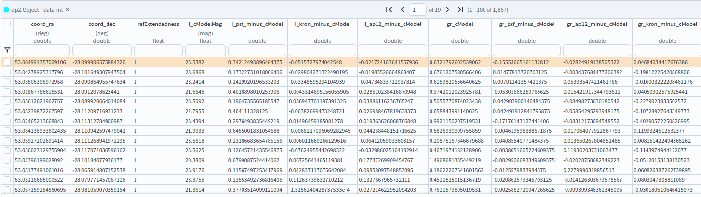
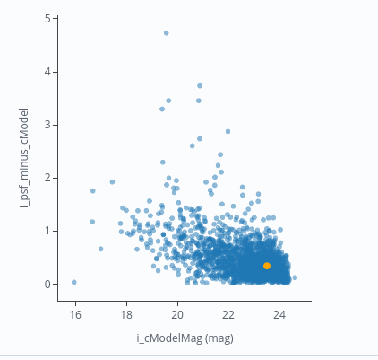
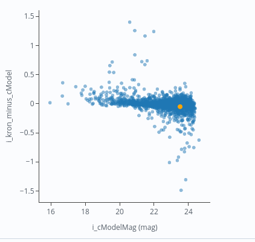
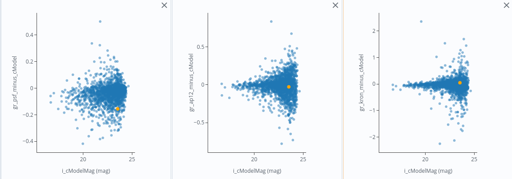

.. _portal-303-2:

###########################################################
303.2. Compare photometry types for galaxies in a DP2 field
###########################################################

For the Portal Aspect of the Rubin Science Platform (RSP) at data.lsst.cloud.

**Data Release:** Data Preview 2

**Last verified to run:** 2026-10-06

**Learning objective:** Query the DP2 ``Object`` table for galaxies in a field, compare the different flux measurements it provides, and judge which are reliable for total magnitudes and for colors.

**LSST data products:** ``Object`` table

**Credit:** Originally developed by the Rubin Community Science team.
Please consider acknowledging them if this tutorial is used for the preparation of journal articles, software releases, or other tutorials.
DOI: `10.11578/rubin/dc.20250909.20 <https://doi.org/10.11578/rubin/dc.20250909.20>`_

**Get Support:** Everyone is encouraged to ask questions or raise issues in the `Support Category <https://community.lsst.org/c/support/6>`_ of the Rubin Community Forum.
Rubin staff will respond to all questions posted there.

----

1. Introduction
===============

Each source in the DP2 ``Object`` table has multiple flux measurements in each band.
They make different assumptions about the shape of a source, so they are not interchangeable.
The PSF flux uses the PSF model as a weight function. The aperture flux ``ap12`` measures the flux within a fixed aperture of 12 pixels radius, which is 2.4 arcseconds at Rubin's pixel scale of 0.2 arcseconds per pixel. The Kron flux measures the flux within an elliptical aperture 2.5 times the Kron radius, which is set from each source's light distribution. The cModel flux is the total flux from a fit of a galaxy model, a combination of an exponential and a de Vaucouleurs profile. The forced cModel flux (``g_cModelFlux``, and similarly for other bands), used here, takes its shape from a reference band. The free cModel flux (``g_free_cModelFlux``) refits every parameter in each band.

This tutorial compares these measurements for galaxies, to see how much they agree for total magnitudes and which ones give reliable colors.

2. Query the galaxies
=====================

**2.1. Go to the catalog ADQL interface.**
Click on the "DP1 & DP2 Catalogs" tab, then click "Edit ADQL" at the upper right.

**2.2. Query the field.**
Copy the query below into the ADQL box and click "Search" at lower left.
It returns only extended sources (``refExtendedness = 1``, where 0 is point-like and 1 is extended) within 0.1 degrees of the field center, with signal-to-noise ratios above 10 in the *i*-band PSF, ``cModel`` and Kron fluxes and above 5 in the *g*- and *r*-band aperture fluxes.
It also converts the Kron and aperture fluxes, which are in nanojansky (nJy), to AB magnitudes with ``-2.5*LOG10(flux) + 31.4``.

.. code-block:: SQL

  SELECT coord_ra, coord_dec,
         refExtendedness,
         i_cModelMag,
         i_psfMag - i_cModelMag AS i_psf_minus_cModel,
         (-2.5*LOG10(i_kronFlux) + 31.4) - i_cModelMag AS i_kron_minus_cModel,
         (-2.5*LOG10(i_ap12Flux) + 31.4) - i_cModelMag AS i_ap12_minus_cModel,
         g_cModelMag - r_cModelMag AS gr_cModel,
         (g_psfMag - r_psfMag) - (g_cModelMag - r_cModelMag) AS gr_psf_minus_cModel,
         -2.5*LOG10(g_ap12Flux / r_ap12Flux) - (g_cModelMag - r_cModelMag) AS gr_ap12_minus_cModel,
         -2.5*LOG10(g_kronFlux / r_kronFlux) - (g_cModelMag - r_cModelMag) AS gr_kron_minus_cModel
  FROM dp2.Object
  WHERE CONTAINS(POINT('ICRS', coord_ra, coord_dec),
        CIRCLE('ICRS', 53.13, -28.10, 0.1))=1
    AND refExtendedness = 1
    AND i_cModel_flag = 0
    AND i_cModelFlux / i_cModelFluxErr > 10
    AND i_psfFlux / i_psfFluxErr > 10
    AND i_kronFlux / i_kronFluxErr > 10
    AND i_ap12Flux / i_ap12FluxErr > 10
    AND g_ap12Flux / g_ap12FluxErr > 5
    AND r_ap12Flux / r_ap12FluxErr > 5
    AND g_kronFlux / g_kronFluxErr > 5
    AND r_kronFlux / r_kronFluxErr > 5

**2.3. Review the results.**
Click the "Results" tab and check the number of rows returned.

    Figure 1: The results table for the galaxies in the ECDFS field.

3. Compare PSF and cModel magnitudes
====================================

**3.1. Compare the PSF and cModel magnitudes.**
A PSF magnitude assumes every source is a point, so for a resolved galaxy it misses light in the outer parts of the galaxy.
The difference between the two magnitudes should therefore be positive, and grow for brighter galaxies.

Open the "Add New Chart" dialog and make a scatter plot with ``i_cModelMag`` on the x-axis and ``i_psf_minus_cModel`` on the y-axis.
This difference is one of the computed columns in the query in section 2.2.

    Figure 2: The difference between the PSF and cModel magnitudes against the cModel magnitude.
    Brighter galaxies have larger offsets, because more of their light lies outside the PSF.

**3.2. Compare the Kron and aperture magnitudes with cModel.**
Make a second scatter plot with ``i_cModelMag`` on the x-axis and ``i_kron_minus_cModel`` on the y-axis, then one with ``i_ap12_minus_cModel``.
The Kron magnitude adapts its aperture to the galaxy's size, so its offset from cModel should stay close to zero across magnitudes.
A fixed aperture encloses a different fraction of each galaxy's light, so its offset depends on how large the galaxy is, and it does not measure the total flux.

    Figure 3: The Kron magnitude compared with cModel. The offset is close to zero, with a wider spread at faint magnitudes.

4. Compare colors
==================

**4.1. Compare the g-r color from each measurement.**
A color is the difference between a galaxy's magnitudes in two bands. This tutorial uses *g*-*r* colors.
They are reliable only if both bands measure the same part of the galaxy.

The cModel color is used as a reference here, because it compares the same model region in each band.
Open the "Add New Chart" dialog and make three scatter plots. For each, use ``i_cModelMag`` on the x-axis and one of the following differences on the y-axis:

* PSF color minus cModel color: ``gr_psf_minus_cModel``
* Aperture color minus cModel color: ``gr_ap12_minus_cModel``
* Kron color minus cModel color: ``gr_kron_minus_cModel``

A difference of zero means the measurement agrees with the reference.

The PSF color is expected to depart most from the reference for galaxies, because a PSF does not describe the extent of a galaxy, and the seeing differs between bands.
The cModel fluxes are forced measurements. The model's position and shape come from a fit in a reference band, and in each other band only the flux of that model is refitted.
The Kron fluxes are also measured independently in each band, so each band's aperture is set from that band's image.
The aperture color uses the same fixed aperture in each band, but it omits light outside the aperture.

    Figure 4: The g-r color difference from the cModel color, for PSF, aperture and Kron fluxes, against i-band cModel magnitude.

5. Discussion
=============

Each measurement is suited to a different purpose.

PSF photometry is appropriate for point sources, such as stars, and for unresolved flux.
For galaxies it underestimates the total flux, because it omits light beyond the central peak.
The deficit grows with galaxy size and brightness.

Aperture photometry measures the flux within a fixed aperture.
Because the aperture is the same in every band, aperture colors compare the same region, provided the seeing is similar across bands.
The total flux is not recovered, and the missed fraction depends on the galaxy's size.

Kron photometry uses an aperture scaled to the measured size of each source, so it recovers more of a galaxy's flux than a fixed aperture does.
It does not assume a light profile, which makes it suitable for irregular galaxies.
Its aperture is determined from each band's image, so it is less precise for faint sources, and the g- and r-band apertures can differ, and because the aperture is a fixed multiple of the measured size, it can omit light in the outer parts of a galaxy.

cModel photometry fits a galaxy model, and gives the most complete total flux when the galaxy resembles an exponential or de Vaucouleurs profile.
The cModel fluxes are forced measurements in each band.
For irregular galaxies the fit can be poor, which biases the total flux, and the fit can fail.
