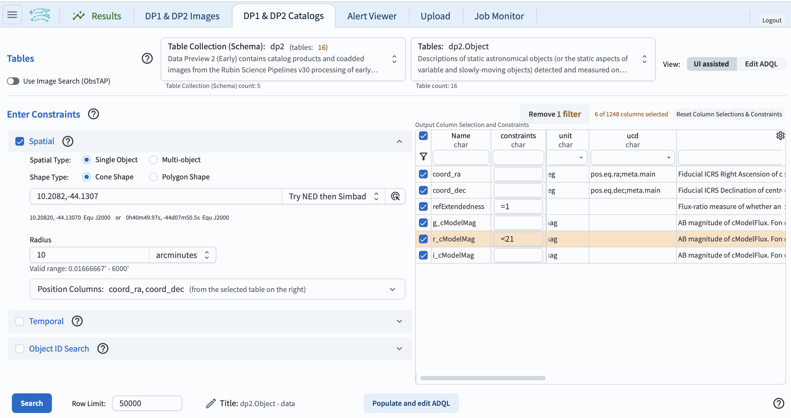
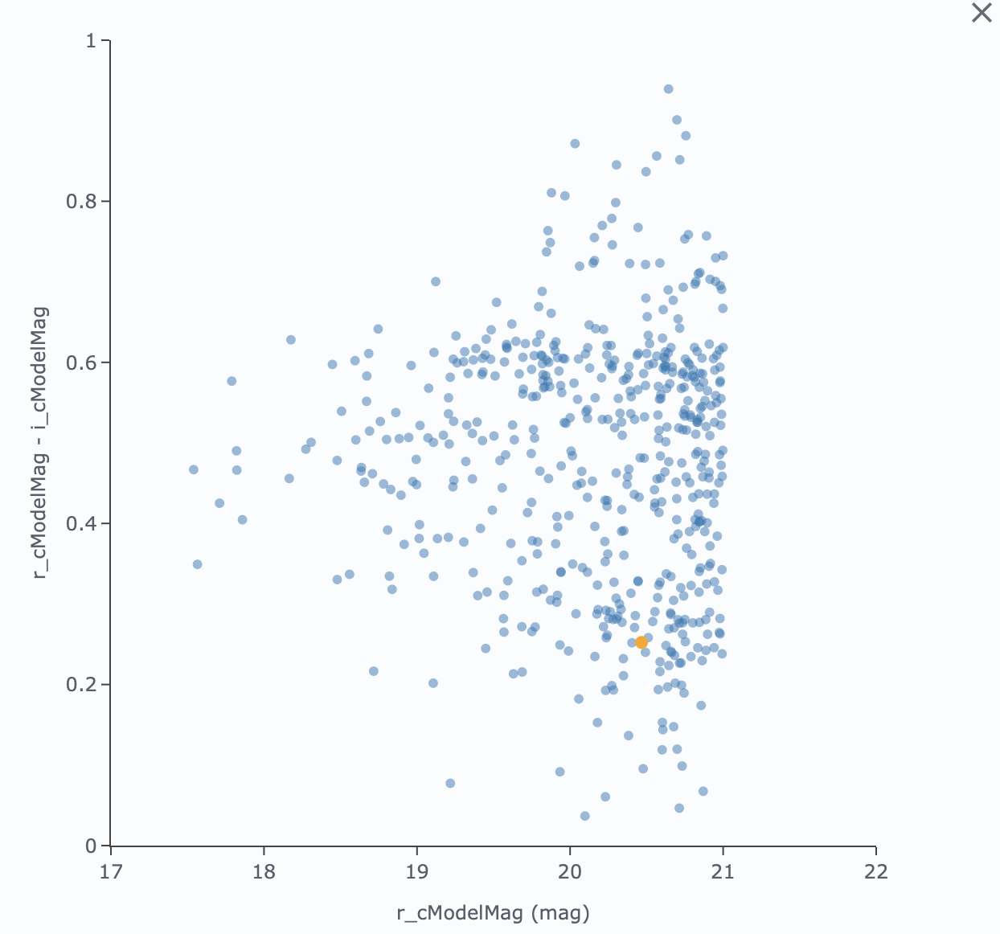
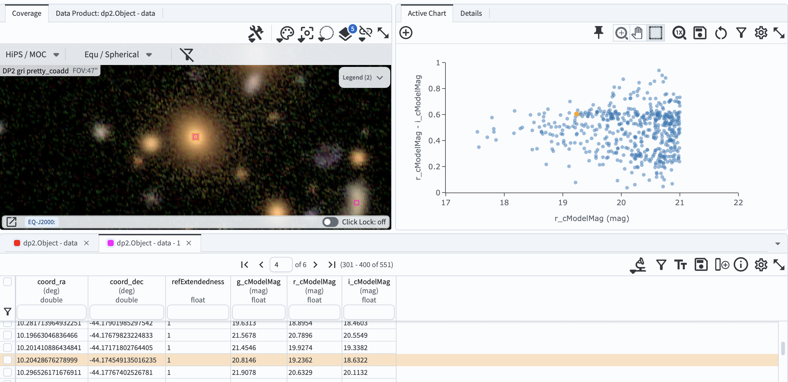

.. _portal-304-1:

###############################################
304.1. Red sequence of a galaxy cluster
###############################################

For the Portal Aspect of the Rubin Science Platform at data.lsst.cloud.

**Data Release:** Data Preview 2

**Last verified to run:** 2026-09-21

**Learning objective:** Identify the red sequence of a galaxy cluster in a color-magnitude diagram.

**LSST data products:** ``Object`` table, ``deep_coadd`` HiPS map

**Credit:** Originally developed by the Rubin Community Science team.

Please consider acknowledging them if this tutorial is used for the preparation of journal articles, software releases, or other tutorials.

**Get Support:** Everyone is encouraged to ask questions or raise issues in the `Support Category <https://community.lsst.org/c/support/6>`_ of the Rubin Community Forum.

Rubin staff will respond to all questions posted there.

----

1. Introduction
===============

This tutorial explores the galaxy cluster PSZ2 G309.43-72.86, which was detected by the Planck satellite through the Sunyaev-Zel'dovich (SZ) effect.
Galaxy clusters are important probes of cosmology, and a large fraction of their member galaxies are red, passive galaxies that form a tight sequence in the color–magnitude diagram, known as the "red sequence."

This tutorial performs a cone search around the cluster, makes a color-magnitude diagram of galaxies, identifies the red sequence, and inspects individual galaxies in the deep coadd images.

**Central coordinates:** (RA, Dec) = 10.2082, -44.1307 degrees

**1.1. Log in to the Portal Aspect of the RSP.**
In a web browser, navigate to `data.lsst.cloud <https://data.lsst.cloud/>`_ and select the "Portal" panel.

2. Query the Object table
=========================

**2.1. Go to the catalog query interface.**
Click on the "DP1 & DP2 Catalogs" tab.
Confirm that the "Table Collection (Schema)" is ``dp2`` and the table is ``dp2.Object``, and that the view is set to "UI assisted".

**2.2. Set the spatial constraints.**
At left, expand the "Spatial" panel.
Set "Spatial Type" to "Single Object" and "Shape Type" to "Cone Shape",
enter ``10.2082, -44.1307`` (the center of the cluster) in the "Coordinates or Object Name" field, and set the radius to 10 arcminutes.

**2.3. Select columns and set constraints.**
In the schema interface table (labelled "Output Column Selection and Constraints"), tick ``coord_ra``, ``coord_dec``, ``g_cModelMag``, ``r_cModelMag``, ``i_cModelMag``, and ``refExtendedness`` to return those columns.
In the "constraints" field for ``refExtendedness`` type ``=1`` to return only extended objects ("galaxies"),
and in the "constraints" field for ``r_cModelMag`` type ``<21`` to return only bright galaxies.
Click the funnel icon at the top left of the table to collapse it to just the selected rows, as in Figure 1.

    Figure 1: The query for galaxies around PSZ2 G309.43-72.86, set up in the UI.

**2.4. Execute the search.**
At lower left, click the blue button labeled "Search".
The query returns N rows of the ``Object`` table.

3. Make the color-magnitude diagram
===================================

**3.1. Create a color-magnitude diagram.**
In the "Active Chart" panel, click the icon of the plus sign in a circle to open the "Add New Chart" pop-up window.
Choose "Plot Type: Scatter", and use magnitude (``r_cModelMag``) on the x-axis and color (``r_cModelMag``-``i_cModelMag``) on the y-axis.
Set the X Min, X Max values to 17, 22, and the Y Min, Y Max values to 0, 1.
Click "OK".

**3.2. Identify the red sequence.**
The resulting plot should look like Figure 2.
The cluster red sequence appears as a narrow, nearly horizontal band of galaxies at *r-i* of about 0.6, extending from the bright cluster galaxies to fainter magnitudes.

    Figure 2: The color-magnitude diagram of galaxies around PSZ2 G309.43-72.86, showing the cluster red sequence.

4. Inspect galaxies in the coadd image
======================================

**4.1. Select a galaxy on the red sequence.**
Click on any point along the red sequence in the color-magnitude diagram.
It will be colored orange and highlighted in the table panel and in the coverage map.

**4.2. View the galaxy in the coverage map.**
The coverage map displays the *gri* color HiPS map of the ``pretty_coadd`` images.
Zoom in on the highlighted object to view the galaxy, as in Figure 3.

    Figure 3: A red-sequence galaxy selected in the color-magnitude diagram and highlighted in the *gri* color coadd in the coverage map.

**4.3. Compare with other galaxies.**
Select a few more points on and off the red sequence, and compare the appearance of the galaxies in the coverage map.

5. Exercises for the learner
============================

Try making the color-magnitude diagram using ``g_cModelMag``-``r_cModelMag`` instead, and compare how clearly the red sequence stands out.
